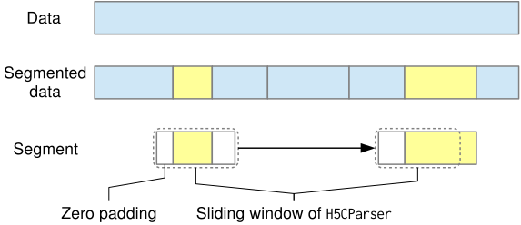

# data.h5py.H5CParser

:codicons-symbol-class: Class · [:octicons-file-code-24: Source]({{ source.root }}/data/h5py.py#L1351)

```python
dset = mdnc.data.h5py.H5CParser(
    file_name, keywords_sequence, keywords_single, batch_size=32,
    sequence_size=5, sequence_position=-1, sequence_padding='same',
    shuffle=True, shuffle_seed=1000, preprocfunc=None,
    num_workers=4, num_buffer=10
)
```

This class allows users to feed one `.h5` file, and parse it by [`mdnc.data.sequence.MPSequence`](../../sequence/MPSequence). The realization could be described as:

This parser is the upgraded version of [`mdnc.data.h5py.H5GParser`](../H5GParser), it is specially designed for parsing data to LSTM/ConvLSTM. A `sequence` dimension would be inserted between `batches` and `channels`. In each batch, the sequence is continuously extracted in the order of the batches. During each epoch, a sliding window would iterate the first axis (samples). The number of batches would be the same as using [`mdnc.data.h5py.H5GParser`](../H5GParser). For each variable specified by `keywords_sequence`, each sample in the mini-batch is a sequence.

This parser could also read the dataset converted by [`mdnc.data.h5py.H5SeqConverter`](../H5SeqConverter). The workflow is shown in the following figure:

{.img-fluid tag=1 title="Split the data into segments and read them."}

## Arguments

**Requries**

| Argument {: .w-8rem} | Type {: .w-5rem} | Description {: .w-8rem} |
| :------: | :-----: | :---------- |
| `file_name` | `#!py str` | The path of the `.h5` file (could be without postfix). |
| `keywords_sequence` | `#!py (str, )` | The keyword of sequence data. The keywords in this list would be parsed as `(B, S, C1, C2, ...)`, where `B` and `S` are the sample number and sequence length (given by the argument `sequence_size`) respectively. It should be a list of keywords (or a single keyword). |
| `keyword_single` | `#!py (str, )` | The keyword of single values. The keywords in this list would be parsed as `(B, C1, C2, ...)`, where `B` is the sample number. It should be a list of keywords (or a single keyword). |
| `batch_size` | `#!py int` | Number of samples in each mini-batch. |
| `sequence_size` | `#!py int` | The size of each sequence. It represents `S` of `(B, S, C1, C2, ...)`. |
| `sequence_position` | `#!py int` | The aligned position between the single values and the sequence values. It should be in the range of `#!py >= 0` and `#!py < sequence_size`. |
| `sequence_padding` | `#!py int` | The padding method for each epoch, it will influence the first or the final samples in the dataset. Could be `#!py 'same'`, `#!py 'zero'` or `#!py 'none'`. If set `#!py None`, the number of batches of each epoch would be a little bit smaller than the actual number. |
| `shuffle` | `#!py bool` | If enabled, shuffle the data set at the beginning of each epoch. |
| `shuffle_seed` | `#!py int` | The seed for random shuffling. |
| `preprocfunc` | `#!py object` | This function would be added to the produced data so that it could serve as a pre-processing tool. Note that this tool would process the batches produced by the parser. The details about this argument would be shown in the following tips. |
| `num_workers` | `#!py int` | The number of parallel workers. |
| `num_buffer` | `#!py int` | The buffer size of the data pool, it means the maximal number of mini-batches stored in the memory. |

??? tip
    At least one keyword requires to be given in `keywords_sequence` or `keyword_single`. In some cases, we need to use both kinds of keywords. For example, the input could be a sequence, and the label may be a scalar.

??? tip
    The minimal requirement for the argument `preprocfunc` is to be a function, or implemented with the `#!py __call__()` method. This function accepts all input mini-batch variables formatted as `#!py np.ndarray`, and returns the pre-processed results. The returned varaible number could be different from the input variable number. In some cases, you could use the provided pre-processors in the `mdnc.data.preprocs` module. The processors in these module support our Broadcasting Pre- and Post- Processor Protocol. For example:

    !!! example
        === "No args"
            ```python linenums="1"
            import mdnc

            def preprocfunc(x1, x2):
                return x1 + x2

            mdnc.data.h5py.H5CParser(..., keywords_sequence=['x_1', 'x_2'],
                                     preprocfunc=preprocfunc)
            ```

        === "With args"
            ```python linenums="1"
            import mdnc

            class PreprocWithArgs:
                def __init__(self, a):
                    self.a = a

                def __call__(self, x1, x2):
                    return x1, self.a * x2

            mdnc.data.h5py.H5CParser(..., keywords_sequence=['x_1', 'x_2'],
                                     preprocfunc=PreprocWithArgs(a=0.1))
            ```

        === "Use data.preprocs"
            ```python linenums="1"
            import mdnc

            mdnc.data.h5py.H5CParser(..., keywords=['x_1', 'x_2'],
                                     preprocfunc=mdnc.data.preprocs.ProcScaler())
            ```

    !!! warning
        The argument `preprocfunc` requires to be a [picklable object][pydoc-picklable]. Therefore, a lambda function or a function implemented inside `#!py if __name__ == '__main__'` is not allowed in this case.

## Methods

### :codicons-symbol-method: `check_dsets`

```python
sze = dset.check_dsets(file_path, keywords)
```

Check the size of `#!py h5py.Dataset` and validate all datasets. A valid group of datasets requires each `#!py h5py.Dataset` shares the same length (sample number). If success, would return the size of the datasets. This method is invoked during the initialization, and do not requires users to call explicitly.

**Requries**

| Argument {: .w-5rem} | Type {: .w-5rem} | Description {: .w-8rem} |
| :------: | :-----: | :---------- |
| `file_path` | `#!py str` | The path of the HDF5 dataset to be validated. |
| `keywords` | `#!py (str, )` | The keywords to be validated. Each keyword should point to or redict to an `#!py h5py.Dataset`. |

**Returns**

| Argument {: .w-5rem} | Description {: .w-8rem} |
| :------: | :---------- |
| `sze` | A `#!py int`, the size of all datasets. |

-----

### :codicons-symbol-method: `get_attrs`

```python
attrs = dset.get_attrs(keyword, *args, attr_names=None)
```

Get the attributes by the keyword.

**Requries**

| Argument {: .w-6rem} | Type {: .w-5rem} | Description {: .w-8rem} |
| :------: | :-----: | :---------- |
| `keyword` | `#!py str` | The keyword of the to a `h5py.Dataset` in the to-be-loaded file. |
| `attr_names` | `#!py (str, )` | A sequence of required attribute names. |
| `*args` | | other attribute names, would be attached to the argument `attr_names` by `#!py list.extend()`. |

**Returns**

| Argument {: .w-5rem} | Description {: .w-8rem} |
| :------: | :---------- |
| `attrs` | A list of the required attribute values. |

-----

### :codicons-symbol-method: `get_file`

```python
f = dset.get_file(enable_write=False)
```

Get a file object of the to-be-loaded file.

**Requries**

| Argument {: .w-6rem} | Type {: .w-4rem} | Description {: .w-8rem} |
| :------: | :-----: | :---------- |
| `enable_write` | `#!py bool` | If enabled, would use the `a` mode to open the file. Otherwise, use the `r` mode. |

**Returns**

| Argument {: .w-5rem} | Description {: .w-8rem} |
| :------: | :---------- |
| `f` | The `#!py h5py.File` object of the to-be-loaded file. |

-----

### :codicons-symbol-method: `start`

```python
dset.start(compat=None)
```

Start the process pool. This method is implemented by [`mdnc.data.sequence.MPSequence`](../../sequence/MPSequence). It supports context management.

Running `start()` or `start_test()` would interrupt the started sequence.

**Requries**

| Argument {: .w-5rem} | Type {: .w-4rem} | Description {: .w-8rem} |
| :------: | :-----: | :---------- |
| `compat` | `#!py bool` | Whether to fall back to multi-threading for the sequence out-type converter. If set None, the decision would be made by checking `#!py os.name`. The compatible mode requires to be enabled on Windows. |

??? tip
    This method supports context management. Using the context is recommended. Here we show two examples:
    === "Without context"
        ```python linenums="1"
        dset.start()
        for ... in dset:
            ...
        dset.finish()
        ```

    === "With context"
        ```python linenums="1"
        with dset.start() as ds:
            for ... in ds:
                ...
        ```

??? danger
    The `#!py cuda.Tensor` could not be put into the queue on Windows (but on Linux we could), see
    
    https://pytorch.org/docs/stable/notes/windows.html#cuda-ipc-operations

    To solve this problem, we need to fall back to multi-threading for the sequence out-type converter on Windows.

??? warning
    Even if you set `#!py shuffle=False`, due to the mechanism of the parallelization, the sample order during the iteration may still get a little bit shuffled. To ensure your sample order not changed, please use `#!py shuffle=False` during the initialization and use [`start_test()`](#start_test) instead.

-----

### :codicons-symbol-method: `start_test`

```python
dset.start_test(test_mode='default')
```

Start the test mode. In the test mode, the process pool would not be open. All operations would be finished in the main thread. However, the random indices are still generated with the same seed of the parallel `#!py dset.start()` mode.

Running `start()` or `start_test()` would interrupt the started sequence.

**Requries**

| Argument {: .w-6rem} | Type {: .w-4rem} | Description {: .w-8rem} |
| :------: | :-----: | :---------- |
| `test_mode` | `#!py str` | Could be `#!py 'default'`, `#!py 'cpu'`, or `#!py 'numpy'`. <ul> <li>`#!py 'default'`: the output would be converted as `start()` mode.</li> <li>`#!py 'cpu'`: even set 'cuda' as output type, the testing output would be still not converted to GPU.</li> <li>`#!py 'numpy'`: would ignore all out_type configurations and return the original output. This output is still pre-processed.</li> </ul>  |

??? tip
    This method also supports context management. See [`start()`](#start) to check how to use it.

-----

### :codicons-symbol-method: `finish`

```python
dset.finish()
```

Finish the process pool. The compatible mode would be auto detected by the previous `start()`.

## Properties

### :codicons-symbol-variable: `len()`, `batch_num`

```python
len(dset)
dset.batch_num
```

The length of the dataset. It is the number of mini-batches, also the number of iterations for each epoch.

-----

### :codicons-symbol-variable: `iter()`

```python
for x1, x2, ... in dset:
    ...
```

The iterator. Recommend to use it inside the context. The unpacked variables `#!py x1, x2 ...` are ordered according to the given argument `#!py keywords` during the initialization.

-----

### :codicons-symbol-variable: `size`

```python
dset.size
```

The size of the dataset. It contains the total number of samples for each epoch.

-----

### :codicons-symbol-variable: `batch_size`

```python
dset.batch_size
```

The size of each batch. This value is given by the argument `#!py batch_size` during the initialization. The last size of the batch may be smaller than this value.

-----

### :codicons-symbol-variable: `sequence_size`

```python
dset.sequence_size
```

The length of each sequence. This value is given by the argument `#!py sequence_size` during the initialization.

-----

### :codicons-symbol-variable: `sequence_position`

```python
dset.sequence_position
```

The alignment between `keywords_sequence` and `keyword_single`. This value is given by the argument `#!py sequence_position` during the initialization.

-----

### :codicons-symbol-variable: `sequence_padding`

```python
dset.sequence_position
```

The padding method of each sequence. This value is given by the argument `#!py sequence_padding` during the initialization.

-----

### :codicons-symbol-variable: `preproc`

```python
dset.preproc
```

The argument `#!py preprocfunc` during the initialziation. This property helps users to invoke the preprocessor manually.

## Examples

???+ example "Example 1"
    === "Codes"
        ```python linenums="1"
        import mdnc

        dset = mdnc.data.h5py.H5CParser('test_cparser', keywords_sequence=['key1', 'key3'], keywords_single=['key2'],
                                        batch_size=1, sequence_size=5, sequence_position=0, sequence_padding='same',
                                        shuffle=False, preprocfunc=None, num_workers=1, num_buffer=1)
        with dset.start() as p:
            for i, data in enumerate(p):
                d1, d2, d3 = data
                print('data.h5py:', i, d1[:, :], d2.shape, d3)
        ```

???+ example "Example 2"
    === "Codes"
        ```python linenums="1"
        import mdnc

        dset = mdnc.data.h5py.H5CParser('test_cparser_seq', keywords_sequence=['key1', 'key3'], keywords_single=['key2'],
                                        batch_size=1, sequence_size=5, sequence_position=-1, sequence_padding='same',
                                        shuffle=False, preprocfunc=None, num_workers=10, num_buffer=1)
        with dset.start() as p:
            for i, data in enumerate(p):
                d1, d2, d3 = data
                print('data.h5py:', i, d1[:,:], d2.shape, d3)
        ```

[pydoc-picklable]:https://docs.python.org/3/library/pickle.html#what-can-be-pickled-and-unpickled "What can be pickled and unpickled?"
