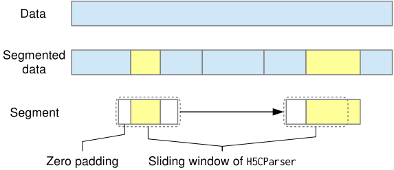

# data.h5py.H5SeqConverter

:codicons-symbol-class: Class · [:octicons-file-code-24: Source]({{ source.root }}/data/h5py.py#L172)

```python
converter = mdnc.data.h5py.H5SeqConverter(
    file_in_name=None, file_out_name=None
)
```

Convert any supervised `.h5` data file into sequence version. This class allows users to choose some keywords and convert them into sequence version. Those keywords would be saved as in the format of continuous sequence. It could serve as a random splitter for preparing the training of LSTM.

The following figure shows how the data get converted. The converted dataset would be cut into several segments with random lengths.

{.img-fluid tag=1 title="Split the data into segments and read them."}

The converted files should only get loaded by `mdnc.data.h5py.H5CParser`.

???+ warning
    * During the conversion, attributes would be lost, and the links and virtual datasets would be treated as `#!py h5py.Datasets`.
    * Although this class supports context, it does not support dictionary-style APIs like `#!py h5py.Group`.

## Arguments

**Requries**

| Argument {: .w-7rem} | Type {: .w-4rem} | Description {: .w-8rem} |
| :------: | :-----: | :---------- |
| `file_in_name` | `#!py str` | A path where we read the non-sequence formatted file. If not set, would not open the dataset. |
| `file_out_name` | `#!py str` | The path of the output data file. If not set, it would be configured as `#!py file_in_name + '_seq'`. |

## Methods

### :codicons-symbol-method: `config`

```python
converter.config(logver=0, set_shuffle=False, seq_len=10, seq_len_max=20, random_seed=2048, **kwargs)
```

Make configuration for the converter. Only the explicitly given argument would be used for changing the configuration of this instance.

**Requries**

| Argument {: .w-6rem} | Type {: .w-4rem} | Description {: .w-8rem} |
| :------: | :-----: | :---------- |
| `logver` | `#!py int` | The verbose level of the outputs. When setting 0, would run silently. |
| `set_shuffle` | `#!py bool` | Whether to shuffle the order of segments during the conversion. |
| `seq_len` | `#!py int` | The lower bound of the random segment length. |
| `seq_len_max` | `#!py int` | The super bound of the random segment length. |
| `random_seed` | `#!py int` | The random seed used in this instance. |
| `**kwargs` | | Any argument that would be used for creating `#!py h5py.Dataset`. The given argument would override the default value during the dataset creation. |

-----

### :codicons-symbol-method: `convert`

```python
converter.convert(keyword, **kwargs)
```

Convert the `#!py h5py.Dataset` given by `keyword` into the segmented dataset, and save it. The data would be converted into sequence. Note that before the conversion, the data should be arranged continuously of the batch axis.

If you have already converted or copied the keyword, please do not do it again.

**Requries**

| Argument {: .w-5rem} | Type {: .w-4rem} | Description {: .w-8rem} |
| :------: | :-----: | :---------- |
| `keyword` | `#!py str` | The keyword that would be converted into segmented dataset. |
| `**kwargs` | | Any argument that would be used for creating `#!py h5py.Dataset`. The given argument would override the default value and configs set by `#!py config()` during the dataset creation. |

-----

### :codicons-symbol-method: `copy`

```python
converter.copy(keyword, **kwargs)
```

Copy the `#!py h5py.Dataset` given by `keyword` into the output file.

If you have already converted or copied the keyword, please do not do it again.

**Requries**

| Argument {: .w-5rem} | Type {: .w-4rem} | Description {: .w-8rem} |
| :------: | :-----: | :---------- |
| `keyword` | `#!py str` | The keyword that would be copied into the output file. |
| `**kwargs` | | Any argument that would be used for creating `#!py h5py.Dataset`. The given argument would override the default value and configs set by `#!py config()` during the dataset creation. |

-----

### :codicons-symbol-method: `open`

```python
converter.open(file_in_name, file_out_name=None)
```

Open a new file. If a file has been opened before, this file would be closed. This method and the `__init__` method (need to specify `file_in_name`) support context management.

**Requries**

| Argument {: .w-7rem} | Type {: .w-4rem} | Description {: .w-8rem} |
| :------: | :-----: | :---------- |
| `file_in_name` | `#!py str` | A path where we read the non-sequence formatted file. |
| `file_out_name` | `#!py str` | The path of the output data file. If not set, it would be configured as `#!py file_in_name + '_seq'`. |

-----

### :codicons-symbol-method: `close`

```python
converter.close()
```

Close the converter.

## Example

???+ example "Example 1"
    === "Codes"
        ```python linenums="1"
        import mdnc

        with mdnc.data.h5py.H5SeqConverter('test_seqconverter.h5') as cvt:
            cvt.config(logver=1, shuffle=True, fletcher32=True, compression='gzip')
            cvt.convert('data_to_sequence')
            cvt.copy('data_only_copied')
        ```

???+ example "Example 2"
    === "Codes"
        ```python linenums="1"
        import mdnc

        converter = mdnc.data.h5py.H5SeqConverter()
        converter.config(logver=1, shuffle=True, fletcher32=True, compression='gzip')
        with converter.open('test_seqconverter.h5') as cvt:
            cvt.convert('data_to_sequence')
            cvt.copy('data_only_copied')
        with converter.open('test_seqconverter2.h5') as cvt:
            cvt.convert('data_to_sequence')
            cvt.copy('data_only_copied')
        ```
