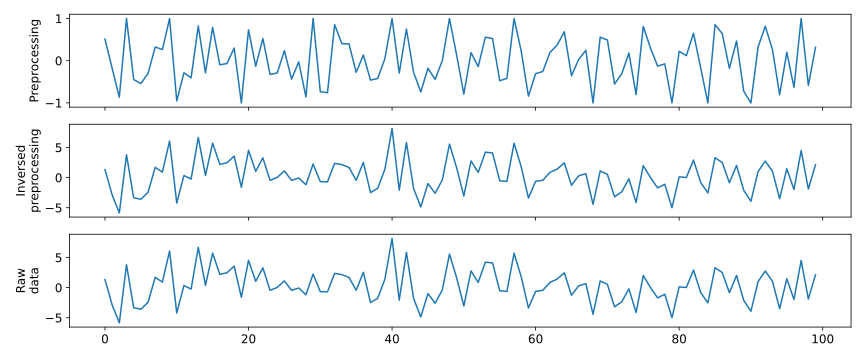

# data.preprocs.ProcNSTScaler

:codicons-symbol-class: Class · [:octicons-file-code-24: Source]({{ source.root }}/data/preprocs.py#L420){ target="_blank" }

```python
proc = mdnc.data.preprocs.ProcNSTScaler(
    dim, kernel_length=9, epsilon=1e-6, inds=None, parent=None
)
```

This is a homogeneous processor. It would remove the lower-frequency part of the data (smoothed data), and use this part for normalization. The normalizer could be formulated as:

```math
\begin{equation}
\left\{
    \begin{aligned}
        \mathbf{y}_n &= \frac{\mathbf{x}_n - \boldsymbol{\mu}_n}{\min(\boldsymbol{\sigma}_n, \varepsilon)}, \\
        \boldsymbol{\mu}_n &= \mathrm{Avg. pool}(\mathbf{x}_n,~L), \\
        \boldsymbol{\sigma}_n &= \mathrm{Max. pool}(\mathbf{x}_n - \boldsymbol{\mu}_n,~L).
    \end{aligned}
\right.
\end{equation}
```

where $\mathbf{x}_n$ and $\mathbf{y}_n$ are the i^th^ input argument and the corresponding output argument respectively. The value $L$ is the smoothing window length, i.e. `kernel_length`. The value $\varepsilon$ determines the lower bound of the divisor during the scaling.

It is recommended to make `kernel_length` large enough especially when the data is very noisy.

## Arguments

**Requries**

| Argument {: .w-5rem} | Type {: .w-6rem} | Description {: .w-8rem} |
| :------: | :-----: | :---------- |
| `dim` | `#!py int` | The dimension of the input data, this value would also determine the dimension of the sliding window. Could be `#!py 1`, `#!py 2`, or `#!py 3`. |
| `kernel_length` | `#!py int` or<br>`#!py (int, )` | The length of the sliding window. Could provide a window shape by using a sequence. |
| `epsilon` | The lower bound of the divisor used for scaling. |
| `inds` | `#!py int` or<br>`#!py (int, )` | Index or indicies of variables where the user implemented methods would be broadcasted. The variables not listed in this argument would be passed to the output without any processing. If set `#!py None`, methods would be broadcasted to all variables. |
| `parent` | [`ProcAbstract`](../ProcAbstract) | Another instance derived from [`mdnc.data.preprocs.ProcAbstract`](../ProcAbstract). The output of `#!py parent.preprocess()` would be used as the input of `#!py self.preprocess()`. The input of `#!py self.postprocess()` would be used as the input of `#!py parent.preprocess()`. |

## Methods

### :codicons-symbol-method: `preprocess`

```python
y_1, y_2, ... = proc.preprocess(x_1, x_2, ...)
```

The preprocess function. Calculate the non-stationary re-scaled values from the input variables.

If `parent` exists, the input of this function comes from the output of `#!py parent.preprocess()`. Otherwise, the input would comes from the input varibable directly.

**Requries**

| Argument {: .w-5rem} | Type {: .w-6rem} | Description {: .w-8rem} |
| :------: | :-----: | :---------- |
| `(x, )` | `#!py np.ndarray` | A sequence of variables. Each variable comes from the parent's outputs (if parent exists). The output of this method would be passed as the input of the next processor (if this processor is used as parent). |

**Returns**

| Argument {: .w-5rem} | Description {: .w-8rem} |
| :------: | :---------- |
| `(y, )` | A sequence of `#!py np.ndarray`, the final preprocessed data. |

-----

### :codicons-symbol-method: `postprocess`

```python
x_1, x_2, ... = proc.postprocess(y_1, y_2, ...)
```

The postprocess function. The inverse operator of the non-stationary scaling.

If `parent` exists, the output of this function would be passed as the input of `#!py parent.postprocess()`. Otherwise, the output would be returned to users directly.

**Requries**

| Argument {: .w-5rem} | Type {: .w-6rem} | Description {: .w-8rem} |
| :------: | :-----: | :---------- |
| `(y, )` | `#!py np.ndarray` | A sequence of variables. Each variable comes from the next processors's outputs (if parent exists). The output of this method would be passed as the input of the parent's method. |

**Returns**

| Argument {: .w-5rem} | Description {: .w-8rem} |
| :------: | :---------- |
| `(x, )` | A sequence of `#!py np.ndarray`, the final postprocessed data. |

## Properties

### :codicons-symbol-variable: `dim`

```python
proc.dim
```

The dimension of the input data.

-----

### :codicons-symbol-variable: `kernel_length`

```python
proc.kernel_length
```

The length of the sliding window when calculating the low-frequnecy shifting value and scaling value.

-----

### :codicons-symbol-variable: `epsilon`

```python
proc.epsilon
```

A value used as the lower bound of the divisor. This value is set small enough in most cases.

-----

### :codicons-symbol-variable: `parent`

```python
proc.parent
```

The parent processor of this instance. The processor is also a derived class of `ProcAbstract`. If the parent does not exist, would return `#!py None`.

-----

### :codicons-symbol-variable: `has_ind`

```python
proc.has_ind
```

A bool flag, showing whether this processor and its all parent processors have `inds` configured or initialized with `_disable_inds`. In this case, the arguments of [`preprocess()`](#preprocess) and [`postprocess()`](#postprocess) would not share the same operation. We call such kind of processors "Inhomogeneous processors".

## Examples

The processor need to be derived. We have two ways to implement the derivation, see the following examples.

???+ example "Example"
    === "Codes"
        ```python linenums="1"
        import numpy as np
        import matplotlib.pyplot as plt
        import mdnc

        proc = mdnc.data.preprocs.ProcNSTScaler(dim=1, kernel_length=9)
        random_rng = np.random.default_rng()
        x, y = random_rng.normal(loc=1.0, scale=3.0, size=[5, 100]), random_rng.normal(loc=1.0, scale=6.0, size=[7, 200])
        x_, y_ = proc.preprocess(x, y)
        xr, yr = proc.postprocess(x_, y_)
        print('Processed shape:', x_.shape, y_.shape)
        print('Processed mean:', np.mean(x_), np.mean(y_))
        print('Processed max:', np.amax(x_), np.amax(y_))
        print('Inverse error:', np.amax(np.abs(x - xr)), np.amax(np.abs(y - yr)))

        with mdnc.utils.draw.setFigure(font_size=12):
            fig, axs = plt.subplots(nrows=3, ncols=1, sharex=True, figsize=(12, 5))
            axs[0].plot(x_[0])
            axs[1].plot(xr[0])
            axs[2].plot(x[0])
            axs[0].set_ylabel('Preprocessing')
            axs[1].set_ylabel('Inversed\npreprocessing')
            axs[2].set_ylabel('Raw\ndata')
            plt.tight_layout()
            plt.show()
        ```

    === "Output"
        ```
        Processed shape: (5, 100) (7, 200)
        Processed mean: -0.003896614253474869 -0.00024727896038973684
        Processed max: 1.0 1.0
        Inverse error: 8.881784197001252e-16 1.7763568394002505e-15
        ```

        {.img-fluid tag=1 title="Example of ProcNSTScaler."}
