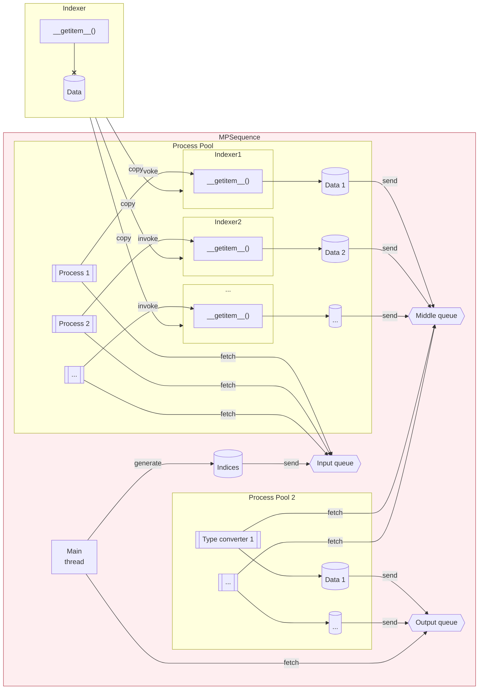

# data.sequence.MPSequence

:codicons-symbol-class: Class · :codicons-symbol-field: Context · [:octicons-file-code-24: Source]({{ source.root }}/data/sequence.py#L504){ target="_blank" }

```python
manager = mdnc.data.sequence.MPSequence(
    worker, dset_size, num_workers=4, num_converters=None, batch_size=32,
    buffer=10, shuffle=True, out_type='cuda', seed=None
)
```

This class is a scheduler based on multi-processing. It is designed as an alternative [`:fontawesome-solid-external-link-alt: keras.utils.Sequence`][keras-sequence]. The multi-processing codes are built on top of the [`:fontawesome-solid-external-link-alt: multiprocessing`][pydoc-mp] module. It supports different workers and allows users to read datasets asynchronously and shuffle dataset randomly.

This class could be loaded without pyTorch. If the pyTorch is detected, the multiprocessing backend would be provided by [`:fontawesome-solid-external-link-alt: torch.multiprocessing`][torch-mp].

The workflow of this class is described in the following figure:





The workflow could be divided into steps:

1. An indexer is initialized outside of the `MPSequence`. The indexer would maintain the dataset during the initialization, and provide a `#! __getitem__(bidx)` method, where the argument `bidx` is a sequence of indicies. This method would read the dataset according to the indices and return a mini-batch of data in the `#! np.ndarray` format.
2. The `MPSequence` would store the indexer during the initialization.
3. When the [`start()`](#start) method is invoked, two process pools would be created. The first pool maintains several processes, each process would get a copy of the indexer provided in step 1. The second pool maintains several output data type converters. These converters are designed in MDNC and do not require users to implement.
4. There are 3 queues maintained by `MPSequence`. During the asynchronous data parsing, the main thread would generate a sequence of indicies in the beginning of each epoch. The indicies would be depatched to these parallel processes (in pool 1) by the **input queue**. Each process would listen to the event of the input queue and try to get the depatched indicies. Once getting a sequence of indicies, the process would invoke the `#! __getitem__()` method of its indexer, the output data would be sent to the second queue, i.e. the **middle queue**.
5. The converters in pool 2 would listen to the middle queue, get the mini-batches, and convert them to `#! torch.Tensor` or `#! torch.cuda.Tensor`. The converted data would be sent to the last queue, i.e. the **output queue**.
6. The main thread is an iterator. It keeps listening the output queue during the workflow. Once the `#!py __next__()` method is invoked, it would get one output mini-batch from the **output queue**. This behavior would repeat until the [`finish()`](#finish) method is invoked (or the context is closed).

## Arguments

**Requries**

| Argument {: .w-6rem} | Type {: .w-4rem} | Description {: .w-8rem} |
| :------: | :-----: | :---------- |
| `worker` | `#!py type` | A class used for generating worker instances, with `#!py __getitem__()` method implemented. This instance would be copied and used as indexer for different processes or threads. |
| `dset_size` | `#!py int` | The number of samples in the dataset. If given an `#!py np.ndarray`, the array would be used as indices, the size of the dataset would be inferred as the length of the array. |
| `num_workers` | `#!py int` | The number of parallel workers, each worker is created by the argument `#!py worker()` inside the processes. |
| `num_converters` | `#!py int` | The number of converters, only used when cuda is enabled. If set `#!py None`, would be determined by `num_workers`. |
| `batch_size` | `#!py int` | The number of samples in each batch, used for depatching the indicies. |
| `shuffle` | `#!py bool` | If enabled, shuffle the dataset at the end of each epoch. |
| `out_type` | `#!py str` | The output type. Could be `#!py 'cuda'`, `#!py 'cpu'` or `#!py 'null'`. If set `#!py 'null'`, the results would not be converted to `torch.Tensor`. |
| `num_workers` | `#!py int` | The number of parallel workers. |
| `seed` | `#!py int` | : the seed used for shuffling the data. If not set, would use random shuffle without seed. |

??? warning
    The argument `worker` requires to be a [:fontawesome-solid-external-link-alt: picklable object][pydoc-picklable]. It means:

    * The `worker` itself should be defined in a global domain, not inside a function or a method.
    * All attributes of the `worker` should be picklable, i.e. a local function like `#!py lambda` expression should not be used.

## Methods

### :codicons-symbol-method: `start`

```python
manager.start(compat=None)
```

Start the process pool. When this method is invoked, the process (or theread) pools would be initialized. It supports context management.

Running `start()` or `start_test()` would interrupt the started sequence.

**Requries**

| Argument {: .w-5rem} | Type {: .w-4rem} | Description {: .w-8rem} |
| :------: | :-----: | :---------- |
| `compat` | `#!py bool` | Whether to fall back to multi-threading for the sequence out-type converter. If set None, the decision would be made by checking `#!py os.name`. The compatible mode requires to be enabled on Windows. |

??? tip
    This method supports context management. Using the context is recommended. Here we show two examples:
    === "Without context"
        ```python linenums="1"
        manager.start()
        for ... in manager:
            ...
        manager.finish()
        ```

    === "With context"
        ```python linenums="1"
        with manager.start() as mng:
            for ... in mng:
                ...
        ```

??? danger
    The `#!py cuda.Tensor` could not be put into the queue on Windows (but on Linux we could), see
    
    https://pytorch.org/docs/stable/notes/windows.html#cuda-ipc-operations

    To solve this problem, we need to fall back to multi-threading for the sequence out-type converter on Windows.

??? warning
    Even if you set `#!py shuffle=False`, due to the mechanism of the parallelization, the sample order during the iteration may still get a little bit shuffled. To ensure your sample order not changed, please use `#!py shuffle=False` during the initialization and use [`start_test()`](#start_test) instead.

-----

### :codicons-symbol-method: `start_test`

```python
manager.start_test(test_mode='default')
```

Start the test mode. In the test mode, the process pool would not be open. All operations would be finished in the main thread. However, the random indices are still generated with the same seed of the parallel `#!py manager.start()` mode (if the indicies are not provided).

Running `start()` or `start_test()` would interrupt the started sequence.

**Requries**

| Argument {: .w-6rem} | Type {: .w-4rem} | Description {: .w-8rem} |
| :------: | :-----: | :---------- |
| `test_mode` | `#!py str` | Could be `#!py 'default'`, `#!py 'cpu'`, or `#!py 'numpy'`. <ul> <li>`#!py 'default'`: the output would be converted as `start()` mode.</li> <li>`#!py 'cpu'`: even set 'cuda' as output type, the testing output would be still not converted to GPU.</li> <li>`#!py 'numpy'`: would ignore all out_type configurations and return the original output. This output is still pre-processed.</li> </ul>  |

??? tip
    This method also supports context management. See [`start()`](#start) to check how to use it.

-----

### :codicons-symbol-method: `finish`

```python
manager.finish()
```

Finish the process pool. The compatible mode would be auto detected by the previous `start()`.

## Properties

### :codicons-symbol-variable: `len()`, `length`

```python
len(dset)
manager.length
```

The length of the epoch. It is the number of mini-batches, also the number of iterations for each epoch.

-----

### :codicons-symbol-variable: `iter()`

```python
for x1, x2, ... in manager:
    ...
```

The iterator. Recommend to use it inside the context. The unpacked variables `#!py x1, x2 ...` are returned by the provided argument `worker`.

-----

### :codicons-symbol-variable: `dset_size`

```python
manager.dset_size
```

The size of the dataset. It contains the total number of samples for each epoch.

-----

### :codicons-symbol-variable: `batch_size`

```python
manager.batch_size
```

The size of each batch. This value is given by the argument `batch_size` during the initialization. The last size of the batch may be smaller than this value.

-----

### :codicons-symbol-variable: `use_cuda`

```python
manager.use_cuda
```

A `#!py bool`, whether to return `#! torch.cuda.Tensor`. This value would be only true when:

* The argument `out_type` is `#! 'cuda'`, or `#! 'cuda:x'` during the initialization.
* The pyTorch is available.

## Examples

???+ example "Example 1: default mode"
    === "Codes"
        ```python linenums="1"
        import mdnc

        class TestSequenceWorker:
            def __getitem__(self, indx):
                # print('data.sequence: thd =', indx)
                return indx

        manager = mdnc.data.sequence.MPSequence(TestSequenceWorker, dset_size=512, batch_size=1,
                                                out_type='cuda', shuffle=False, num_workers=1)

        if __name__ == '__main__':
            with manager.start() as mng:
                for i in mng:
                    print(i)
        ```

    === "Output"
        ```
        tensor([0.], device='cuda:0')
        tensor([1.], device='cuda:0')
        tensor([2.], device='cuda:0')
        tensor([3.], device='cuda:0')
        tensor([4.], device='cuda:0')
        tensor([5.], device='cuda:0')
        tensor([6.], device='cuda:0')
        tensor([7.], device='cuda:0')
        tensor([8.], device='cuda:0')
        tensor([9.], device='cuda:0')
        tensor([10.], device='cuda:0')
        tensor([11.], device='cuda:0')
        tensor([12.], device='cuda:0')
        tensor([13.], device='cuda:0')
        tensor([14.], device='cuda:0')
        tensor([15.], device='cuda:0')
        tensor([16.], device='cuda:0')
        tensor([17.], device='cuda:0')
        tensor([18.], device='cuda:0')
        tensor([19.], device='cuda:0')
        tensor([20.], device='cuda:0')
        tensor([21.], device='cuda:0')
        tensor([22.], device='cuda:0')
        tensor([23.], device='cuda:0')
        tensor([24.], device='cuda:0')
        tensor([25.], device='cuda:0')
        tensor([26.], device='cuda:0')
        tensor([27.], device='cuda:0')
        tensor([28.], device='cuda:0')
        tensor([29.], device='cuda:0')
        tensor([30.], device='cuda:0')
        tensor([31.], device='cuda:0')
        tensor([32.], device='cuda:0')
        tensor([33.], device='cuda:0')
        tensor([34.], device='cuda:0')
        tensor([35.], device='cuda:0')
        tensor([36.], device='cuda:0')
        tensor([37.], device='cuda:0')
        tensor([38.], device='cuda:0')
        tensor([39.], device='cuda:0')
        tensor([40.], device='cuda:0')
        tensor([41.], device='cuda:0')
        tensor([42.], device='cuda:0')
        tensor([43.], device='cuda:0')
        tensor([44.], device='cuda:0')
        tensor([45.], device='cuda:0')
        tensor([46.], device='cuda:0')
        tensor([47.], device='cuda:0')
        tensor([48.], device='cuda:0')
        tensor([49.], device='cuda:0')
        tensor([50.], device='cuda:0')
        tensor([51.], device='cuda:0')
        tensor([52.], device='cuda:0')
        tensor([53.], device='cuda:0')
        tensor([54.], device='cuda:0')
        tensor([55.], device='cuda:0')
        tensor([56.], device='cuda:0')
        tensor([57.], device='cuda:0')
        tensor([58.], device='cuda:0')
        tensor([59.], device='cuda:0')
        tensor([60.], device='cuda:0')
        tensor([61.], device='cuda:0')
        tensor([62.], device='cuda:0')
        tensor([63.], device='cuda:0')
        tensor([64.], device='cuda:0')
        tensor([65.], device='cuda:0')
        tensor([66.], device='cuda:0')
        tensor([67.], device='cuda:0')
        tensor([68.], device='cuda:0')
        tensor([69.], device='cuda:0')
        tensor([70.], device='cuda:0')
        tensor([71.], device='cuda:0')
        tensor([72.], device='cuda:0')
        tensor([73.], device='cuda:0')
        tensor([74.], device='cuda:0')
        tensor([75.], device='cuda:0')
        tensor([76.], device='cuda:0')
        tensor([77.], device='cuda:0')
        tensor([78.], device='cuda:0')
        tensor([79.], device='cuda:0')
        tensor([80.], device='cuda:0')
        tensor([81.], device='cuda:0')
        tensor([82.], device='cuda:0')
        tensor([83.], device='cuda:0')
        tensor([84.], device='cuda:0')
        tensor([85.], device='cuda:0')
        tensor([86.], device='cuda:0')
        tensor([87.], device='cuda:0')
        tensor([88.], device='cuda:0')
        tensor([89.], device='cuda:0')
        tensor([90.], device='cuda:0')
        tensor([91.], device='cuda:0')
        tensor([92.], device='cuda:0')
        tensor([93.], device='cuda:0')
        tensor([94.], device='cuda:0')
        tensor([95.], device='cuda:0')
        tensor([96.], device='cuda:0')
        tensor([97.], device='cuda:0')
        tensor([98.], device='cuda:0')
        tensor([99.], device='cuda:0')
        tensor([100.], device='cuda:0')
        tensor([101.], device='cuda:0')
        tensor([102.], device='cuda:0')
        tensor([103.], device='cuda:0')
        tensor([104.], device='cuda:0')
        tensor([105.], device='cuda:0')
        tensor([106.], device='cuda:0')
        tensor([107.], device='cuda:0')
        tensor([108.], device='cuda:0')
        tensor([109.], device='cuda:0')
        tensor([110.], device='cuda:0')
        tensor([111.], device='cuda:0')
        tensor([112.], device='cuda:0')
        tensor([113.], device='cuda:0')
        tensor([114.], device='cuda:0')
        tensor([115.], device='cuda:0')
        tensor([116.], device='cuda:0')
        tensor([117.], device='cuda:0')
        tensor([118.], device='cuda:0')
        tensor([119.], device='cuda:0')
        tensor([120.], device='cuda:0')
        tensor([121.], device='cuda:0')
        tensor([122.], device='cuda:0')
        tensor([123.], device='cuda:0')
        tensor([124.], device='cuda:0')
        tensor([125.], device='cuda:0')
        tensor([126.], device='cuda:0')
        tensor([127.], device='cuda:0')
        tensor([128.], device='cuda:0')
        tensor([129.], device='cuda:0')
        tensor([130.], device='cuda:0')
        tensor([131.], device='cuda:0')
        tensor([132.], device='cuda:0')
        tensor([133.], device='cuda:0')
        tensor([134.], device='cuda:0')
        tensor([135.], device='cuda:0')
        tensor([136.], device='cuda:0')
        tensor([137.], device='cuda:0')
        tensor([138.], device='cuda:0')
        tensor([139.], device='cuda:0')
        tensor([140.], device='cuda:0')
        tensor([141.], device='cuda:0')
        tensor([142.], device='cuda:0')
        tensor([143.], device='cuda:0')
        tensor([144.], device='cuda:0')
        tensor([145.], device='cuda:0')
        tensor([146.], device='cuda:0')
        tensor([147.], device='cuda:0')
        tensor([148.], device='cuda:0')
        tensor([149.], device='cuda:0')
        tensor([150.], device='cuda:0')
        tensor([151.], device='cuda:0')
        tensor([152.], device='cuda:0')
        tensor([153.], device='cuda:0')
        tensor([154.], device='cuda:0')
        tensor([155.], device='cuda:0')
        tensor([156.], device='cuda:0')
        tensor([157.], device='cuda:0')
        tensor([158.], device='cuda:0')
        tensor([159.], device='cuda:0')
        tensor([160.], device='cuda:0')
        tensor([161.], device='cuda:0')
        tensor([162.], device='cuda:0')
        tensor([163.], device='cuda:0')
        tensor([164.], device='cuda:0')
        tensor([165.], device='cuda:0')
        tensor([166.], device='cuda:0')
        tensor([167.], device='cuda:0')
        tensor([168.], device='cuda:0')
        tensor([169.], device='cuda:0')
        tensor([170.], device='cuda:0')
        tensor([171.], device='cuda:0')
        tensor([172.], device='cuda:0')
        tensor([173.], device='cuda:0')
        tensor([174.], device='cuda:0')
        tensor([175.], device='cuda:0')
        tensor([176.], device='cuda:0')
        tensor([177.], device='cuda:0')
        tensor([178.], device='cuda:0')
        tensor([179.], device='cuda:0')
        tensor([180.], device='cuda:0')
        tensor([181.], device='cuda:0')
        tensor([182.], device='cuda:0')
        tensor([183.], device='cuda:0')
        tensor([184.], device='cuda:0')
        tensor([185.], device='cuda:0')
        tensor([186.], device='cuda:0')
        tensor([187.], device='cuda:0')
        tensor([188.], device='cuda:0')
        tensor([189.], device='cuda:0')
        tensor([190.], device='cuda:0')
        tensor([191.], device='cuda:0')
        tensor([192.], device='cuda:0')
        tensor([193.], device='cuda:0')
        tensor([194.], device='cuda:0')
        tensor([195.], device='cuda:0')
        tensor([196.], device='cuda:0')
        tensor([197.], device='cuda:0')
        tensor([198.], device='cuda:0')
        tensor([199.], device='cuda:0')
        tensor([200.], device='cuda:0')
        tensor([201.], device='cuda:0')
        tensor([202.], device='cuda:0')
        tensor([203.], device='cuda:0')
        tensor([204.], device='cuda:0')
        tensor([205.], device='cuda:0')
        tensor([206.], device='cuda:0')
        tensor([207.], device='cuda:0')
        tensor([208.], device='cuda:0')
        tensor([209.], device='cuda:0')
        tensor([210.], device='cuda:0')
        tensor([211.], device='cuda:0')
        tensor([212.], device='cuda:0')
        tensor([213.], device='cuda:0')
        tensor([214.], device='cuda:0')
        tensor([215.], device='cuda:0')
        tensor([216.], device='cuda:0')
        tensor([217.], device='cuda:0')
        tensor([218.], device='cuda:0')
        tensor([219.], device='cuda:0')
        tensor([220.], device='cuda:0')
        tensor([221.], device='cuda:0')
        tensor([222.], device='cuda:0')
        tensor([223.], device='cuda:0')
        tensor([224.], device='cuda:0')
        tensor([225.], device='cuda:0')
        tensor([226.], device='cuda:0')
        tensor([227.], device='cuda:0')
        tensor([228.], device='cuda:0')
        tensor([229.], device='cuda:0')
        tensor([230.], device='cuda:0')
        tensor([231.], device='cuda:0')
        tensor([232.], device='cuda:0')
        tensor([233.], device='cuda:0')
        tensor([234.], device='cuda:0')
        tensor([235.], device='cuda:0')
        tensor([236.], device='cuda:0')
        tensor([237.], device='cuda:0')
        tensor([238.], device='cuda:0')
        tensor([239.], device='cuda:0')
        tensor([240.], device='cuda:0')
        tensor([241.], device='cuda:0')
        tensor([242.], device='cuda:0')
        tensor([243.], device='cuda:0')
        tensor([244.], device='cuda:0')
        tensor([245.], device='cuda:0')
        tensor([246.], device='cuda:0')
        tensor([247.], device='cuda:0')
        tensor([248.], device='cuda:0')
        tensor([249.], device='cuda:0')
        tensor([250.], device='cuda:0')
        tensor([251.], device='cuda:0')
        tensor([252.], device='cuda:0')
        tensor([253.], device='cuda:0')
        tensor([254.], device='cuda:0')
        tensor([255.], device='cuda:0')
        tensor([256.], device='cuda:0')
        tensor([257.], device='cuda:0')
        tensor([258.], device='cuda:0')
        tensor([259.], device='cuda:0')
        tensor([260.], device='cuda:0')
        tensor([261.], device='cuda:0')
        tensor([262.], device='cuda:0')
        tensor([263.], device='cuda:0')
        tensor([264.], device='cuda:0')
        tensor([265.], device='cuda:0')
        tensor([266.], device='cuda:0')
        tensor([267.], device='cuda:0')
        tensor([268.], device='cuda:0')
        tensor([269.], device='cuda:0')
        tensor([270.], device='cuda:0')
        tensor([271.], device='cuda:0')
        tensor([272.], device='cuda:0')
        tensor([273.], device='cuda:0')
        tensor([274.], device='cuda:0')
        tensor([275.], device='cuda:0')
        tensor([276.], device='cuda:0')
        tensor([277.], device='cuda:0')
        tensor([278.], device='cuda:0')
        tensor([279.], device='cuda:0')
        tensor([280.], device='cuda:0')
        tensor([281.], device='cuda:0')
        tensor([282.], device='cuda:0')
        tensor([283.], device='cuda:0')
        tensor([284.], device='cuda:0')
        tensor([285.], device='cuda:0')
        tensor([286.], device='cuda:0')
        tensor([287.], device='cuda:0')
        tensor([288.], device='cuda:0')
        tensor([289.], device='cuda:0')
        tensor([290.], device='cuda:0')
        tensor([291.], device='cuda:0')
        tensor([292.], device='cuda:0')
        tensor([293.], device='cuda:0')
        tensor([294.], device='cuda:0')
        tensor([295.], device='cuda:0')
        tensor([296.], device='cuda:0')
        tensor([297.], device='cuda:0')
        tensor([298.], device='cuda:0')
        tensor([299.], device='cuda:0')
        tensor([300.], device='cuda:0')
        tensor([301.], device='cuda:0')
        tensor([302.], device='cuda:0')
        tensor([303.], device='cuda:0')
        tensor([304.], device='cuda:0')
        tensor([305.], device='cuda:0')
        tensor([306.], device='cuda:0')
        tensor([307.], device='cuda:0')
        tensor([308.], device='cuda:0')
        tensor([309.], device='cuda:0')
        tensor([310.], device='cuda:0')
        tensor([311.], device='cuda:0')
        tensor([312.], device='cuda:0')
        tensor([313.], device='cuda:0')
        tensor([314.], device='cuda:0')
        tensor([315.], device='cuda:0')
        tensor([316.], device='cuda:0')
        tensor([317.], device='cuda:0')
        tensor([318.], device='cuda:0')
        tensor([319.], device='cuda:0')
        tensor([320.], device='cuda:0')
        tensor([321.], device='cuda:0')
        tensor([322.], device='cuda:0')
        tensor([323.], device='cuda:0')
        tensor([324.], device='cuda:0')
        tensor([325.], device='cuda:0')
        tensor([326.], device='cuda:0')
        tensor([327.], device='cuda:0')
        tensor([328.], device='cuda:0')
        tensor([329.], device='cuda:0')
        tensor([330.], device='cuda:0')
        tensor([331.], device='cuda:0')
        tensor([332.], device='cuda:0')
        tensor([333.], device='cuda:0')
        tensor([334.], device='cuda:0')
        tensor([335.], device='cuda:0')
        tensor([336.], device='cuda:0')
        tensor([337.], device='cuda:0')
        tensor([338.], device='cuda:0')
        tensor([339.], device='cuda:0')
        tensor([340.], device='cuda:0')
        tensor([341.], device='cuda:0')
        tensor([342.], device='cuda:0')
        tensor([343.], device='cuda:0')
        tensor([344.], device='cuda:0')
        tensor([345.], device='cuda:0')
        tensor([346.], device='cuda:0')
        tensor([347.], device='cuda:0')
        tensor([348.], device='cuda:0')
        tensor([349.], device='cuda:0')
        tensor([350.], device='cuda:0')
        tensor([351.], device='cuda:0')
        tensor([352.], device='cuda:0')
        tensor([353.], device='cuda:0')
        tensor([354.], device='cuda:0')
        tensor([355.], device='cuda:0')
        tensor([356.], device='cuda:0')
        tensor([357.], device='cuda:0')
        tensor([358.], device='cuda:0')
        tensor([359.], device='cuda:0')
        tensor([360.], device='cuda:0')
        tensor([361.], device='cuda:0')
        tensor([362.], device='cuda:0')
        tensor([363.], device='cuda:0')
        tensor([364.], device='cuda:0')
        tensor([365.], device='cuda:0')
        tensor([366.], device='cuda:0')
        tensor([367.], device='cuda:0')
        tensor([368.], device='cuda:0')
        tensor([369.], device='cuda:0')
        tensor([370.], device='cuda:0')
        tensor([371.], device='cuda:0')
        tensor([372.], device='cuda:0')
        tensor([373.], device='cuda:0')
        tensor([374.], device='cuda:0')
        tensor([375.], device='cuda:0')
        tensor([376.], device='cuda:0')
        tensor([377.], device='cuda:0')
        tensor([378.], device='cuda:0')
        tensor([379.], device='cuda:0')
        tensor([380.], device='cuda:0')
        tensor([381.], device='cuda:0')
        tensor([382.], device='cuda:0')
        tensor([383.], device='cuda:0')
        tensor([384.], device='cuda:0')
        tensor([385.], device='cuda:0')
        tensor([386.], device='cuda:0')
        tensor([387.], device='cuda:0')
        tensor([388.], device='cuda:0')
        tensor([389.], device='cuda:0')
        tensor([390.], device='cuda:0')
        tensor([391.], device='cuda:0')
        tensor([392.], device='cuda:0')
        tensor([393.], device='cuda:0')
        tensor([394.], device='cuda:0')
        tensor([395.], device='cuda:0')
        tensor([396.], device='cuda:0')
        tensor([397.], device='cuda:0')
        tensor([398.], device='cuda:0')
        tensor([399.], device='cuda:0')
        tensor([400.], device='cuda:0')
        tensor([401.], device='cuda:0')
        tensor([402.], device='cuda:0')
        tensor([403.], device='cuda:0')
        tensor([404.], device='cuda:0')
        tensor([405.], device='cuda:0')
        tensor([406.], device='cuda:0')
        tensor([407.], device='cuda:0')
        tensor([408.], device='cuda:0')
        tensor([409.], device='cuda:0')
        tensor([410.], device='cuda:0')
        tensor([411.], device='cuda:0')
        tensor([412.], device='cuda:0')
        tensor([413.], device='cuda:0')
        tensor([414.], device='cuda:0')
        tensor([415.], device='cuda:0')
        tensor([416.], device='cuda:0')
        tensor([417.], device='cuda:0')
        tensor([418.], device='cuda:0')
        tensor([419.], device='cuda:0')
        tensor([420.], device='cuda:0')
        tensor([421.], device='cuda:0')
        tensor([422.], device='cuda:0')
        tensor([423.], device='cuda:0')
        tensor([424.], device='cuda:0')
        tensor([425.], device='cuda:0')
        tensor([426.], device='cuda:0')
        tensor([427.], device='cuda:0')
        tensor([428.], device='cuda:0')
        tensor([429.], device='cuda:0')
        tensor([430.], device='cuda:0')
        tensor([431.], device='cuda:0')
        tensor([432.], device='cuda:0')
        tensor([433.], device='cuda:0')
        tensor([434.], device='cuda:0')
        tensor([435.], device='cuda:0')
        tensor([436.], device='cuda:0')
        tensor([437.], device='cuda:0')
        tensor([438.], device='cuda:0')
        tensor([439.], device='cuda:0')
        tensor([440.], device='cuda:0')
        tensor([441.], device='cuda:0')
        tensor([442.], device='cuda:0')
        tensor([443.], device='cuda:0')
        tensor([444.], device='cuda:0')
        tensor([445.], device='cuda:0')
        tensor([446.], device='cuda:0')
        tensor([447.], device='cuda:0')
        tensor([448.], device='cuda:0')
        tensor([449.], device='cuda:0')
        tensor([450.], device='cuda:0')
        tensor([451.], device='cuda:0')
        tensor([452.], device='cuda:0')
        tensor([453.], device='cuda:0')
        tensor([454.], device='cuda:0')
        tensor([455.], device='cuda:0')
        tensor([456.], device='cuda:0')
        tensor([457.], device='cuda:0')
        tensor([458.], device='cuda:0')
        tensor([459.], device='cuda:0')
        tensor([460.], device='cuda:0')
        tensor([461.], device='cuda:0')
        tensor([462.], device='cuda:0')
        tensor([463.], device='cuda:0')
        tensor([464.], device='cuda:0')
        tensor([465.], device='cuda:0')
        tensor([466.], device='cuda:0')
        tensor([467.], device='cuda:0')
        tensor([468.], device='cuda:0')
        tensor([469.], device='cuda:0')
        tensor([470.], device='cuda:0')
        tensor([471.], device='cuda:0')
        tensor([472.], device='cuda:0')
        tensor([473.], device='cuda:0')
        tensor([474.], device='cuda:0')
        tensor([475.], device='cuda:0')
        tensor([476.], device='cuda:0')
        tensor([477.], device='cuda:0')
        tensor([478.], device='cuda:0')
        tensor([479.], device='cuda:0')
        tensor([480.], device='cuda:0')
        tensor([481.], device='cuda:0')
        tensor([482.], device='cuda:0')
        tensor([483.], device='cuda:0')
        tensor([484.], device='cuda:0')
        tensor([485.], device='cuda:0')
        tensor([486.], device='cuda:0')
        tensor([487.], device='cuda:0')
        tensor([488.], device='cuda:0')
        tensor([489.], device='cuda:0')
        tensor([490.], device='cuda:0')
        tensor([491.], device='cuda:0')
        tensor([492.], device='cuda:0')
        tensor([493.], device='cuda:0')
        tensor([494.], device='cuda:0')
        tensor([495.], device='cuda:0')
        tensor([496.], device='cuda:0')
        tensor([497.], device='cuda:0')
        tensor([498.], device='cuda:0')
        tensor([499.], device='cuda:0')
        tensor([500.], device='cuda:0')
        tensor([501.], device='cuda:0')
        tensor([502.], device='cuda:0')
        tensor([503.], device='cuda:0')
        tensor([504.], device='cuda:0')
        tensor([505.], device='cuda:0')
        tensor([506.], device='cuda:0')
        tensor([507.], device='cuda:0')
        tensor([508.], device='cuda:0')
        tensor([509.], device='cuda:0')
        tensor([510.], device='cuda:0')
        tensor([511.], device='cuda:0')
        ```

???+ example "Example 2: test mode"
    === "Codes"
        ```python linenums="1"
        import mdnc

        class TestSequenceWorker:
            def __getitem__(self, indx):
                # print('data.sequence: thd =', indx)
                return indx

        manager = mdnc.data.sequence.MPSequence(TestSequenceWorker, dset_size=512, batch_size=1,
                                                out_type='cuda', shuffle=False, num_workers=1)

        if __name__ == '__main__':
            with manager.start_test('numpy') as mng:
                for i in mng:
                    print(i)
        ```

    === "Output"
        ```
        [0]
        [1]
        [2]
        [3]
        [4]
        [5]
        [6]
        [7]
        [8]
        [9]
        [10]
        [11]
        [12]
        [13]
        [14]
        [15]
        [16]
        [17]
        [18]
        [19]
        [20]
        [21]
        [22]
        [23]
        [24]
        [25]
        [26]
        [27]
        [28]
        [29]
        [30]
        [31]
        [32]
        [33]
        [34]
        [35]
        [36]
        [37]
        [38]
        [39]
        [40]
        [41]
        [42]
        [43]
        [44]
        [45]
        [46]
        [47]
        [48]
        [49]
        [50]
        [51]
        [52]
        [53]
        [54]
        [55]
        [56]
        [57]
        [58]
        [59]
        [60]
        [61]
        [62]
        [63]
        [64]
        [65]
        [66]
        [67]
        [68]
        [69]
        [70]
        [71]
        [72]
        [73]
        [74]
        [75]
        [76]
        [77]
        [78]
        [79]
        [80]
        [81]
        [82]
        [83]
        [84]
        [85]
        [86]
        [87]
        [88]
        [89]
        [90]
        [91]
        [92]
        [93]
        [94]
        [95]
        [96]
        [97]
        [98]
        [99]
        [100]
        [101]
        [102]
        [103]
        [104]
        [105]
        [106]
        [107]
        [108]
        [109]
        [110]
        [111]
        [112]
        [113]
        [114]
        [115]
        [116]
        [117]
        [118]
        [119]
        [120]
        [121]
        [122]
        [123]
        [124]
        [125]
        [126]
        [127]
        [128]
        [129]
        [130]
        [131]
        [132]
        [133]
        [134]
        [135]
        [136]
        [137]
        [138]
        [139]
        [140]
        [141]
        [142]
        [143]
        [144]
        [145]
        [146]
        [147]
        [148]
        [149]
        [150]
        [151]
        [152]
        [153]
        [154]
        [155]
        [156]
        [157]
        [158]
        [159]
        [160]
        [161]
        [162]
        [163]
        [164]
        [165]
        [166]
        [167]
        [168]
        [169]
        [170]
        [171]
        [172]
        [173]
        [174]
        [175]
        [176]
        [177]
        [178]
        [179]
        [180]
        [181]
        [182]
        [183]
        [184]
        [185]
        [186]
        [187]
        [188]
        [189]
        [190]
        [191]
        [192]
        [193]
        [194]
        [195]
        [196]
        [197]
        [198]
        [199]
        [200]
        [201]
        [202]
        [203]
        [204]
        [205]
        [206]
        [207]
        [208]
        [209]
        [210]
        [211]
        [212]
        [213]
        [214]
        [215]
        [216]
        [217]
        [218]
        [219]
        [220]
        [221]
        [222]
        [223]
        [224]
        [225]
        [226]
        [227]
        [228]
        [229]
        [230]
        [231]
        [232]
        [233]
        [234]
        [235]
        [236]
        [237]
        [238]
        [239]
        [240]
        [241]
        [242]
        [243]
        [244]
        [245]
        [246]
        [247]
        [248]
        [249]
        [250]
        [251]
        [252]
        [253]
        [254]
        [255]
        [256]
        [257]
        [258]
        [259]
        [260]
        [261]
        [262]
        [263]
        [264]
        [265]
        [266]
        [267]
        [268]
        [269]
        [270]
        [271]
        [272]
        [273]
        [274]
        [275]
        [276]
        [277]
        [278]
        [279]
        [280]
        [281]
        [282]
        [283]
        [284]
        [285]
        [286]
        [287]
        [288]
        [289]
        [290]
        [291]
        [292]
        [293]
        [294]
        [295]
        [296]
        [297]
        [298]
        [299]
        [300]
        [301]
        [302]
        [303]
        [304]
        [305]
        [306]
        [307]
        [308]
        [309]
        [310]
        [311]
        [312]
        [313]
        [314]
        [315]
        [316]
        [317]
        [318]
        [319]
        [320]
        [321]
        [322]
        [323]
        [324]
        [325]
        [326]
        [327]
        [328]
        [329]
        [330]
        [331]
        [332]
        [333]
        [334]
        [335]
        [336]
        [337]
        [338]
        [339]
        [340]
        [341]
        [342]
        [343]
        [344]
        [345]
        [346]
        [347]
        [348]
        [349]
        [350]
        [351]
        [352]
        [353]
        [354]
        [355]
        [356]
        [357]
        [358]
        [359]
        [360]
        [361]
        [362]
        [363]
        [364]
        [365]
        [366]
        [367]
        [368]
        [369]
        [370]
        [371]
        [372]
        [373]
        [374]
        [375]
        [376]
        [377]
        [378]
        [379]
        [380]
        [381]
        [382]
        [383]
        [384]
        [385]
        [386]
        [387]
        [388]
        [389]
        [390]
        [391]
        [392]
        [393]
        [394]
        [395]
        [396]
        [397]
        [398]
        [399]
        [400]
        [401]
        [402]
        [403]
        [404]
        [405]
        [406]
        [407]
        [408]
        [409]
        [410]
        [411]
        [412]
        [413]
        [414]
        [415]
        [416]
        [417]
        [418]
        [419]
        [420]
        [421]
        [422]
        [423]
        [424]
        [425]
        [426]
        [427]
        [428]
        [429]
        [430]
        [431]
        [432]
        [433]
        [434]
        [435]
        [436]
        [437]
        [438]
        [439]
        [440]
        [441]
        [442]
        [443]
        [444]
        [445]
        [446]
        [447]
        [448]
        [449]
        [450]
        [451]
        [452]
        [453]
        [454]
        [455]
        [456]
        [457]
        [458]
        [459]
        [460]
        [461]
        [462]
        [463]
        [464]
        [465]
        [466]
        [467]
        [468]
        [469]
        [470]
        [471]
        [472]
        [473]
        [474]
        [475]
        [476]
        [477]
        [478]
        [479]
        [480]
        [481]
        [482]
        [483]
        [484]
        [485]
        [486]
        [487]
        [488]
        [489]
        [490]
        [491]
        [492]
        [493]
        [494]
        [495]
        [496]
        [497]
        [498]
        [499]
        [500]
        [501]
        [502]
        [503]
        [504]
        [505]
        [506]
        [507]
        [508]
        [509]
        [510]
        [511]
        ```

[pydoc-picklable]:https://docs.python.org/3/library/pickle.html#what-can-be-pickled-and-unpickled "What can be pickled and unpickled?"
[pydoc-mp]:https://docs.python.org/3/library/multiprocessing.html "Process-based parallelism"
[torch-mp]:https://pytorch.org/docs/stable/multiprocessing.html "Multiprocessing package"
[keras-sequence]:https://www.tensorflow.org/api_docs/python/tf/keras/utils/Sequence "tf.keras.utils.Sequence"
