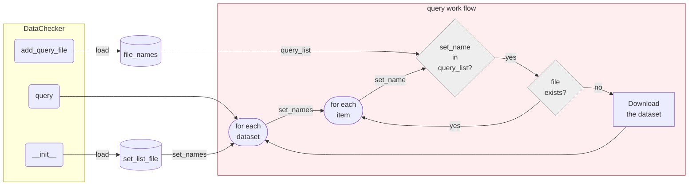

# data.webtools.DataChecker

:codicons-symbol-class: Class · [:octicons-file-code-24: Source]({{ source.root }}/data/h5py.py#L1351)

```python
dchecker = mdnc.data.webtools.DataChecker(
    root='./datasets', set_list_file='web-data', token='', verbose=False
)
```

This data checker could check the local dataset folder, find the not existing datasets and fetch those required datasets from online repositories or links.

The workflow is illustrated in the following figure,



To use this class, users require to follow 3 steps:

1. Initialize the `DataChecker` with the `set_list_file` argument, which is a json file. This file defines where the online datasets stored and what those datasets have.
2. Use [`add_query_file`](#add_query_file) to add the require data file name.
3. Invoke [`query`](#query), this method would start iterate the dataset list, then find and download all online datasets which satisfies the following conditions:
    1. Has a file item that does not locally exist.
    2. Has a file item that is required by the query list.

A private repository requires a token. In this case, the argument `token` need to be not blank.

## Arguments

**Requries**

| Argument {: .w-7rem} | Type {: .w-5rem} | Description {: .w-8rem} |
| :------: | :-----: | :---------- |
| `root` | `#!py str` | The root path of all maintained local datasets. |
| `set_list_file` | `#!py str` | A json file recording the online repository paths (the file name extension could be absent) of the required datasets. |
| `token` | `#!py int` or<br>`#!py (int, )` | The default Github OAuth token for downloading files from private repositories. If not set, the downloading from public repositories would not be influenced. To learn how to set the token, please refer to [`mdnc.data.webtools.get_token`](../get_token). |
| `verbose`  | `#!py bool` | A flag, whether to show the downloaded size during the web request. |

## Methods

### :codicons-symbol-method: `init_set_list`

```python
dchecker.init_set_list(file_name='web-data')
```

This method should get used by users manually. It is used for creating an initialized `.json` config file for the `DataChecker`.

**Requries**

| Argument {: .w-5rem} | Type {: .w-6rem} | Description {: .w-8rem} |
| :------: | :-----: | :---------- |
| `file_name` | `#!py str` | The name of the to-be-created dataset config file. |

-----

### :codicons-symbol-method: `clear`

```python
dchecker.clear()
```

Clear the query list. The query list is a list to required dataset names. This function is not necessary to be used frequently, because `DataChecker` may only need to be invoked for one time.

-----

### :codicons-symbol-method: `add_query_file`

```python
dchecker.add_query_file(file_names)
```

Add one or more file names in the query list. Add file names into the required dataset name list. For each different application, the required datasets could be different. The query file list should be a sub-set of the whole list given by `set_list_file`.

**Requries**

| Argument {: .w-5rem} | Type {: .w-6rem} | Description {: .w-8rem} |
| :------: | :-----: | :---------- |
| `file_name` | `#!py str`<br>`#!py (str, )` | The could be one or a list of file name strs, including all requried dataset names for the current program. This argument could also be one or a list of file name strs, including all requried dataset names for the current program. |

-----

### :codicons-symbol-method: `query`

```python
dchecker.query()
```

Search the files in the query list, and download the datasets.

## Properties

### :codicons-symbol-variable: `token`

```python
dchecker.token
```

Check or set the Github OAuth token.

## Examples

Here we show an example of creating and using the config file.

???+ example "Example"
    === "Codes"
        ```python linenums="1"
        import os
        import numpy as np
        import mdnc

        set_list_file = os.path.join('./datasets', 'web-data')
        mdnc.data.webtools.DataChecker.init_set_list(set_list_file)
        dc = mdnc.data.webtools.DataChecker(root='./datasets', set_list_file=set_list_file, token='', verbose=True)
        dc.add_query_file('dataset_file_name_01.txt')
        dc.query()
        ```

    === "Output"
        ```
        data.webtools: There are required dataset missing. Start downloading from the online repository...
        Get test-datasets-1.tar.xz: 216B [00:00, 108kB/s]
        data.webtools: Successfully download all required datasets.
        ```

The config file should be formatted like the following json examples:

???+ example "Example of meta-data"

    ```json linenums="1"
    {
        "set_list": [
            {
                "tag": "test",
                "asset": "test-datasets-1.tar.xz",
                "items": [
                    "dataset_file_name_01.txt",
                    "dataset_file_name_02.txt"
                ]
            }
        ],
        "user": "cainmagi",
        "repo": "MDNC"
    }
    ```

    where the `set_list` contains a list of dictionaries. Each dictionary represents an `xz` file. The keyword `items` represents a list of file names inside the `xz` file.
