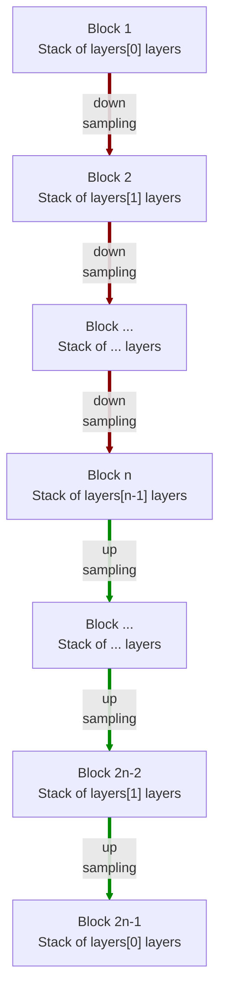

# modules.conv.AE3d

:codicons-symbol-class: Class · [:material-graph-outline: nn.Module][torch-module] · [:octicons-file-code-24: Source]({{ source.root }}/modules/conv.py#L838){ target="_blank" }

```python
net = mdnc.modules.conv.AE3d(
    channel, layers,
    kernel_size=3, in_planes=1, out_planes=1
)
```

This moule is a built-in model for 3D convolutional auto-encoder. The network structure is almost the same as [`mdnc.modules.conv.UNet3d`](../UNet3d) but all block-level skip connections are removed. Generally, using [`mdnc.modules.conv.UNet3d`](../UNet3d) should be a better choice.

The network would down-sample and up-sample the input data according to the network depth. The depth is given by the length of the argument `layers`.  The network structure is shown in the following chart:



The argument `layers` is a sequence of `#!py int`. For each block $i$, it contains `#!py layers[i-1]` repeated modern convolutional layers (see [`mdnc.modules.conv.ConvModern3d`](../ConvModern3d)). Each down-sampling or up-sampling is configured by `#!py stride=2`. The channel number would be doubled in the down-sampling route and reduced to 1/2 in the up-sampling route.

## Arguments

**Requries**

| Argument {: .w-6rem} | Type {: .w-7rem} | Description {: .w-8rem} |
| :------: | :-----: | :---------- |
| `channel` | `#!py int` | The channel number of the first hidden block (layer). After each down-sampling, the channel number would be doubled. After each up-sampling, the channel number would be reduced to 1/2. |
| `layers` | `#!py (int,)` | A sequence of layer numbers for each block. Each number represents the number of convolutional layers of a stage (block). The stage numer, i.e. the depth of the network is the length of this list. |
| `kernel_size` | `#!py int` or<br>`#!py (int, int, int)` | The kernel size of each convolutional layer. |
| `in_planes` | `#!py int` | The channel number of the input data. |
| `out_planes` | `#!py int` | The channel number of the output data. |

## Operators

### :codicons-symbol-operator: `#!py __call__`

```python
y = net(x)
```

The forward operator implemented by the `forward()` method. The input is a 3D tensor, and the output is the final output of this network.

**Requries**

| Argument {: .w-5rem} | Type {: .w-6rem} | Description {: .w-8rem} |
| :------: | :-----: | :---------- |
| `x` | `#!py torch.Tensor` | A 3D tensor, the size should be `#!py (B, C, L1, L2, L3)`, where `B` is the batch size, `C` is the input channel number, and `(L1, L2, L3)` is the input data size. |

**Returns**

| Argument {: .w-5rem} | Description {: .w-8rem} |
| :------: | :---------- |
| `y` | A 3D tensor, the size should be `#!py (B, C, L1, L2, L3)`, where `B` is the batch size, `C` is the output channel number, and `(L1, L2, L3)` is the **input** data size. |

## Properties

### :codicons-symbol-variable: `nlayers`

```python
net.nlayers
```

The total number of convolutional layers along the depth of the network.

## Examples

???+ example "Example"
    === "Codes"
        ```python linenums="1"
        import mdnc

        net = mdnc.modules.conv.AE3d(64, [2, 2, 3, 3, 3], in_planes=3, out_planes=1)
        print('The number of convolutional layers along the depth is {0}.'.format(net.nlayers))
        mdnc.contribs.torchsummary.summary(net, (3, 31, 32, 30), device='cpu')
        ```

    === "Output"
        ```
        The number of convolutional layers along the depth is 25.
        ----------------------------------------------------------------
                Layer (type)               Output Shape         Param #
        ================================================================
                    Conv3d-1       [-1, 64, 31, 32, 30]          24,000
            InstanceNorm3d-2       [-1, 64, 31, 32, 30]             128
                     PReLU-3       [-1, 64, 31, 32, 30]              64
                    Conv3d-4       [-1, 64, 31, 32, 30]         110,592
             _ConvModernNd-5       [-1, 64, 31, 32, 30]               0
            InstanceNorm3d-6       [-1, 64, 31, 32, 30]             128
                     PReLU-7       [-1, 64, 31, 32, 30]              64
                    Conv3d-8       [-1, 64, 16, 16, 15]         110,592
             _ConvModernNd-9       [-1, 64, 16, 16, 15]               0
          _BlockConvStkNd-10       [-1, 64, 16, 16, 15]               0
           InstanceNorm3d-11       [-1, 64, 16, 16, 15]             128
                    PReLU-12       [-1, 64, 16, 16, 15]              64
                   Conv3d-13      [-1, 128, 16, 16, 15]         221,184
            _ConvModernNd-14      [-1, 128, 16, 16, 15]               0
           InstanceNorm3d-15      [-1, 128, 16, 16, 15]             256
                    PReLU-16      [-1, 128, 16, 16, 15]             128
                   Conv3d-17         [-1, 128, 8, 8, 8]         442,368
            _ConvModernNd-18         [-1, 128, 8, 8, 8]               0
          _BlockConvStkNd-19         [-1, 128, 8, 8, 8]               0
           InstanceNorm3d-20         [-1, 128, 8, 8, 8]             256
                    PReLU-21         [-1, 128, 8, 8, 8]             128
                   Conv3d-22         [-1, 256, 8, 8, 8]         884,736
            _ConvModernNd-23         [-1, 256, 8, 8, 8]               0
           InstanceNorm3d-24         [-1, 256, 8, 8, 8]             512
                    PReLU-25         [-1, 256, 8, 8, 8]             256
                   Conv3d-26         [-1, 256, 8, 8, 8]       1,769,472
            _ConvModernNd-27         [-1, 256, 8, 8, 8]               0
           InstanceNorm3d-28         [-1, 256, 8, 8, 8]             512
                    PReLU-29         [-1, 256, 8, 8, 8]             256
                   Conv3d-30         [-1, 256, 4, 4, 4]       1,769,472
            _ConvModernNd-31         [-1, 256, 4, 4, 4]               0
          _BlockConvStkNd-32         [-1, 256, 4, 4, 4]               0
           InstanceNorm3d-33         [-1, 256, 4, 4, 4]             512
                    PReLU-34         [-1, 256, 4, 4, 4]             256
                   Conv3d-35         [-1, 512, 4, 4, 4]       3,538,944
            _ConvModernNd-36         [-1, 512, 4, 4, 4]               0
           InstanceNorm3d-37         [-1, 512, 4, 4, 4]           1,024
                    PReLU-38         [-1, 512, 4, 4, 4]             512
                   Conv3d-39         [-1, 512, 4, 4, 4]       7,077,888
            _ConvModernNd-40         [-1, 512, 4, 4, 4]               0
           InstanceNorm3d-41         [-1, 512, 4, 4, 4]           1,024
                    PReLU-42         [-1, 512, 4, 4, 4]             512
                   Conv3d-43         [-1, 512, 2, 2, 2]       7,077,888
            _ConvModernNd-44         [-1, 512, 2, 2, 2]               0
          _BlockConvStkNd-45         [-1, 512, 2, 2, 2]               0
           InstanceNorm3d-46         [-1, 512, 2, 2, 2]           1,024
                    PReLU-47         [-1, 512, 2, 2, 2]             512
                   Conv3d-48        [-1, 1024, 2, 2, 2]      14,155,776
            _ConvModernNd-49        [-1, 1024, 2, 2, 2]               0
           InstanceNorm3d-50        [-1, 1024, 2, 2, 2]           2,048
                    PReLU-51        [-1, 1024, 2, 2, 2]           1,024
                   Conv3d-52        [-1, 1024, 2, 2, 2]      28,311,552
            _ConvModernNd-53        [-1, 1024, 2, 2, 2]               0
           InstanceNorm3d-54        [-1, 1024, 2, 2, 2]           2,048
                    PReLU-55        [-1, 1024, 2, 2, 2]           1,024
                 Upsample-56        [-1, 1024, 4, 4, 4]               0
                   Conv3d-57         [-1, 512, 4, 4, 4]      14,155,776
            _ConvModernNd-58         [-1, 512, 4, 4, 4]               0
          _BlockConvStkNd-59         [-1, 512, 4, 4, 4]               0
           InstanceNorm3d-60         [-1, 512, 4, 4, 4]           1,024
                    PReLU-61         [-1, 512, 4, 4, 4]             512
                   Conv3d-62         [-1, 512, 4, 4, 4]       7,077,888
            _ConvModernNd-63         [-1, 512, 4, 4, 4]               0
           InstanceNorm3d-64         [-1, 512, 4, 4, 4]           1,024
                    PReLU-65         [-1, 512, 4, 4, 4]             512
                   Conv3d-66         [-1, 512, 4, 4, 4]       7,077,888
            _ConvModernNd-67         [-1, 512, 4, 4, 4]               0
           InstanceNorm3d-68         [-1, 512, 4, 4, 4]           1,024
                    PReLU-69         [-1, 512, 4, 4, 4]             512
                 Upsample-70         [-1, 512, 8, 8, 8]               0
                   Conv3d-71         [-1, 256, 8, 8, 8]       3,538,944
            _ConvModernNd-72         [-1, 256, 8, 8, 8]               0
          _BlockConvStkNd-73         [-1, 256, 8, 8, 8]               0
           InstanceNorm3d-74         [-1, 256, 8, 8, 8]             512
                    PReLU-75         [-1, 256, 8, 8, 8]             256
                   Conv3d-76         [-1, 256, 8, 8, 8]       1,769,472
            _ConvModernNd-77         [-1, 256, 8, 8, 8]               0
           InstanceNorm3d-78         [-1, 256, 8, 8, 8]             512
                    PReLU-79         [-1, 256, 8, 8, 8]             256
                   Conv3d-80         [-1, 256, 8, 8, 8]       1,769,472
            _ConvModernNd-81         [-1, 256, 8, 8, 8]               0
           InstanceNorm3d-82         [-1, 256, 8, 8, 8]             512
                    PReLU-83         [-1, 256, 8, 8, 8]             256
                 Upsample-84      [-1, 256, 16, 16, 16]               0
                   Conv3d-85      [-1, 128, 16, 16, 16]         884,736
            _ConvModernNd-86      [-1, 128, 16, 16, 16]               0
          _BlockConvStkNd-87      [-1, 128, 16, 16, 16]               0
           InstanceNorm3d-88      [-1, 128, 16, 16, 15]             256
                    PReLU-89      [-1, 128, 16, 16, 15]             128
                   Conv3d-90      [-1, 128, 16, 16, 15]         442,368
            _ConvModernNd-91      [-1, 128, 16, 16, 15]               0
           InstanceNorm3d-92      [-1, 128, 16, 16, 15]             256
                    PReLU-93      [-1, 128, 16, 16, 15]             128
                 Upsample-94      [-1, 128, 32, 32, 30]               0
                   Conv3d-95       [-1, 64, 32, 32, 30]         221,184
            _ConvModernNd-96       [-1, 64, 32, 32, 30]               0
          _BlockConvStkNd-97       [-1, 64, 32, 32, 30]               0
           InstanceNorm3d-98       [-1, 64, 31, 32, 30]             128
                    PReLU-99       [-1, 64, 31, 32, 30]              64
                  Conv3d-100       [-1, 64, 31, 32, 30]         110,592
           _ConvModernNd-101       [-1, 64, 31, 32, 30]               0
          InstanceNorm3d-102       [-1, 64, 31, 32, 30]             128
                   PReLU-103       [-1, 64, 31, 32, 30]              64
                  Conv3d-104       [-1, 64, 31, 32, 30]         110,592
           _ConvModernNd-105       [-1, 64, 31, 32, 30]               0
         _BlockConvStkNd-106       [-1, 64, 31, 32, 30]               0
                  Conv3d-107        [-1, 3, 31, 32, 30]          24,003
                    AE3d-108        [-1, 3, 31, 32, 30]               0
        ================================================================
        Total params: 102,699,843
        Trainable params: 102,699,843
        Non-trainable params: 0
        ----------------------------------------------------------------
        Input size (MB): 0.34
        Forward/backward pass size (MB): 408.27
        Params size (MB): 391.77
        Estimated Total Size (MB): 800.38
        ----------------------------------------------------------------
        ```

[torch-module]:https://pytorch.org/docs/stable/generated/torch.nn.Module.html "torch.nn.Module"
