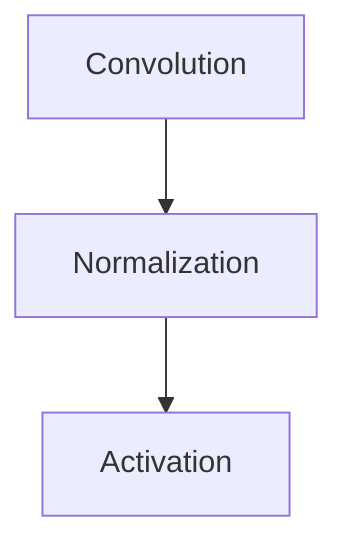
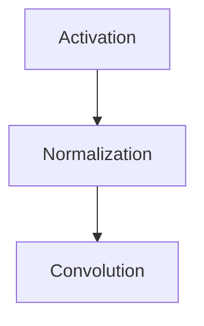

# modules.conv.ConvModern1d

:codicons-symbol-class: Class · [:material-graph-outline: nn.Module][torch-module] · [:octicons-file-code-24: Source]({{ source.root }}/modules/conv.py#L571){ target="_blank" }

```python
layer = mdnc.modules.conv.ConvModern1d(
    in_planes, out_planes,
    kernel_size=3, stride=1, padding=1, output_size=None,
    normalizer='pinst', activator='prelu', layer_order='new', scaler='down'
)
```

The implementation for the 1D modern convolutional layer. It supports both down-sampling mode and up-sampling modes. The modern convolutional layer is a stack of convolution, normalization and activation. Shown in the following chart:



In the following paper, a new op composition order is proposed for building residual block. This idea is may help the performance get improved.

[:fontawesome-regular-file-pdf: Identity Mappings in Deep Residual Networks](https://arxiv.org/abs/1603.05027)

The basic idea of this method is shown in the following diagram:



This idea is called "pre-activation" in some works. We also support this implementation. By setting the argument `#!py layer_order='new'`, the "pre-activation" method would be used for building the layer.

## Arguments

**Requries**

| Argument {: .w-6rem} | Type {: .w-4rem} | Description {: .w-8rem} |
| :------: | :-----: | :---------- |
| `in_planes` | `#!py int` | The channel number of the input data. |
| `out_planes` | `#!py int` | The channel number of the output data. |
| `kernel_size` | `#!py int` | The kernel size of this layer. |
| `stride` | `#!py int` | The stride size of this layer. When `#!py scaler='down'`, this argument serves as the down-sampling factor. When `#!py scaler='up'`, this argument serves as the up-sampling factor. |
| `padding` | `#!py int` | The padding size of this layer. The zero padding would be performed on both edges of the input before the convolution. |
| `output_size` | `#!py int` | The length of the output data. This option is only used when `#!py scaler='up'`. When setting this value, the size of the up-sampling would be given explicitly and the argument `stride` would not be used. |
| `normalizer` | `#!py str` | The normalization method, could be: <ul> <li>`#!py 'batch'`: Batch normalization.</li> <li>`#!py 'inst'`: Instance normalization.</li> <li>`#!py 'pinst'`: Instance normalization with tunable rescaling parameters.</li> <li>`#!py 'null'`: Without normalization, would falls back to the "convolution + activation" form. In this case, the `#!py layer_order='new'` would not take effects.</li> </ul> |
| `activator` | `#!py str` | The activation method, could be: `#!py 'prelu'`, `#!py 'relu'`, `#!py 'null'`. |
| `layer_order` | `#!py str` | The sub-layer composition order, could be: <ul> <li>`#!py 'new'`: normalization + activation + convolution.</li> <li>`#!py 'old'`: convolution + normalization + activation.</li> </ul> |
| `scaler` | `#!py str` | The scaling method, could be: <ul> <li>`#!py 'down'`: the argument `stride` would be used for down-sampling.</li> <li>`#!py 'up'`: the argument `stride` would be used for up-sampling (equivalent to transposed convolution).</li> </ul> |

## Operators

### :codicons-symbol-operator: `#!py __call__`

```python
y = layer(x)
```

The forward operator implemented by the `forward()` method. The input is a 1D tensor, and the output is the final output of this layer.

**Requries**

| Argument {: .w-5rem} | Type {: .w-6rem} | Description {: .w-8rem} |
| :------: | :-----: | :---------- |
| `x` | `#!py torch.Tensor` | A 1D tensor, the size should be `#!py (B, C, L)`, where `B` is the batch size, `C` is the input channel number, and `L` is the input data length. |

**Returns**

| Argument {: .w-5rem} | Description {: .w-8rem} |
| :------: | :---------- |
| `y` | A 1D tensor, the size should be `#!py (B, C, L)`, where `B` is the batch size, `C` is the output channel number, and `L` is the output data length. |

## Examples

In the first example, we build a modern convolutional layer with 1/2 down-sampling and same padding.

???+ example "Example 1"
    === "Codes"
        ```python linenums="1"
        import mdnc

        layer = mdnc.modules.conv.ConvModern1d(16, 32, kernel_size=3, stride=2, padding=1, scaler='down')
        mdnc.contribs.torchsummary.summary(layer, (16, 255), device='cpu')
        ```

    === "Output"
        ```
        ----------------------------------------------------------------
                Layer (type)               Output Shape         Param #
        ================================================================
            InstanceNorm1d-1              [-1, 16, 255]              32
                     PReLU-2              [-1, 16, 255]              16
                    Conv1d-3              [-1, 32, 128]           1,536
              ConvModern1d-4              [-1, 32, 128]               0
        ================================================================
        Total params: 1,584
        Trainable params: 1,584
        Non-trainable params: 0
        ----------------------------------------------------------------
        Input size (MB): 0.02
        Forward/backward pass size (MB): 0.12
        Params size (MB): 0.01
        Estimated Total Size (MB): 0.15
        ----------------------------------------------------------------
        ```

Note that the output length would be `128` in this example, because the same padding is used for the input. In this case, if we want to make a reverse layer, we could specify the `output_size` for the up-sampling layer, for example:

???+ example "Example 2"
    === "Codes"
        ```python linenums="1"
        import mdnc

        layer = mdnc.modules.conv.ConvModern1d(32, 16, kernel_size=3, output_size=255, padding=1, scaler='up')
        mdnc.contribs.torchsummary.summary(layer, (32, 128), device='cpu')
        ```

    === "Output"
        ```
        ----------------------------------------------------------------
                Layer (type)               Output Shape         Param #
        ================================================================
            InstanceNorm1d-1              [-1, 32, 128]              64
                     PReLU-2              [-1, 32, 128]              32
                  Upsample-3              [-1, 32, 255]               0
                    Conv1d-4              [-1, 16, 255]           1,536
              ConvModern1d-5              [-1, 16, 255]               0
        ================================================================
        Total params: 1,632
        Trainable params: 1,632
        Non-trainable params: 0
        ----------------------------------------------------------------
        Input size (MB): 0.02
        Forward/backward pass size (MB): 0.19
        Params size (MB): 0.01
        Estimated Total Size (MB): 0.21
        ----------------------------------------------------------------
        ```

[torch-module]:https://pytorch.org/docs/stable/generated/torch.nn.Module.html "torch.nn.Module"
