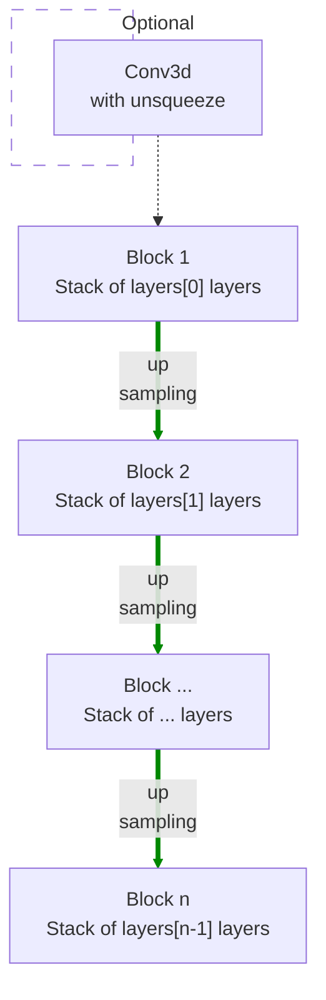

# modules.conv.DecoderNet3d

:codicons-symbol-class: Class · [:material-graph-outline: nn.Module][torch-module] · [:octicons-file-code-24: Source]({{ source.root }}/modules/conv.py#L999){ target="_blank" }

```python
net = mdnc.modules.conv.DecoderNet3d(
     channel, layers, out_size,
     kernel_size=3, in_length=2, out_planes=1
)
```

This moule is a built-in model for 3D convolutional decoder network. This network could be used as a part of the auto-encoder, or just a network for up-sampling (or generating) data.

The network would up-sample the input data according to the network depth. The depth is given by the length of the argument `layers`.  The network structure is shown in the following chart:



The argument `layers` is a sequence of `#!py int`. For each block $i$, it contains `#!py layers[i-1]` repeated modern convolutional layers (see [`mdnc.modules.conv.ConvModern3d`](../ConvModern3d)). Each up-sampling is configured by `#!py stride=2`. The channel number would be doubled in the up-sampling route. An optional unsqueezer and convolutional layer could be prepended to the first layer when the argument `#!py in_length != None`. This optional layer is used for converting the vector features in initial feature maps.

## Arguments

**Requries**

| Argument {: .w-6rem} | Type {: .w-7rem} | Description {: .w-8rem} |
| :------: | :-----: | :---------- |
| `channel` | `#!py int` | The channel number of the first hidden block (layer). After each down-sampling, the channel number would be doubled. |
| `layers` | `#!py (int,)` | A sequence of layer numbers for each block. Each number represents the number of convolutional layers of a stage (block). The stage numer, i.e. the depth of the network is the length of this list. |
| `out_size` | `#!py int` or<br>`#!py (int, int, int)` | The size of the output data. This argument needs to be specified by users, because the network needs to configure its layers according to the output size. |
| `kernel_size` | `#!py int` or<br>`#!py (int, int, int)` | The kernel size of each convolutional layer. |
| `in_length` | `#!py int` | The length of the input vector, if not set, the input needs to be feature maps. See the property [`input_size`](#input_size) to check the input data size in this case. |
| `out_planes` | `#!py int` | The channel number of the output data. |

## Operators

### :codicons-symbol-operator: `#!py __call__`

```python
y = net(x)
```

The forward operator implemented by the `forward()` method. The input data is a tensor with a size determined by configurations. The output is a 3D tensor. The channel number of the output is specified by the argument `out_planes`.

**Requries**

| Argument {: .w-5rem} | Type {: .w-6rem} | Description {: .w-8rem} |
| :------: | :-----: | :---------- |
| `x` | `#!py torch.Tensor` | A tensor, <ul> <li>When `#!py in_length is None`: the size should be `#!py (B, L)`, where `B` is the batch size, and `L` is `in_length`.</li> <li>When `#!py in_length != None`: the size should be `#!py (B, C, L1, L2, L3)`, where `B` is the batch size, `C` and `(L1, L2, L3)` are the channel number and the size of the input feature maps (see [`input_size`](#input_size)) respectively.</li> </ul> |

**Returns**

| Argument {: .w-5rem} | Description {: .w-8rem} |
| :------: | :---------- |
| `y` | A 3D tensor, the size should be `#!py (B, C, L1, L2, L3)`, where `B` is the batch size, `C` is the input channel number, and `(L1, L2, L3)` is the output data size specified by the argument `out_size`. |

## Properties

### :codicons-symbol-variable: `nlayers`

```python
net.nlayers
```

The total number of convolutional layers along the depth of the network. This value would not take the fully-connected layer into consideration.

-----

### :codicons-symbol-variable: `input_size`

```python
net.input_size
```

The size of the input data size (a `#!py tuple`). This property is useful when `#!py in_length is None`. In this case, the input size is determined by the network.

??? warning
    This size contains the channel number (as the first element), because the input channel number is also determined by network when `#!py in_length is None`.

## Examples

???+ example "Example 1"
    === "Codes"
        ```python linenums="1"
        import mdnc

        net = mdnc.modules.conv.DecoderNet3d(64, [3, 3, 3, 3, 3], in_length=32, out_size=(31, 32, 30), out_planes=3)
        print('The number of convolutional layers along the depth is {0}.'.format(net.nlayers))
        print('The input size is {0}.'.format(net.input_size))
        mdnc.contribs.torchsummary.summary(net, net.input_size, device='cpu')
        ```

    === "Output"
        ```
        The number of convolutional layers along the depth is 18.
        The input size is (32,).
        ----------------------------------------------------------------
                Layer (type)               Output Shape         Param #
        ================================================================
                    Conv3d-1        [-1, 1024, 1, 1, 1]          33,792
                    Conv3d-2        [-1, 1024, 1, 1, 1]      28,311,552
            InstanceNorm3d-3        [-1, 1024, 1, 1, 1]           2,048
                     PReLU-4        [-1, 1024, 1, 1, 1]           1,024
                    Conv3d-5         [-1, 512, 1, 1, 1]      14,155,776
             _ConvModernNd-6         [-1, 512, 1, 1, 1]               0
            InstanceNorm3d-7         [-1, 512, 1, 1, 1]           1,024
                     PReLU-8         [-1, 512, 1, 1, 1]             512
                    Conv3d-9         [-1, 512, 1, 1, 1]       7,077,888
            _ConvModernNd-10         [-1, 512, 1, 1, 1]               0
           InstanceNorm3d-11         [-1, 512, 1, 1, 1]           1,024
                    PReLU-12         [-1, 512, 1, 1, 1]             512
                 Upsample-13         [-1, 512, 2, 2, 2]               0
                   Conv3d-14         [-1, 512, 2, 2, 2]       7,077,888
            _ConvModernNd-15         [-1, 512, 2, 2, 2]               0
          _BlockConvStkNd-16         [-1, 512, 2, 2, 2]               0
           InstanceNorm3d-17         [-1, 512, 2, 2, 2]           1,024
                    PReLU-18         [-1, 512, 2, 2, 2]             512
                   Conv3d-19         [-1, 256, 2, 2, 2]       3,538,944
            _ConvModernNd-20         [-1, 256, 2, 2, 2]               0
           InstanceNorm3d-21         [-1, 256, 2, 2, 2]             512
                    PReLU-22         [-1, 256, 2, 2, 2]             256
                   Conv3d-23         [-1, 256, 2, 2, 2]       1,769,472
            _ConvModernNd-24         [-1, 256, 2, 2, 2]               0
           InstanceNorm3d-25         [-1, 256, 2, 2, 2]             512
                    PReLU-26         [-1, 256, 2, 2, 2]             256
                 Upsample-27         [-1, 256, 4, 4, 4]               0
                   Conv3d-28         [-1, 256, 4, 4, 4]       1,769,472
            _ConvModernNd-29         [-1, 256, 4, 4, 4]               0
          _BlockConvStkNd-30         [-1, 256, 4, 4, 4]               0
           InstanceNorm3d-31         [-1, 256, 4, 4, 4]             512
                    PReLU-32         [-1, 256, 4, 4, 4]             256
                   Conv3d-33         [-1, 128, 4, 4, 4]         884,736
            _ConvModernNd-34         [-1, 128, 4, 4, 4]               0
           InstanceNorm3d-35         [-1, 128, 4, 4, 4]             256
                    PReLU-36         [-1, 128, 4, 4, 4]             128
                   Conv3d-37         [-1, 128, 4, 4, 4]         442,368
            _ConvModernNd-38         [-1, 128, 4, 4, 4]               0
           InstanceNorm3d-39         [-1, 128, 4, 4, 4]             256
                    PReLU-40         [-1, 128, 4, 4, 4]             128
                 Upsample-41         [-1, 128, 8, 8, 8]               0
                   Conv3d-42         [-1, 128, 8, 8, 8]         442,368
            _ConvModernNd-43         [-1, 128, 8, 8, 8]               0
          _BlockConvStkNd-44         [-1, 128, 8, 8, 8]               0
           InstanceNorm3d-45         [-1, 128, 8, 8, 8]             256
                    PReLU-46         [-1, 128, 8, 8, 8]             128
                   Conv3d-47          [-1, 64, 8, 8, 8]         221,184
            _ConvModernNd-48          [-1, 64, 8, 8, 8]               0
           InstanceNorm3d-49          [-1, 64, 8, 8, 8]             128
                    PReLU-50          [-1, 64, 8, 8, 8]              64
                   Conv3d-51          [-1, 64, 8, 8, 8]         110,592
            _ConvModernNd-52          [-1, 64, 8, 8, 8]               0
           InstanceNorm3d-53          [-1, 64, 8, 8, 8]             128
                    PReLU-54          [-1, 64, 8, 8, 8]              64
                 Upsample-55       [-1, 64, 16, 16, 16]               0
                   Conv3d-56       [-1, 64, 16, 16, 16]         110,592
            _ConvModernNd-57       [-1, 64, 16, 16, 16]               0
          _BlockConvStkNd-58       [-1, 64, 16, 16, 16]               0
           InstanceNorm3d-59       [-1, 64, 16, 16, 15]             128
                    PReLU-60       [-1, 64, 16, 16, 15]              64
                   Conv3d-61       [-1, 64, 16, 16, 15]         110,592
            _ConvModernNd-62       [-1, 64, 16, 16, 15]               0
           InstanceNorm3d-63       [-1, 64, 16, 16, 15]             128
                    PReLU-64       [-1, 64, 16, 16, 15]              64
                   Conv3d-65       [-1, 64, 16, 16, 15]         110,592
            _ConvModernNd-66       [-1, 64, 16, 16, 15]               0
           InstanceNorm3d-67       [-1, 64, 16, 16, 15]             128
                    PReLU-68       [-1, 64, 16, 16, 15]              64
                 Upsample-69       [-1, 64, 32, 32, 30]               0
                   Conv3d-70       [-1, 64, 32, 32, 30]         110,592
            _ConvModernNd-71       [-1, 64, 32, 32, 30]               0
          _BlockConvStkNd-72       [-1, 64, 32, 32, 30]               0
                   Conv3d-73        [-1, 3, 31, 32, 30]          24,003
             DecoderNet3d-74        [-1, 3, 31, 32, 30]               0
        ================================================================
        Total params: 66,314,499
        Trainable params: 66,314,499
        Non-trainable params: 0
        ----------------------------------------------------------------
        Input size (MB): 0.00
        Forward/backward pass size (MB): 94.74
        Params size (MB): 252.97
        Estimated Total Size (MB): 347.71
        ----------------------------------------------------------------
        ```

???+ example "Example 2"
    === "Codes"
        ```python linenums="1"
        import mdnc

        net = mdnc.modules.conv.DecoderNet3d(64, [3, 3, 3, 3, 3], in_length=None, out_size=(31, 32, 30), out_planes=3)
        print('The number of convolutional layers along the depth is {0}.'.format(net.nlayers))
        print('The input size is {0}.'.format(net.input_size))
        mdnc.contribs.torchsummary.summary(net, net.input_size, device='cpu')
        ```

    === "Output"
        ```
        The number of convolutional layers along the depth is 17.
        The input size is (1024, 1, 1, 1).
        ----------------------------------------------------------------
                Layer (type)               Output Shape         Param #
        ================================================================
                    Conv3d-1        [-1, 1024, 1, 1, 1]      28,311,552
            InstanceNorm3d-2        [-1, 1024, 1, 1, 1]           2,048
                     PReLU-3        [-1, 1024, 1, 1, 1]           1,024
                    Conv3d-4         [-1, 512, 1, 1, 1]      14,155,776
             _ConvModernNd-5         [-1, 512, 1, 1, 1]               0
            InstanceNorm3d-6         [-1, 512, 1, 1, 1]           1,024
                     PReLU-7         [-1, 512, 1, 1, 1]             512
                    Conv3d-8         [-1, 512, 1, 1, 1]       7,077,888
             _ConvModernNd-9         [-1, 512, 1, 1, 1]               0
           InstanceNorm3d-10         [-1, 512, 1, 1, 1]           1,024
                    PReLU-11         [-1, 512, 1, 1, 1]             512
                 Upsample-12         [-1, 512, 2, 2, 2]               0
                   Conv3d-13         [-1, 512, 2, 2, 2]       7,077,888
            _ConvModernNd-14         [-1, 512, 2, 2, 2]               0
          _BlockConvStkNd-15         [-1, 512, 2, 2, 2]               0
           InstanceNorm3d-16         [-1, 512, 2, 2, 2]           1,024
                    PReLU-17         [-1, 512, 2, 2, 2]             512
                   Conv3d-18         [-1, 256, 2, 2, 2]       3,538,944
            _ConvModernNd-19         [-1, 256, 2, 2, 2]               0
           InstanceNorm3d-20         [-1, 256, 2, 2, 2]             512
                    PReLU-21         [-1, 256, 2, 2, 2]             256
                   Conv3d-22         [-1, 256, 2, 2, 2]       1,769,472
            _ConvModernNd-23         [-1, 256, 2, 2, 2]               0
           InstanceNorm3d-24         [-1, 256, 2, 2, 2]             512
                    PReLU-25         [-1, 256, 2, 2, 2]             256
                 Upsample-26         [-1, 256, 4, 4, 4]               0
                   Conv3d-27         [-1, 256, 4, 4, 4]       1,769,472
            _ConvModernNd-28         [-1, 256, 4, 4, 4]               0
          _BlockConvStkNd-29         [-1, 256, 4, 4, 4]               0
           InstanceNorm3d-30         [-1, 256, 4, 4, 4]             512
                    PReLU-31         [-1, 256, 4, 4, 4]             256
                   Conv3d-32         [-1, 128, 4, 4, 4]         884,736
            _ConvModernNd-33         [-1, 128, 4, 4, 4]               0
           InstanceNorm3d-34         [-1, 128, 4, 4, 4]             256
                    PReLU-35         [-1, 128, 4, 4, 4]             128
                   Conv3d-36         [-1, 128, 4, 4, 4]         442,368
            _ConvModernNd-37         [-1, 128, 4, 4, 4]               0
           InstanceNorm3d-38         [-1, 128, 4, 4, 4]             256
                    PReLU-39         [-1, 128, 4, 4, 4]             128
                 Upsample-40         [-1, 128, 8, 8, 8]               0
                   Conv3d-41         [-1, 128, 8, 8, 8]         442,368
            _ConvModernNd-42         [-1, 128, 8, 8, 8]               0
          _BlockConvStkNd-43         [-1, 128, 8, 8, 8]               0
           InstanceNorm3d-44         [-1, 128, 8, 8, 8]             256
                    PReLU-45         [-1, 128, 8, 8, 8]             128
                   Conv3d-46          [-1, 64, 8, 8, 8]         221,184
            _ConvModernNd-47          [-1, 64, 8, 8, 8]               0
           InstanceNorm3d-48          [-1, 64, 8, 8, 8]             128
                    PReLU-49          [-1, 64, 8, 8, 8]              64
                   Conv3d-50          [-1, 64, 8, 8, 8]         110,592
            _ConvModernNd-51          [-1, 64, 8, 8, 8]               0
           InstanceNorm3d-52          [-1, 64, 8, 8, 8]             128
                    PReLU-53          [-1, 64, 8, 8, 8]              64
                 Upsample-54       [-1, 64, 16, 16, 16]               0
                   Conv3d-55       [-1, 64, 16, 16, 16]         110,592
            _ConvModernNd-56       [-1, 64, 16, 16, 16]               0
          _BlockConvStkNd-57       [-1, 64, 16, 16, 16]               0
           InstanceNorm3d-58       [-1, 64, 16, 16, 15]             128
                    PReLU-59       [-1, 64, 16, 16, 15]              64
                   Conv3d-60       [-1, 64, 16, 16, 15]         110,592
            _ConvModernNd-61       [-1, 64, 16, 16, 15]               0
           InstanceNorm3d-62       [-1, 64, 16, 16, 15]             128
                    PReLU-63       [-1, 64, 16, 16, 15]              64
                   Conv3d-64       [-1, 64, 16, 16, 15]         110,592
            _ConvModernNd-65       [-1, 64, 16, 16, 15]               0
           InstanceNorm3d-66       [-1, 64, 16, 16, 15]             128
                    PReLU-67       [-1, 64, 16, 16, 15]              64
                 Upsample-68       [-1, 64, 32, 32, 30]               0
                   Conv3d-69       [-1, 64, 32, 32, 30]         110,592
            _ConvModernNd-70       [-1, 64, 32, 32, 30]               0
          _BlockConvStkNd-71       [-1, 64, 32, 32, 30]               0
                   Conv3d-72        [-1, 3, 31, 32, 30]          24,003
             DecoderNet3d-73        [-1, 3, 31, 32, 30]               0
        ================================================================
        Total params: 66,280,707
        Trainable params: 66,280,707
        Non-trainable params: 0
        ----------------------------------------------------------------
        Input size (MB): 0.00
        Forward/backward pass size (MB): 94.73
        Params size (MB): 252.84
        Estimated Total Size (MB): 347.57
        ----------------------------------------------------------------
        ```

[torch-module]:https://pytorch.org/docs/stable/generated/torch.nn.Module.html "torch.nn.Module"
