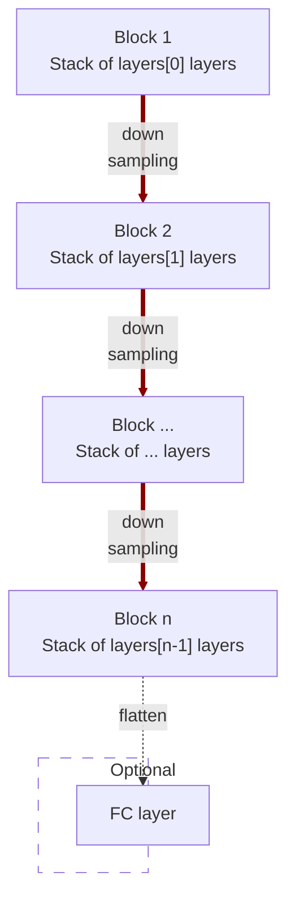

# modules.conv.EncoderNet1d

:codicons-symbol-class: Class · [:material-graph-outline: nn.Module][torch-module] · [:octicons-file-code-24: Source]({{ source.root }}/modules/conv.py#L862){ target="_blank" }

```python
net = mdnc.modules.conv.EncoderNet1d(
    channel, layers,
    kernel_size=3, in_planes=1, out_length=2
)
```

This moule is a built-in model for 1D convolutional encoder network. This network could be used as a part of the auto-encoder, or just a network for down-sampling data.

The network would down-sample the input data according to the network depth. The depth is given by the length of the argument `layers`.  The network structure is shown in the following chart:



The argument `layers` is a sequence of `#!py int`. For each block $i$, it contains `#!py layers[i-1]` repeated modern convolutional layers (see [`mdnc.modules.conv.ConvModern1d`](../ConvModern1d)). Each down-sampling is configured by `#!py stride=2`. The channel number would be doubled in the down-sampling route. An optional flattener and fully-connected layer could be appended to the last layer when the argument `#!py out_length != None`.

## Arguments

**Requries**

| Argument {: .w-6rem} | Type {: .w-4rem} | Description {: .w-8rem} |
| :------: | :-----: | :---------- |
| `channel` | `#!py int` | The channel number of the first hidden block (layer). After each down-sampling, the channel number would be doubled. |
| `layers` | `#!py (int,)` | A sequence of layer numbers for each block. Each number represents the number of convolutional layers of a stage (block). The stage numer, i.e. the depth of the network is the length of this list. |
| `kernel_size` | `#!py int` | The kernel size of each convolutional layer. |
| `in_planes` | `#!py int` | The channel number of the input data. |
| `out_length` | `#!py int` | The length of the output vector, if not set, the output would not be flattened. |

## Operators

### :codicons-symbol-operator: `#!py __call__`

```python
y = net(x)
```

The forward operator implemented by the `forward()` method. The input is a 1D tensor, and the output is the final output of this network.

**Requries**

| Argument {: .w-5rem} | Type {: .w-6rem} | Description {: .w-8rem} |
| :------: | :-----: | :---------- |
| `x` | `#!py torch.Tensor` | A 1D tensor, the size should be `#!py (B, C, L)`, where `B` is the batch size, `C` is the input channel number, and `L` is the input data length. |

**Returns**

| Argument {: .w-5rem} | Description {: .w-8rem} |
| :------: | :---------- |
| `y` | A tensor, <ul> <li>When `#!py out_length is None`: the size should be `#!py (B, L)`, where `B` is the batch size, and `L` is `out_length`.</li> <li>When `#!py out_length != None`: the size should be `#!py (B, C, L)`, where `B` is the batch size, `C` and `L` are the channel number and the length of the last output stage (block) respectively.</li> </ul> |

## Properties

### :codicons-symbol-variable: `nlayers`

```python
net.nlayers
```

The total number of convolutional layers along the depth of the network. This value would not take the fully-connected layer into consideration.

## Examples

???+ example "Example 1"
    === "Codes"
        ```python linenums="1"
        import mdnc

        net = mdnc.modules.conv.EncoderNet1d(64, [3, 3, 3, 3, 3], in_planes=3, out_length=32)
        print('The number of convolutional layers along the depth is {0}.'.format(net.nlayers))
        mdnc.contribs.torchsummary.summary(net, (3, 128), device='cpu')
        ```

    === "Output"
        ```
        The number of convolutional layers along the depth is 17.
        ----------------------------------------------------------------
                Layer (type)               Output Shape         Param #
        ================================================================
                    Conv1d-1              [-1, 64, 128]             960
            InstanceNorm1d-2              [-1, 64, 128]             128
                     PReLU-3              [-1, 64, 128]              64
                    Conv1d-4              [-1, 64, 128]          12,288
             _ConvModernNd-5              [-1, 64, 128]               0
            InstanceNorm1d-6              [-1, 64, 128]             128
                     PReLU-7              [-1, 64, 128]              64
                    Conv1d-8              [-1, 64, 128]          12,288
             _ConvModernNd-9              [-1, 64, 128]               0
           InstanceNorm1d-10              [-1, 64, 128]             128
                    PReLU-11              [-1, 64, 128]              64
                   Conv1d-12               [-1, 64, 64]          12,288
            _ConvModernNd-13               [-1, 64, 64]               0
          _BlockConvStkNd-14               [-1, 64, 64]               0
           InstanceNorm1d-15               [-1, 64, 64]             128
                    PReLU-16               [-1, 64, 64]              64
                   Conv1d-17              [-1, 128, 64]          24,576
            _ConvModernNd-18              [-1, 128, 64]               0
           InstanceNorm1d-19              [-1, 128, 64]             256
                    PReLU-20              [-1, 128, 64]             128
                   Conv1d-21              [-1, 128, 64]          49,152
            _ConvModernNd-22              [-1, 128, 64]               0
           InstanceNorm1d-23              [-1, 128, 64]             256
                    PReLU-24              [-1, 128, 64]             128
                   Conv1d-25              [-1, 128, 32]          49,152
            _ConvModernNd-26              [-1, 128, 32]               0
          _BlockConvStkNd-27              [-1, 128, 32]               0
           InstanceNorm1d-28              [-1, 128, 32]             256
                    PReLU-29              [-1, 128, 32]             128
                   Conv1d-30              [-1, 256, 32]          98,304
            _ConvModernNd-31              [-1, 256, 32]               0
           InstanceNorm1d-32              [-1, 256, 32]             512
                    PReLU-33              [-1, 256, 32]             256
                   Conv1d-34              [-1, 256, 32]         196,608
            _ConvModernNd-35              [-1, 256, 32]               0
           InstanceNorm1d-36              [-1, 256, 32]             512
                    PReLU-37              [-1, 256, 32]             256
                   Conv1d-38              [-1, 256, 16]         196,608
            _ConvModernNd-39              [-1, 256, 16]               0
          _BlockConvStkNd-40              [-1, 256, 16]               0
           InstanceNorm1d-41              [-1, 256, 16]             512
                    PReLU-42              [-1, 256, 16]             256
                   Conv1d-43              [-1, 512, 16]         393,216
            _ConvModernNd-44              [-1, 512, 16]               0
           InstanceNorm1d-45              [-1, 512, 16]           1,024
                    PReLU-46              [-1, 512, 16]             512
                   Conv1d-47              [-1, 512, 16]         786,432
            _ConvModernNd-48              [-1, 512, 16]               0
           InstanceNorm1d-49              [-1, 512, 16]           1,024
                    PReLU-50              [-1, 512, 16]             512
                   Conv1d-51               [-1, 512, 8]         786,432
            _ConvModernNd-52               [-1, 512, 8]               0
          _BlockConvStkNd-53               [-1, 512, 8]               0
           InstanceNorm1d-54               [-1, 512, 8]           1,024
                    PReLU-55               [-1, 512, 8]             512
                   Conv1d-56              [-1, 1024, 8]       1,572,864
            _ConvModernNd-57              [-1, 1024, 8]               0
           InstanceNorm1d-58              [-1, 1024, 8]           2,048
                    PReLU-59              [-1, 1024, 8]           1,024
                   Conv1d-60              [-1, 1024, 8]       3,145,728
            _ConvModernNd-61              [-1, 1024, 8]               0
           InstanceNorm1d-62              [-1, 1024, 8]           2,048
                    PReLU-63              [-1, 1024, 8]           1,024
                   Conv1d-64              [-1, 1024, 4]       3,145,728
            _ConvModernNd-65              [-1, 1024, 4]               0
          _BlockConvStkNd-66              [-1, 1024, 4]               0
                   Conv1d-67              [-1, 1024, 4]       3,146,752
        AdaptiveAvgPool1d-68              [-1, 1024, 1]               0
                   Linear-69                   [-1, 32]          32,800
             EncoderNet1d-70                   [-1, 32]               0
        ================================================================
        Total params: 13,677,152
        Trainable params: 13,677,152
        Non-trainable params: 0
        ----------------------------------------------------------------
        Input size (MB): 0.00
        Forward/backward pass size (MB): 3.45
        Params size (MB): 52.17
        Estimated Total Size (MB): 55.62
        ----------------------------------------------------------------
        ```

???+ example "Example 2"
    === "Codes"
        ```python linenums="1"
        import mdnc

        net = mdnc.modules.conv.EncoderNet1d(64, [3, 3, 3, 3, 3], in_planes=3, out_length=None)
        print('The number of convolutional layers along the depth is {0}.'.format(net.nlayers))
        mdnc.contribs.torchsummary.summary(net, (3, 128), device='cpu')
        ```

    === "Output"
        ```
        The number of convolutional layers along the depth is 17.
        ----------------------------------------------------------------
                Layer (type)               Output Shape         Param #
        ================================================================
                    Conv1d-1              [-1, 64, 128]             960
            InstanceNorm1d-2              [-1, 64, 128]             128
                     PReLU-3              [-1, 64, 128]              64
                    Conv1d-4              [-1, 64, 128]          12,288
             _ConvModernNd-5              [-1, 64, 128]               0
            InstanceNorm1d-6              [-1, 64, 128]             128
                     PReLU-7              [-1, 64, 128]              64
                    Conv1d-8              [-1, 64, 128]          12,288
             _ConvModernNd-9              [-1, 64, 128]               0
           InstanceNorm1d-10              [-1, 64, 128]             128
                    PReLU-11              [-1, 64, 128]              64
                   Conv1d-12               [-1, 64, 64]          12,288
            _ConvModernNd-13               [-1, 64, 64]               0
          _BlockConvStkNd-14               [-1, 64, 64]               0
           InstanceNorm1d-15               [-1, 64, 64]             128
                    PReLU-16               [-1, 64, 64]              64
                   Conv1d-17              [-1, 128, 64]          24,576
            _ConvModernNd-18              [-1, 128, 64]               0
           InstanceNorm1d-19              [-1, 128, 64]             256
                    PReLU-20              [-1, 128, 64]             128
                   Conv1d-21              [-1, 128, 64]          49,152
            _ConvModernNd-22              [-1, 128, 64]               0
           InstanceNorm1d-23              [-1, 128, 64]             256
                    PReLU-24              [-1, 128, 64]             128
                   Conv1d-25              [-1, 128, 32]          49,152
            _ConvModernNd-26              [-1, 128, 32]               0
          _BlockConvStkNd-27              [-1, 128, 32]               0
           InstanceNorm1d-28              [-1, 128, 32]             256
                    PReLU-29              [-1, 128, 32]             128
                   Conv1d-30              [-1, 256, 32]          98,304
            _ConvModernNd-31              [-1, 256, 32]               0
           InstanceNorm1d-32              [-1, 256, 32]             512
                    PReLU-33              [-1, 256, 32]             256
                   Conv1d-34              [-1, 256, 32]         196,608
            _ConvModernNd-35              [-1, 256, 32]               0
           InstanceNorm1d-36              [-1, 256, 32]             512
                    PReLU-37              [-1, 256, 32]             256
                   Conv1d-38              [-1, 256, 16]         196,608
            _ConvModernNd-39              [-1, 256, 16]               0
          _BlockConvStkNd-40              [-1, 256, 16]               0
           InstanceNorm1d-41              [-1, 256, 16]             512
                    PReLU-42              [-1, 256, 16]             256
                   Conv1d-43              [-1, 512, 16]         393,216
            _ConvModernNd-44              [-1, 512, 16]               0
           InstanceNorm1d-45              [-1, 512, 16]           1,024
                    PReLU-46              [-1, 512, 16]             512
                   Conv1d-47              [-1, 512, 16]         786,432
            _ConvModernNd-48              [-1, 512, 16]               0
           InstanceNorm1d-49              [-1, 512, 16]           1,024
                    PReLU-50              [-1, 512, 16]             512
                   Conv1d-51               [-1, 512, 8]         786,432
            _ConvModernNd-52               [-1, 512, 8]               0
          _BlockConvStkNd-53               [-1, 512, 8]               0
           InstanceNorm1d-54               [-1, 512, 8]           1,024
                    PReLU-55               [-1, 512, 8]             512
                   Conv1d-56              [-1, 1024, 8]       1,572,864
            _ConvModernNd-57              [-1, 1024, 8]               0
           InstanceNorm1d-58              [-1, 1024, 8]           2,048
                    PReLU-59              [-1, 1024, 8]           1,024
                   Conv1d-60              [-1, 1024, 8]       3,145,728
            _ConvModernNd-61              [-1, 1024, 8]               0
           InstanceNorm1d-62              [-1, 1024, 8]           2,048
                    PReLU-63              [-1, 1024, 8]           1,024
                   Conv1d-64              [-1, 1024, 4]       3,145,728
            _ConvModernNd-65              [-1, 1024, 4]               0
          _BlockConvStkNd-66              [-1, 1024, 4]               0
                   Conv1d-67              [-1, 1024, 4]       3,146,752
             EncoderNet1d-68              [-1, 1024, 4]               0
        ================================================================
        Total params: 13,644,352
        Trainable params: 13,644,352
        Non-trainable params: 0
        ----------------------------------------------------------------
        Input size (MB): 0.00
        Forward/backward pass size (MB): 3.47
        Params size (MB): 52.05
        Estimated Total Size (MB): 55.52
        ----------------------------------------------------------------
        ```

[torch-module]:https://pytorch.org/docs/stable/generated/torch.nn.Module.html "torch.nn.Module"
