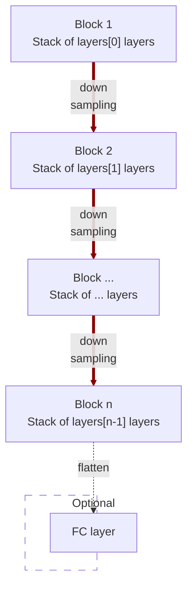

# modules.conv.EncoderNet2d

:codicons-symbol-class: Class · [:material-graph-outline: nn.Module][torch-module] · [:octicons-file-code-24: Source]({{ source.root }}/modules/conv.py#L887){ target="_blank" }

```python
net = mdnc.modules.conv.EncoderNet2d(
    channel, layers,
    kernel_size=3, in_planes=1, out_length=2
)
```

This moule is a built-in model for 2D convolutional encoder network. This network could be used as a part of the auto-encoder, or just a network for down-sampling data.

The network would down-sample the input data according to the network depth. The depth is given by the length of the argument `layers`.  The network structure is shown in the following chart:



The argument `layers` is a sequence of `#!py int`. For each block $i$, it contains `#!py layers[i-1]` repeated modern convolutional layers (see [`mdnc.modules.conv.ConvModern2d`](../ConvModern2d)). Each down-sampling is configured by `#!py stride=2`. The channel number would be doubled in the down-sampling route. An optional flattener and fully-connected layer could be appended to the last layer when the argument `#!py out_length != None`.

## Arguments

**Requries**

| Argument {: .w-6rem} | Type {: .w-6rem} | Description {: .w-8rem} |
| :------: | :-----: | :---------- |
| `channel` | `#!py int` | The channel number of the first hidden block (layer). After each down-sampling, the channel number would be doubled. |
| `layers` | `#!py (int,)` | A sequence of layer numbers for each block. Each number represents the number of convolutional layers of a stage (block). The stage numer, i.e. the depth of the network is the length of this list. |
| `kernel_size` | `#!py int` or<br>`#!py (int, int)` | The kernel size of each convolutional layer. |
| `in_planes` | `#!py int` | The channel number of the input data. |
| `out_length` | `#!py int` | The length of the output vector, if not set, the output would not be flattened. |

## Operators

### :codicons-symbol-operator: `#!py __call__`

```python
y = net(x)
```

The forward operator implemented by the `forward()` method. The input is a 2D tensor, and the output is the final output of this network.

**Requries**

| Argument {: .w-5rem} | Type {: .w-6rem} | Description {: .w-8rem} |
| :------: | :-----: | :---------- |
| `x` | `#!py torch.Tensor` | A 2D tensor, the size should be `#!py (B, C, L1, L2)`, where `B` is the batch size, `C` is the input channel number, and `(L1, L2)` is the input data size. |

**Returns**

| Argument {: .w-5rem} | Description {: .w-8rem} |
| :------: | :---------- |
| `y` | A tensor, <ul> <li>When `#!py out_length is None`: the size should be `#!py (B, L)`, where `B` is the batch size, and `L` is `out_length`.</li> <li>When `#!py out_length != None`: the size should be `#!py (B, C, L1, L2)`, where `B` is the batch size, `C` and `(L1, L2)` are the channel number and the size of the last output stage (block) respectively.</li> </ul> |

## Properties

### :codicons-symbol-variable: `nlayers`

```python
net.nlayers
```

The total number of convolutional layers along the depth of the network. This value would not take the fully-connected layer into consideration.

## Examples

???+ example "Example 1"
    === "Codes"
        ```python linenums="1"
        import mdnc

        net = mdnc.modules.conv.EncoderNet2d(64, [3, 3, 3, 3, 3], in_planes=3, out_length=32)
        print('The number of convolutional layers along the depth is {0}.'.format(net.nlayers))
        mdnc.contribs.torchsummary.summary(net, (3, 64, 63), device='cpu')
        ```

    === "Output"
        ```
        The number of convolutional layers along the depth is 17.
        ----------------------------------------------------------------
                Layer (type)               Output Shape         Param #
        ================================================================
                    Conv2d-1           [-1, 64, 64, 63]           4,800
            InstanceNorm2d-2           [-1, 64, 64, 63]             128
                     PReLU-3           [-1, 64, 64, 63]              64
                    Conv2d-4           [-1, 64, 64, 63]          36,864
             _ConvModernNd-5           [-1, 64, 64, 63]               0
            InstanceNorm2d-6           [-1, 64, 64, 63]             128
                     PReLU-7           [-1, 64, 64, 63]              64
                    Conv2d-8           [-1, 64, 64, 63]          36,864
             _ConvModernNd-9           [-1, 64, 64, 63]               0
           InstanceNorm2d-10           [-1, 64, 64, 63]             128
                    PReLU-11           [-1, 64, 64, 63]              64
                   Conv2d-12           [-1, 64, 32, 32]          36,864
            _ConvModernNd-13           [-1, 64, 32, 32]               0
          _BlockConvStkNd-14           [-1, 64, 32, 32]               0
           InstanceNorm2d-15           [-1, 64, 32, 32]             128
                    PReLU-16           [-1, 64, 32, 32]              64
                   Conv2d-17          [-1, 128, 32, 32]          73,728
            _ConvModernNd-18          [-1, 128, 32, 32]               0
           InstanceNorm2d-19          [-1, 128, 32, 32]             256
                    PReLU-20          [-1, 128, 32, 32]             128
                   Conv2d-21          [-1, 128, 32, 32]         147,456
            _ConvModernNd-22          [-1, 128, 32, 32]               0
           InstanceNorm2d-23          [-1, 128, 32, 32]             256
                    PReLU-24          [-1, 128, 32, 32]             128
                   Conv2d-25          [-1, 128, 16, 16]         147,456
            _ConvModernNd-26          [-1, 128, 16, 16]               0
          _BlockConvStkNd-27          [-1, 128, 16, 16]               0
           InstanceNorm2d-28          [-1, 128, 16, 16]             256
                    PReLU-29          [-1, 128, 16, 16]             128
                   Conv2d-30          [-1, 256, 16, 16]         294,912
            _ConvModernNd-31          [-1, 256, 16, 16]               0
           InstanceNorm2d-32          [-1, 256, 16, 16]             512
                    PReLU-33          [-1, 256, 16, 16]             256
                   Conv2d-34          [-1, 256, 16, 16]         589,824
            _ConvModernNd-35          [-1, 256, 16, 16]               0
           InstanceNorm2d-36          [-1, 256, 16, 16]             512
                    PReLU-37          [-1, 256, 16, 16]             256
                   Conv2d-38            [-1, 256, 8, 8]         589,824
            _ConvModernNd-39            [-1, 256, 8, 8]               0
          _BlockConvStkNd-40            [-1, 256, 8, 8]               0
           InstanceNorm2d-41            [-1, 256, 8, 8]             512
                    PReLU-42            [-1, 256, 8, 8]             256
                   Conv2d-43            [-1, 512, 8, 8]       1,179,648
            _ConvModernNd-44            [-1, 512, 8, 8]               0
           InstanceNorm2d-45            [-1, 512, 8, 8]           1,024
                    PReLU-46            [-1, 512, 8, 8]             512
                   Conv2d-47            [-1, 512, 8, 8]       2,359,296
            _ConvModernNd-48            [-1, 512, 8, 8]               0
           InstanceNorm2d-49            [-1, 512, 8, 8]           1,024
                    PReLU-50            [-1, 512, 8, 8]             512
                   Conv2d-51            [-1, 512, 4, 4]       2,359,296
            _ConvModernNd-52            [-1, 512, 4, 4]               0
          _BlockConvStkNd-53            [-1, 512, 4, 4]               0
           InstanceNorm2d-54            [-1, 512, 4, 4]           1,024
                    PReLU-55            [-1, 512, 4, 4]             512
                   Conv2d-56           [-1, 1024, 4, 4]       4,718,592
            _ConvModernNd-57           [-1, 1024, 4, 4]               0
           InstanceNorm2d-58           [-1, 1024, 4, 4]           2,048
                    PReLU-59           [-1, 1024, 4, 4]           1,024
                   Conv2d-60           [-1, 1024, 4, 4]       9,437,184
            _ConvModernNd-61           [-1, 1024, 4, 4]               0
           InstanceNorm2d-62           [-1, 1024, 4, 4]           2,048
                    PReLU-63           [-1, 1024, 4, 4]           1,024
                   Conv2d-64           [-1, 1024, 2, 2]       9,437,184
            _ConvModernNd-65           [-1, 1024, 2, 2]               0
          _BlockConvStkNd-66           [-1, 1024, 2, 2]               0
                   Conv2d-67           [-1, 1024, 2, 2]       9,438,208
        AdaptiveAvgPool2d-68           [-1, 1024, 1, 1]               0
                   Linear-69                   [-1, 32]          32,800
             EncoderNet2d-70                   [-1, 32]               0
        ================================================================
        Total params: 40,935,776
        Trainable params: 40,935,776
        Non-trainable params: 0
        ----------------------------------------------------------------
        Input size (MB): 0.05
        Forward/backward pass size (MB): 41.48
        Params size (MB): 156.16
        Estimated Total Size (MB): 197.68
        ----------------------------------------------------------------
        ```

???+ example "Example 2"
    === "Codes"
        ```python linenums="1"
        import mdnc

        net = mdnc.modules.conv.EncoderNet2d(64, [3, 3, 3, 3, 3], in_planes=3, out_length=None)
        print('The number of convolutional layers along the depth is {0}.'.format(net.nlayers))
        mdnc.contribs.torchsummary.summary(net, (3, 64, 63), device='cpu')
        ```

    === "Output"
        ```
        The number of convolutional layers along the depth is 17.
        ----------------------------------------------------------------
                Layer (type)               Output Shape         Param #
        ================================================================
                    Conv2d-1           [-1, 64, 64, 63]           4,800
            InstanceNorm2d-2           [-1, 64, 64, 63]             128
                     PReLU-3           [-1, 64, 64, 63]              64
                    Conv2d-4           [-1, 64, 64, 63]          36,864
             _ConvModernNd-5           [-1, 64, 64, 63]               0
            InstanceNorm2d-6           [-1, 64, 64, 63]             128
                     PReLU-7           [-1, 64, 64, 63]              64
                    Conv2d-8           [-1, 64, 64, 63]          36,864
             _ConvModernNd-9           [-1, 64, 64, 63]               0
           InstanceNorm2d-10           [-1, 64, 64, 63]             128
                    PReLU-11           [-1, 64, 64, 63]              64
                   Conv2d-12           [-1, 64, 32, 32]          36,864
            _ConvModernNd-13           [-1, 64, 32, 32]               0
          _BlockConvStkNd-14           [-1, 64, 32, 32]               0
           InstanceNorm2d-15           [-1, 64, 32, 32]             128
                    PReLU-16           [-1, 64, 32, 32]              64
                   Conv2d-17          [-1, 128, 32, 32]          73,728
            _ConvModernNd-18          [-1, 128, 32, 32]               0
           InstanceNorm2d-19          [-1, 128, 32, 32]             256
                    PReLU-20          [-1, 128, 32, 32]             128
                   Conv2d-21          [-1, 128, 32, 32]         147,456
            _ConvModernNd-22          [-1, 128, 32, 32]               0
           InstanceNorm2d-23          [-1, 128, 32, 32]             256
                    PReLU-24          [-1, 128, 32, 32]             128
                   Conv2d-25          [-1, 128, 16, 16]         147,456
            _ConvModernNd-26          [-1, 128, 16, 16]               0
          _BlockConvStkNd-27          [-1, 128, 16, 16]               0
           InstanceNorm2d-28          [-1, 128, 16, 16]             256
                    PReLU-29          [-1, 128, 16, 16]             128
                   Conv2d-30          [-1, 256, 16, 16]         294,912
            _ConvModernNd-31          [-1, 256, 16, 16]               0
           InstanceNorm2d-32          [-1, 256, 16, 16]             512
                    PReLU-33          [-1, 256, 16, 16]             256
                   Conv2d-34          [-1, 256, 16, 16]         589,824
            _ConvModernNd-35          [-1, 256, 16, 16]               0
           InstanceNorm2d-36          [-1, 256, 16, 16]             512
                    PReLU-37          [-1, 256, 16, 16]             256
                   Conv2d-38            [-1, 256, 8, 8]         589,824
            _ConvModernNd-39            [-1, 256, 8, 8]               0
          _BlockConvStkNd-40            [-1, 256, 8, 8]               0
           InstanceNorm2d-41            [-1, 256, 8, 8]             512
                    PReLU-42            [-1, 256, 8, 8]             256
                   Conv2d-43            [-1, 512, 8, 8]       1,179,648
            _ConvModernNd-44            [-1, 512, 8, 8]               0
           InstanceNorm2d-45            [-1, 512, 8, 8]           1,024
                    PReLU-46            [-1, 512, 8, 8]             512
                   Conv2d-47            [-1, 512, 8, 8]       2,359,296
            _ConvModernNd-48            [-1, 512, 8, 8]               0
           InstanceNorm2d-49            [-1, 512, 8, 8]           1,024
                    PReLU-50            [-1, 512, 8, 8]             512
                   Conv2d-51            [-1, 512, 4, 4]       2,359,296
            _ConvModernNd-52            [-1, 512, 4, 4]               0
          _BlockConvStkNd-53            [-1, 512, 4, 4]               0
           InstanceNorm2d-54            [-1, 512, 4, 4]           1,024
                    PReLU-55            [-1, 512, 4, 4]             512
                   Conv2d-56           [-1, 1024, 4, 4]       4,718,592
            _ConvModernNd-57           [-1, 1024, 4, 4]               0
           InstanceNorm2d-58           [-1, 1024, 4, 4]           2,048
                    PReLU-59           [-1, 1024, 4, 4]           1,024
                   Conv2d-60           [-1, 1024, 4, 4]       9,437,184
            _ConvModernNd-61           [-1, 1024, 4, 4]               0
           InstanceNorm2d-62           [-1, 1024, 4, 4]           2,048
                    PReLU-63           [-1, 1024, 4, 4]           1,024
                   Conv2d-64           [-1, 1024, 2, 2]       9,437,184
            _ConvModernNd-65           [-1, 1024, 2, 2]               0
          _BlockConvStkNd-66           [-1, 1024, 2, 2]               0
                   Conv2d-67           [-1, 1024, 2, 2]       9,438,208
             EncoderNet2d-68           [-1, 1024, 2, 2]               0
        ================================================================
        Total params: 40,902,976
        Trainable params: 40,902,976
        Non-trainable params: 0
        ----------------------------------------------------------------
        Input size (MB): 0.05
        Forward/backward pass size (MB): 41.50
        Params size (MB): 156.03
        Estimated Total Size (MB): 197.58
        ----------------------------------------------------------------
        ```

[torch-module]:https://pytorch.org/docs/stable/generated/torch.nn.Module.html "torch.nn.Module"
