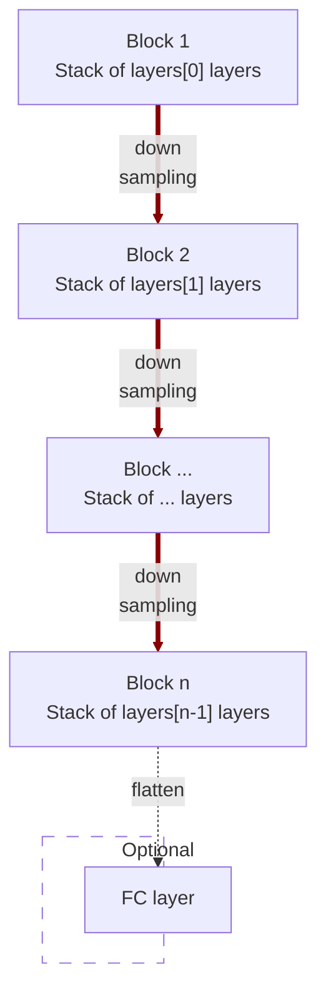

# modules.conv.EncoderNet3d

:codicons-symbol-class: Class · [:material-graph-outline: nn.Module][torch-module] · [:octicons-file-code-24: Source]({{ source.root }}/modules/conv.py#L912){ target="_blank" }

```python
net = mdnc.modules.conv.EncoderNet3d(
    channel, layers,
    kernel_size=3, in_planes=1, out_length=2
)
```

This moule is a built-in model for 3D convolutional encoder network. This network could be used as a part of the auto-encoder, or just a network for down-sampling data.

The network would down-sample the input data according to the network depth. The depth is given by the length of the argument `layers`.  The network structure is shown in the following chart:



The argument `layers` is a sequence of `#!py int`. For each block $i$, it contains `#!py layers[i-1]` repeated modern convolutional layers (see [`mdnc.modules.conv.ConvModern3d`](../ConvModern3d)). Each down-sampling is configured by `#!py stride=2`. The channel number would be doubled in the down-sampling route. An optional flattener and fully-connected layer could be appended to the last layer when the argument `#!py out_length != None`.

## Arguments

**Requries**

| Argument {: .w-6rem} | Type {: .w-7rem} | Description {: .w-8rem} |
| :------: | :-----: | :---------- |
| `channel` | `#!py int` | The channel number of the first hidden block (layer). After each down-sampling, the channel number would be doubled. |
| `layers` | `#!py (int,)` | A sequence of layer numbers for each block. Each number represents the number of convolutional layers of a stage (block). The stage numer, i.e. the depth of the network is the length of this list. |
| `kernel_size` | `#!py int` or<br>`#!py (int, int, int)` | The kernel size of each convolutional layer. |
| `in_planes` | `#!py int` | The channel number of the input data. |
| `out_length` | `#!py int` | The length of the output vector, if not set, the output would not be flattened. |

## Operators

### :codicons-symbol-operator: `#!py __call__`

```python
y = net(x)
```

The forward operator implemented by the `forward()` method. The input is a 3D tensor, and the output is the final output of this network.

**Requries**

| Argument {: .w-5rem} | Type {: .w-6rem} | Description {: .w-8rem} |
| :------: | :-----: | :---------- |
| `x` | `#!py torch.Tensor` | A 3D tensor, the size should be `#!py (B, C, L1, L2, L3)`, where `B` is the batch size, `C` is the input channel number, and `(L1, L2, L3)` is the input data size. |

**Returns**

| Argument {: .w-5rem} | Description {: .w-8rem} |
| :------: | :---------- |
| `y` | A tensor, <ul> <li>When `#!py out_length is None`: the size should be `#!py (B, L)`, where `B` is the batch size, and `L` is `out_length`.</li> <li>When `#!py out_length != None`: the size should be `#!py (B, C, L1, L2, L3)`, where `B` is the batch size, `C` and `(L1, L2, L3)` are the channel number and the size of the last output stage (block) respectively.</li> </ul> |

## Properties

### :codicons-symbol-variable: `nlayers`

```python
net.nlayers
```

The total number of convolutional layers along the depth of the network. This value would not take the fully-connected layer into consideration.

## Examples

???+ example "Example 1"
    === "Codes"
        ```python linenums="1"
        import mdnc

        net = mdnc.modules.conv.EncoderNet3d(64, [3, 3, 3, 3, 3], in_planes=3, out_length=32)
        print('The number of convolutional layers along the depth is {0}.'.format(net.nlayers))
        mdnc.contribs.torchsummary.summary(net, (3, 31, 32, 30), device='cpu')
        ```

    === "Output"
        ```
        The number of convolutional layers along the depth is 17.
        ----------------------------------------------------------------
                Layer (type)               Output Shape         Param #
        ================================================================
                    Conv3d-1       [-1, 64, 31, 32, 30]          24,000
            InstanceNorm3d-2       [-1, 64, 31, 32, 30]             128
                     PReLU-3       [-1, 64, 31, 32, 30]              64
                    Conv3d-4       [-1, 64, 31, 32, 30]         110,592
             _ConvModernNd-5       [-1, 64, 31, 32, 30]               0
            InstanceNorm3d-6       [-1, 64, 31, 32, 30]             128
                     PReLU-7       [-1, 64, 31, 32, 30]              64
                    Conv3d-8       [-1, 64, 31, 32, 30]         110,592
             _ConvModernNd-9       [-1, 64, 31, 32, 30]               0
           InstanceNorm3d-10       [-1, 64, 31, 32, 30]             128
                    PReLU-11       [-1, 64, 31, 32, 30]              64
                   Conv3d-12       [-1, 64, 16, 16, 15]         110,592
            _ConvModernNd-13       [-1, 64, 16, 16, 15]               0
          _BlockConvStkNd-14       [-1, 64, 16, 16, 15]               0
           InstanceNorm3d-15       [-1, 64, 16, 16, 15]             128
                    PReLU-16       [-1, 64, 16, 16, 15]              64
                   Conv3d-17      [-1, 128, 16, 16, 15]         221,184
            _ConvModernNd-18      [-1, 128, 16, 16, 15]               0
           InstanceNorm3d-19      [-1, 128, 16, 16, 15]             256
                    PReLU-20      [-1, 128, 16, 16, 15]             128
                   Conv3d-21      [-1, 128, 16, 16, 15]         442,368
            _ConvModernNd-22      [-1, 128, 16, 16, 15]               0
           InstanceNorm3d-23      [-1, 128, 16, 16, 15]             256
                    PReLU-24      [-1, 128, 16, 16, 15]             128
                   Conv3d-25         [-1, 128, 8, 8, 8]         442,368
            _ConvModernNd-26         [-1, 128, 8, 8, 8]               0
          _BlockConvStkNd-27         [-1, 128, 8, 8, 8]               0
           InstanceNorm3d-28         [-1, 128, 8, 8, 8]             256
                    PReLU-29         [-1, 128, 8, 8, 8]             128
                   Conv3d-30         [-1, 256, 8, 8, 8]         884,736
            _ConvModernNd-31         [-1, 256, 8, 8, 8]               0
           InstanceNorm3d-32         [-1, 256, 8, 8, 8]             512
                    PReLU-33         [-1, 256, 8, 8, 8]             256
                   Conv3d-34         [-1, 256, 8, 8, 8]       1,769,472
            _ConvModernNd-35         [-1, 256, 8, 8, 8]               0
           InstanceNorm3d-36         [-1, 256, 8, 8, 8]             512
                    PReLU-37         [-1, 256, 8, 8, 8]             256
                   Conv3d-38         [-1, 256, 4, 4, 4]       1,769,472
            _ConvModernNd-39         [-1, 256, 4, 4, 4]               0
          _BlockConvStkNd-40         [-1, 256, 4, 4, 4]               0
           InstanceNorm3d-41         [-1, 256, 4, 4, 4]             512
                    PReLU-42         [-1, 256, 4, 4, 4]             256
                   Conv3d-43         [-1, 512, 4, 4, 4]       3,538,944
            _ConvModernNd-44         [-1, 512, 4, 4, 4]               0
           InstanceNorm3d-45         [-1, 512, 4, 4, 4]           1,024
                    PReLU-46         [-1, 512, 4, 4, 4]             512
                   Conv3d-47         [-1, 512, 4, 4, 4]       7,077,888
            _ConvModernNd-48         [-1, 512, 4, 4, 4]               0
           InstanceNorm3d-49         [-1, 512, 4, 4, 4]           1,024
                    PReLU-50         [-1, 512, 4, 4, 4]             512
                   Conv3d-51         [-1, 512, 2, 2, 2]       7,077,888
            _ConvModernNd-52         [-1, 512, 2, 2, 2]               0
          _BlockConvStkNd-53         [-1, 512, 2, 2, 2]               0
           InstanceNorm3d-54         [-1, 512, 2, 2, 2]           1,024
                    PReLU-55         [-1, 512, 2, 2, 2]             512
                   Conv3d-56        [-1, 1024, 2, 2, 2]      14,155,776
            _ConvModernNd-57        [-1, 1024, 2, 2, 2]               0
           InstanceNorm3d-58        [-1, 1024, 2, 2, 2]           2,048
                    PReLU-59        [-1, 1024, 2, 2, 2]           1,024
                   Conv3d-60        [-1, 1024, 2, 2, 2]      28,311,552
            _ConvModernNd-61        [-1, 1024, 2, 2, 2]               0
           InstanceNorm3d-62        [-1, 1024, 2, 2, 2]           2,048
                    PReLU-63        [-1, 1024, 2, 2, 2]           1,024
                   Conv3d-64        [-1, 1024, 1, 1, 1]      28,311,552
            _ConvModernNd-65        [-1, 1024, 1, 1, 1]               0
          _BlockConvStkNd-66        [-1, 1024, 1, 1, 1]               0
                   Conv3d-67        [-1, 1024, 1, 1, 1]      28,312,576
        AdaptiveAvgPool3d-68        [-1, 1024, 1, 1, 1]               0
                   Linear-69                   [-1, 32]          32,800
             EncoderNet3d-70                   [-1, 32]               0
        ================================================================
        Total params: 122,719,328
        Trainable params: 122,719,328
        Non-trainable params: 0
        ----------------------------------------------------------------
        Input size (MB): 0.34
        Forward/backward pass size (MB): 213.04
        Params size (MB): 468.14
        Estimated Total Size (MB): 681.52
        ----------------------------------------------------------------
        ```

???+ example "Example 2"
    === "Codes"
        ```python linenums="1"
        import mdnc

        net = mdnc.modules.conv.EncoderNet3d(64, [3, 3, 3, 3, 3], in_planes=3, out_length=None)
        print('The number of convolutional layers along the depth is {0}.'.format(net.nlayers))
        mdnc.contribs.torchsummary.summary(net, (3, 31, 32, 30), device='cpu')
        ```

    === "Output"
        ```
        The number of convolutional layers along the depth is 17.
        ----------------------------------------------------------------
                Layer (type)               Output Shape         Param #
        ================================================================
                    Conv3d-1       [-1, 64, 31, 32, 30]          24,000
            InstanceNorm3d-2       [-1, 64, 31, 32, 30]             128
                     PReLU-3       [-1, 64, 31, 32, 30]              64
                    Conv3d-4       [-1, 64, 31, 32, 30]         110,592
             _ConvModernNd-5       [-1, 64, 31, 32, 30]               0
            InstanceNorm3d-6       [-1, 64, 31, 32, 30]             128
                     PReLU-7       [-1, 64, 31, 32, 30]              64
                    Conv3d-8       [-1, 64, 31, 32, 30]         110,592
             _ConvModernNd-9       [-1, 64, 31, 32, 30]               0
           InstanceNorm3d-10       [-1, 64, 31, 32, 30]             128
                    PReLU-11       [-1, 64, 31, 32, 30]              64
                   Conv3d-12       [-1, 64, 16, 16, 15]         110,592
            _ConvModernNd-13       [-1, 64, 16, 16, 15]               0
          _BlockConvStkNd-14       [-1, 64, 16, 16, 15]               0
           InstanceNorm3d-15       [-1, 64, 16, 16, 15]             128
                    PReLU-16       [-1, 64, 16, 16, 15]              64
                   Conv3d-17      [-1, 128, 16, 16, 15]         221,184
            _ConvModernNd-18      [-1, 128, 16, 16, 15]               0
           InstanceNorm3d-19      [-1, 128, 16, 16, 15]             256
                    PReLU-20      [-1, 128, 16, 16, 15]             128
                   Conv3d-21      [-1, 128, 16, 16, 15]         442,368
            _ConvModernNd-22      [-1, 128, 16, 16, 15]               0
           InstanceNorm3d-23      [-1, 128, 16, 16, 15]             256
                    PReLU-24      [-1, 128, 16, 16, 15]             128
                   Conv3d-25         [-1, 128, 8, 8, 8]         442,368
            _ConvModernNd-26         [-1, 128, 8, 8, 8]               0
          _BlockConvStkNd-27         [-1, 128, 8, 8, 8]               0
           InstanceNorm3d-28         [-1, 128, 8, 8, 8]             256
                    PReLU-29         [-1, 128, 8, 8, 8]             128
                   Conv3d-30         [-1, 256, 8, 8, 8]         884,736
            _ConvModernNd-31         [-1, 256, 8, 8, 8]               0
           InstanceNorm3d-32         [-1, 256, 8, 8, 8]             512
                    PReLU-33         [-1, 256, 8, 8, 8]             256
                   Conv3d-34         [-1, 256, 8, 8, 8]       1,769,472
            _ConvModernNd-35         [-1, 256, 8, 8, 8]               0
           InstanceNorm3d-36         [-1, 256, 8, 8, 8]             512
                    PReLU-37         [-1, 256, 8, 8, 8]             256
                   Conv3d-38         [-1, 256, 4, 4, 4]       1,769,472
            _ConvModernNd-39         [-1, 256, 4, 4, 4]               0
          _BlockConvStkNd-40         [-1, 256, 4, 4, 4]               0
           InstanceNorm3d-41         [-1, 256, 4, 4, 4]             512
                    PReLU-42         [-1, 256, 4, 4, 4]             256
                   Conv3d-43         [-1, 512, 4, 4, 4]       3,538,944
            _ConvModernNd-44         [-1, 512, 4, 4, 4]               0
           InstanceNorm3d-45         [-1, 512, 4, 4, 4]           1,024
                    PReLU-46         [-1, 512, 4, 4, 4]             512
                   Conv3d-47         [-1, 512, 4, 4, 4]       7,077,888
            _ConvModernNd-48         [-1, 512, 4, 4, 4]               0
           InstanceNorm3d-49         [-1, 512, 4, 4, 4]           1,024
                    PReLU-50         [-1, 512, 4, 4, 4]             512
                   Conv3d-51         [-1, 512, 2, 2, 2]       7,077,888
            _ConvModernNd-52         [-1, 512, 2, 2, 2]               0
          _BlockConvStkNd-53         [-1, 512, 2, 2, 2]               0
           InstanceNorm3d-54         [-1, 512, 2, 2, 2]           1,024
                    PReLU-55         [-1, 512, 2, 2, 2]             512
                   Conv3d-56        [-1, 1024, 2, 2, 2]      14,155,776
            _ConvModernNd-57        [-1, 1024, 2, 2, 2]               0
           InstanceNorm3d-58        [-1, 1024, 2, 2, 2]           2,048
                    PReLU-59        [-1, 1024, 2, 2, 2]           1,024
                   Conv3d-60        [-1, 1024, 2, 2, 2]      28,311,552
            _ConvModernNd-61        [-1, 1024, 2, 2, 2]               0
           InstanceNorm3d-62        [-1, 1024, 2, 2, 2]           2,048
                    PReLU-63        [-1, 1024, 2, 2, 2]           1,024
                   Conv3d-64        [-1, 1024, 1, 1, 1]      28,311,552
            _ConvModernNd-65        [-1, 1024, 1, 1, 1]               0
          _BlockConvStkNd-66        [-1, 1024, 1, 1, 1]               0
                   Conv3d-67        [-1, 1024, 1, 1, 1]      28,312,576
             EncoderNet3d-68        [-1, 1024, 1, 1, 1]               0
        ================================================================
        Total params: 122,686,528
        Trainable params: 122,686,528
        Non-trainable params: 0
        ----------------------------------------------------------------
        Input size (MB): 0.34
        Forward/backward pass size (MB): 213.04
        Params size (MB): 468.01
        Estimated Total Size (MB): 681.39
        ----------------------------------------------------------------
        ```

[torch-module]:https://pytorch.org/docs/stable/generated/torch.nn.Module.html "torch.nn.Module"
