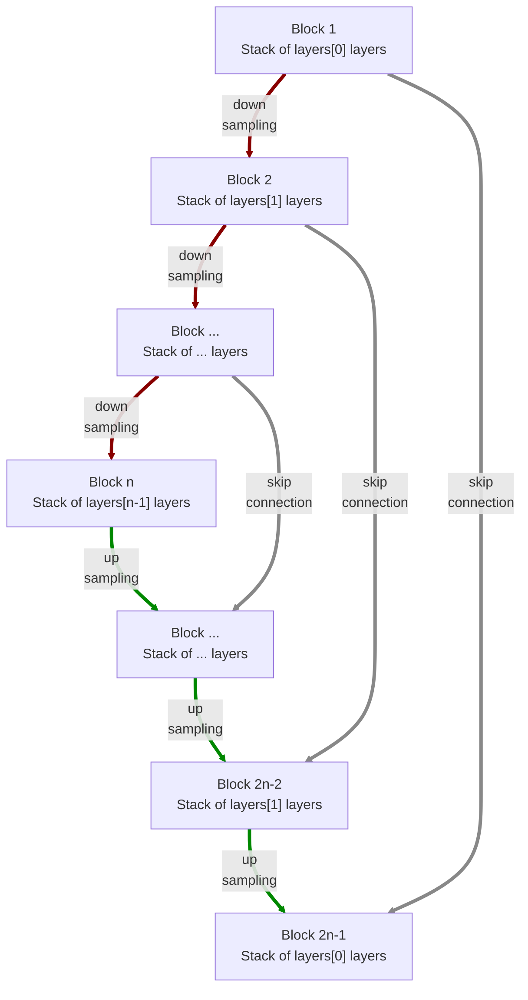

# modules.conv.UNet1d

:codicons-symbol-class: Class · [:material-graph-outline: nn.Module][torch-module] · [:octicons-file-code-24: Source]({{ source.root }}/modules/conv.py#L712){ target="_blank" }

```python
net = mdnc.modules.conv.UNet1d(
    channel, layers,
    kernel_size=3, in_planes=1, out_planes=1
)
```

This moule is a built-in model for 1D convolutional U-Net. The network is inspired by:

@milesial/Pytorch-UNet

The network would down-sample and up-sample the input data according to the network depth. The depth is given by the length of the argument `layers`.  The network structure is shown in the following chart:



The argument `layers` is a sequence of `#!py int`. For each block $i$, it contains `#!py layers[i-1]` repeated modern convolutional layers (see [`mdnc.modules.conv.ConvModern1d`](../ConvModern1d)). Each down-sampling or up-sampling is configured by `#!py stride=2`. The channel number would be doubled in the down-sampling route and reduced to 1/2 in the up-sampling route. The skip connection is perfromed by concatenation.

## Arguments

**Requries**

| Argument {: .w-6rem} | Type {: .w-4rem} | Description {: .w-8rem} |
| :------: | :-----: | :---------- |
| `channel` | `#!py int` | The channel number of the first hidden block (layer). After each down-sampling, the channel number would be doubled. After each up-sampling, the channel number would be reduced to 1/2. |
| `layers` | `#!py (int,)` | A sequence of layer numbers for each block. Each number represents the number of convolutional layers of a stage (block). The stage numer, i.e. the depth of the network is the length of this list. |
| `kernel_size` | `#!py int` | The kernel size of each convolutional layer. |
| `in_planes` | `#!py int` | The channel number of the input data. |
| `out_planes` | `#!py int` | The channel number of the output data. |

## Operators

### :codicons-symbol-operator: `#!py __call__`

```python
y = net(x)
```

The forward operator implemented by the `forward()` method. The input is a 1D tensor, and the output is the final output of this network.

**Requries**

| Argument {: .w-5rem} | Type {: .w-6rem} | Description {: .w-8rem} |
| :------: | :-----: | :---------- |
| `x` | `#!py torch.Tensor` | A 1D tensor, the size should be `#!py (B, C, L)`, where `B` is the batch size, `C` is the input channel number, and `L` is the input data length. |

**Returns**

| Argument {: .w-5rem} | Description {: .w-8rem} |
| :------: | :---------- |
| `y` | A 1D tensor, the size should be `#!py (B, C, L)`, where `B` is the batch size, `C` is the output channel number, and `L` is the **input** data length. |

## Properties

### :codicons-symbol-variable: `nlayers`

```python
net.nlayers
```

The total number of convolutional layers along the depth of the network.

## Examples

???+ example "Example"
    === "Codes"
        ```python linenums="1"
        import mdnc

        net = mdnc.modules.conv.UNet1d(64, [2, 2, 3, 3, 3], in_planes=3, out_planes=1)
        print('The number of convolutional layers along the depth is {0}.'.format(net.nlayers))
        mdnc.contribs.torchsummary.summary(net, (3, 128), device='cpu')
        ```

    === "Output"
        ```
        The number of convolutional layers along the depth is 25.
        ----------------------------------------------------------------
                Layer (type)               Output Shape         Param #
        ================================================================
                    Conv1d-1              [-1, 64, 128]             960
            InstanceNorm1d-2              [-1, 64, 128]             128
                     PReLU-3              [-1, 64, 128]              64
                    Conv1d-4              [-1, 64, 128]          12,288
             _ConvModernNd-5              [-1, 64, 128]               0
            InstanceNorm1d-6              [-1, 64, 128]             128
                     PReLU-7              [-1, 64, 128]              64
                    Conv1d-8               [-1, 64, 64]          12,288
             _ConvModernNd-9               [-1, 64, 64]               0
          _BlockConvStkNd-10               [-1, 64, 64]               0
                                          [-1, 64, 128]
           InstanceNorm1d-11               [-1, 64, 64]             128
                    PReLU-12               [-1, 64, 64]              64
                   Conv1d-13              [-1, 128, 64]          24,576
            _ConvModernNd-14              [-1, 128, 64]               0
           InstanceNorm1d-15              [-1, 128, 64]             256
                    PReLU-16              [-1, 128, 64]             128
                   Conv1d-17              [-1, 128, 32]          49,152
            _ConvModernNd-18              [-1, 128, 32]               0
          _BlockConvStkNd-19              [-1, 128, 32]               0
                                          [-1, 128, 64]
           InstanceNorm1d-20              [-1, 128, 32]             256
                    PReLU-21              [-1, 128, 32]             128
                   Conv1d-22              [-1, 256, 32]          98,304
            _ConvModernNd-23              [-1, 256, 32]               0
           InstanceNorm1d-24              [-1, 256, 32]             512
                    PReLU-25              [-1, 256, 32]             256
                   Conv1d-26              [-1, 256, 32]         196,608
            _ConvModernNd-27              [-1, 256, 32]               0
           InstanceNorm1d-28              [-1, 256, 32]             512
                    PReLU-29              [-1, 256, 32]             256
                   Conv1d-30              [-1, 256, 16]         196,608
            _ConvModernNd-31              [-1, 256, 16]               0
          _BlockConvStkNd-32              [-1, 256, 16]               0
                                          [-1, 256, 32]
           InstanceNorm1d-33              [-1, 256, 16]             512
                    PReLU-34              [-1, 256, 16]             256
                   Conv1d-35              [-1, 512, 16]         393,216
            _ConvModernNd-36              [-1, 512, 16]               0
           InstanceNorm1d-37              [-1, 512, 16]           1,024
                    PReLU-38              [-1, 512, 16]             512
                   Conv1d-39              [-1, 512, 16]         786,432
            _ConvModernNd-40              [-1, 512, 16]               0
           InstanceNorm1d-41              [-1, 512, 16]           1,024
                    PReLU-42              [-1, 512, 16]             512
                   Conv1d-43               [-1, 512, 8]         786,432
            _ConvModernNd-44               [-1, 512, 8]               0
          _BlockConvStkNd-45               [-1, 512, 8]               0
                                          [-1, 512, 16]
           InstanceNorm1d-46               [-1, 512, 8]           1,024
                    PReLU-47               [-1, 512, 8]             512
                   Conv1d-48              [-1, 1024, 8]       1,572,864
            _ConvModernNd-49              [-1, 1024, 8]               0
           InstanceNorm1d-50              [-1, 1024, 8]           2,048
                    PReLU-51              [-1, 1024, 8]           1,024
                   Conv1d-52              [-1, 1024, 8]       3,145,728
            _ConvModernNd-53              [-1, 1024, 8]               0
           InstanceNorm1d-54              [-1, 1024, 8]           2,048
                    PReLU-55              [-1, 1024, 8]           1,024
                 Upsample-56             [-1, 1024, 16]               0
                   Conv1d-57              [-1, 512, 16]       1,572,864
            _ConvModernNd-58              [-1, 512, 16]               0
          _BlockConvStkNd-59              [-1, 512, 16]               0
           InstanceNorm1d-60             [-1, 1024, 16]           2,048
                    PReLU-61             [-1, 1024, 16]           1,024
                   Conv1d-62              [-1, 512, 16]       1,572,864
            _ConvModernNd-63              [-1, 512, 16]               0
           InstanceNorm1d-64              [-1, 512, 16]           1,024
                    PReLU-65              [-1, 512, 16]             512
                   Conv1d-66              [-1, 512, 16]         786,432
            _ConvModernNd-67              [-1, 512, 16]               0
           InstanceNorm1d-68              [-1, 512, 16]           1,024
                    PReLU-69              [-1, 512, 16]             512
                 Upsample-70              [-1, 512, 32]               0
                   Conv1d-71              [-1, 256, 32]         393,216
            _ConvModernNd-72              [-1, 256, 32]               0
          _BlockConvStkNd-73              [-1, 256, 32]               0
           InstanceNorm1d-74              [-1, 512, 32]           1,024
                    PReLU-75              [-1, 512, 32]             512
                   Conv1d-76              [-1, 256, 32]         393,216
            _ConvModernNd-77              [-1, 256, 32]               0
           InstanceNorm1d-78              [-1, 256, 32]             512
                    PReLU-79              [-1, 256, 32]             256
                   Conv1d-80              [-1, 256, 32]         196,608
            _ConvModernNd-81              [-1, 256, 32]               0
           InstanceNorm1d-82              [-1, 256, 32]             512
                    PReLU-83              [-1, 256, 32]             256
                 Upsample-84              [-1, 256, 64]               0
                   Conv1d-85              [-1, 128, 64]          98,304
            _ConvModernNd-86              [-1, 128, 64]               0
          _BlockConvStkNd-87              [-1, 128, 64]               0
           InstanceNorm1d-88              [-1, 256, 64]             512
                    PReLU-89              [-1, 256, 64]             256
                   Conv1d-90              [-1, 128, 64]          98,304
            _ConvModernNd-91              [-1, 128, 64]               0
           InstanceNorm1d-92              [-1, 128, 64]             256
                    PReLU-93              [-1, 128, 64]             128
                 Upsample-94             [-1, 128, 128]               0
                   Conv1d-95              [-1, 64, 128]          24,576
            _ConvModernNd-96              [-1, 64, 128]               0
          _BlockConvStkNd-97              [-1, 64, 128]               0
           InstanceNorm1d-98             [-1, 128, 128]             256
                    PReLU-99             [-1, 128, 128]             128
                  Conv1d-100              [-1, 64, 128]          24,576
           _ConvModernNd-101              [-1, 64, 128]               0
          InstanceNorm1d-102              [-1, 64, 128]             128
                   PReLU-103              [-1, 64, 128]              64
                  Conv1d-104              [-1, 64, 128]          12,288
           _ConvModernNd-105              [-1, 64, 128]               0
         _BlockConvStkNd-106              [-1, 64, 128]               0
                  Conv1d-107               [-1, 1, 128]             321
                  UNet1d-108               [-1, 1, 128]               0
        ================================================================
        Total params: 12,474,369
        Trainable params: 12,474,369
        Non-trainable params: 0
        ----------------------------------------------------------------
        Input size (MB): 0.00
        Forward/backward pass size (MB): 7.00
        Params size (MB): 47.59
        Estimated Total Size (MB): 54.59
        ----------------------------------------------------------------
        ```

[torch-module]:https://pytorch.org/docs/stable/generated/torch.nn.Module.html "torch.nn.Module"
