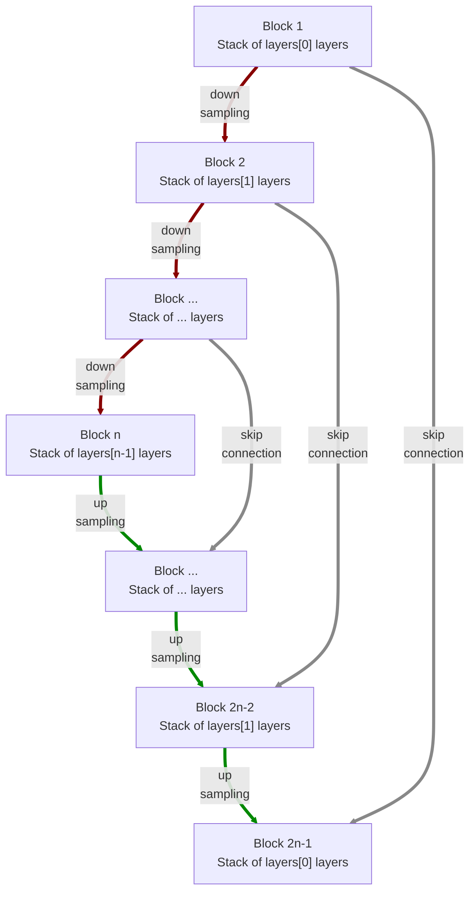

# modules.conv.UNet2d

:codicons-symbol-class: Class · [:material-graph-outline: nn.Module][torch-module] · [:octicons-file-code-24: Source]({{ source.root }}/modules/conv.py#L738){ target="_blank" }

```python
net = mdnc.modules.conv.UNet2d(
    channel, layers,
    kernel_size=3, in_planes=1, out_planes=1
)
```

This moule is a built-in model for 2D convolutional U-Net. The network is inspired by:

@milesial/Pytorch-UNet

The network would down-sample and up-sample the input data according to the network depth. The depth is given by the length of the argument `layers`.  The network structure is shown in the following chart:



The argument `layers` is a sequence of `#!py int`. For each block $i$, it contains `#!py layers[i-1]` repeated modern convolutional layers (see [`mdnc.modules.conv.ConvModern2d`](../ConvModern2d)). Each down-sampling or up-sampling is configured by `#!py stride=2`. The channel number would be doubled in the down-sampling route and reduced to 1/2 in the up-sampling route. The skip connection is perfromed by concatenation.

## Arguments

**Requries**

| Argument {: .w-6rem} | Type {: .w-6rem} | Description {: .w-8rem} |
| :------: | :-----: | :---------- |
| `channel` | `#!py int` | The channel number of the first hidden block (layer). After each down-sampling, the channel number would be doubled. After each up-sampling, the channel number would be reduced to 1/2. |
| `layers` | `#!py (int,)` | A sequence of layer numbers for each block. Each number represents the number of convolutional layers of a stage (block). The stage numer, i.e. the depth of the network is the length of this list. |
| `kernel_size` | `#!py int` or<br>`#!py (int, int)` | The kernel size of each convolutional layer. |
| `in_planes` | `#!py int` | The channel number of the input data. |
| `out_planes` | `#!py int` | The channel number of the output data. |

## Operators

### :codicons-symbol-operator: `#!py __call__`

```python
y = net(x)
```

The forward operator implemented by the `forward()` method. The input is a 2D tensor, and the output is the final output of this network.

**Requries**

| Argument {: .w-5rem} | Type {: .w-6rem} | Description {: .w-8rem} |
| :------: | :-----: | :---------- |
| `x` | `#!py torch.Tensor` | A 2D tensor, the size should be `#!py (B, C, L1, L2)`, where `B` is the batch size, `C` is the input channel number, and `(L1, L2)` is the input data size. |

**Returns**

| Argument {: .w-5rem} | Description {: .w-8rem} |
| :------: | :---------- |
| `y` | A 2D tensor, the size should be `#!py (B, C, L1, L2)`, where `B` is the batch size, `C` is the output channel number, and `(L1, L2)` is the **input** data size. |

## Properties

### :codicons-symbol-variable: `nlayers`

```python
net.nlayers
```

The total number of convolutional layers along the depth of the network.

## Examples

???+ example "Example"
    === "Codes"
        ```python linenums="1"
        import mdnc

        net = mdnc.modules.conv.UNet2d(64, [2, 2, 3, 3, 3], in_planes=3, out_planes=1)
        print('The number of convolutional layers along the depth is {0}.'.format(net.nlayers))
        mdnc.contribs.torchsummary.summary(net, (3, 64, 63), device='cpu')
        ```

    === "Output"
        ```
        The number of convolutional layers along the depth is 25.
        ----------------------------------------------------------------
                Layer (type)               Output Shape         Param #
        ================================================================
                    Conv2d-1           [-1, 64, 64, 63]           4,800
            InstanceNorm2d-2           [-1, 64, 64, 63]             128
                     PReLU-3           [-1, 64, 64, 63]              64
                    Conv2d-4           [-1, 64, 64, 63]          36,864
             _ConvModernNd-5           [-1, 64, 64, 63]               0
            InstanceNorm2d-6           [-1, 64, 64, 63]             128
                     PReLU-7           [-1, 64, 64, 63]              64
                    Conv2d-8           [-1, 64, 32, 32]          36,864
             _ConvModernNd-9           [-1, 64, 32, 32]               0
          _BlockConvStkNd-10           [-1, 64, 32, 32]               0
                                       [-1, 64, 64, 63]
           InstanceNorm2d-11           [-1, 64, 32, 32]             128
                    PReLU-12           [-1, 64, 32, 32]              64
                   Conv2d-13          [-1, 128, 32, 32]          73,728
            _ConvModernNd-14          [-1, 128, 32, 32]               0
           InstanceNorm2d-15          [-1, 128, 32, 32]             256
                    PReLU-16          [-1, 128, 32, 32]             128
                   Conv2d-17          [-1, 128, 16, 16]         147,456
            _ConvModernNd-18          [-1, 128, 16, 16]               0
          _BlockConvStkNd-19          [-1, 128, 16, 16]               0
                                      [-1, 128, 32, 32]
           InstanceNorm2d-20          [-1, 128, 16, 16]             256
                    PReLU-21          [-1, 128, 16, 16]             128
                   Conv2d-22          [-1, 256, 16, 16]         294,912
            _ConvModernNd-23          [-1, 256, 16, 16]               0
           InstanceNorm2d-24          [-1, 256, 16, 16]             512
                    PReLU-25          [-1, 256, 16, 16]             256
                   Conv2d-26          [-1, 256, 16, 16]         589,824
            _ConvModernNd-27          [-1, 256, 16, 16]               0
           InstanceNorm2d-28          [-1, 256, 16, 16]             512
                    PReLU-29          [-1, 256, 16, 16]             256
                   Conv2d-30            [-1, 256, 8, 8]         589,824
            _ConvModernNd-31            [-1, 256, 8, 8]               0
          _BlockConvStkNd-32            [-1, 256, 8, 8]               0
                                      [-1, 256, 16, 16]
           InstanceNorm2d-33            [-1, 256, 8, 8]             512
                    PReLU-34            [-1, 256, 8, 8]             256
                   Conv2d-35            [-1, 512, 8, 8]       1,179,648
            _ConvModernNd-36            [-1, 512, 8, 8]               0
           InstanceNorm2d-37            [-1, 512, 8, 8]           1,024
                    PReLU-38            [-1, 512, 8, 8]             512
                   Conv2d-39            [-1, 512, 8, 8]       2,359,296
            _ConvModernNd-40            [-1, 512, 8, 8]               0
           InstanceNorm2d-41            [-1, 512, 8, 8]           1,024
                    PReLU-42            [-1, 512, 8, 8]             512
                   Conv2d-43            [-1, 512, 4, 4]       2,359,296
            _ConvModernNd-44            [-1, 512, 4, 4]               0
          _BlockConvStkNd-45            [-1, 512, 4, 4]               0
                                        [-1, 512, 8, 8]
           InstanceNorm2d-46            [-1, 512, 4, 4]           1,024
                    PReLU-47            [-1, 512, 4, 4]             512
                   Conv2d-48           [-1, 1024, 4, 4]       4,718,592
            _ConvModernNd-49           [-1, 1024, 4, 4]               0
           InstanceNorm2d-50           [-1, 1024, 4, 4]           2,048
                    PReLU-51           [-1, 1024, 4, 4]           1,024
                   Conv2d-52           [-1, 1024, 4, 4]       9,437,184
            _ConvModernNd-53           [-1, 1024, 4, 4]               0
           InstanceNorm2d-54           [-1, 1024, 4, 4]           2,048
                    PReLU-55           [-1, 1024, 4, 4]           1,024
                 Upsample-56           [-1, 1024, 8, 8]               0
                   Conv2d-57            [-1, 512, 8, 8]       4,718,592
            _ConvModernNd-58            [-1, 512, 8, 8]               0
          _BlockConvStkNd-59            [-1, 512, 8, 8]               0
           InstanceNorm2d-60           [-1, 1024, 8, 8]           2,048
                    PReLU-61           [-1, 1024, 8, 8]           1,024
                   Conv2d-62            [-1, 512, 8, 8]       4,718,592
            _ConvModernNd-63            [-1, 512, 8, 8]               0
           InstanceNorm2d-64            [-1, 512, 8, 8]           1,024
                    PReLU-65            [-1, 512, 8, 8]             512
                   Conv2d-66            [-1, 512, 8, 8]       2,359,296
            _ConvModernNd-67            [-1, 512, 8, 8]               0
           InstanceNorm2d-68            [-1, 512, 8, 8]           1,024
                    PReLU-69            [-1, 512, 8, 8]             512
                 Upsample-70          [-1, 512, 16, 16]               0
                   Conv2d-71          [-1, 256, 16, 16]       1,179,648
            _ConvModernNd-72          [-1, 256, 16, 16]               0
          _BlockConvStkNd-73          [-1, 256, 16, 16]               0
           InstanceNorm2d-74          [-1, 512, 16, 16]           1,024
                    PReLU-75          [-1, 512, 16, 16]             512
                   Conv2d-76          [-1, 256, 16, 16]       1,179,648
            _ConvModernNd-77          [-1, 256, 16, 16]               0
           InstanceNorm2d-78          [-1, 256, 16, 16]             512
                    PReLU-79          [-1, 256, 16, 16]             256
                   Conv2d-80          [-1, 256, 16, 16]         589,824
            _ConvModernNd-81          [-1, 256, 16, 16]               0
           InstanceNorm2d-82          [-1, 256, 16, 16]             512
                    PReLU-83          [-1, 256, 16, 16]             256
                 Upsample-84          [-1, 256, 32, 32]               0
                   Conv2d-85          [-1, 128, 32, 32]         294,912
            _ConvModernNd-86          [-1, 128, 32, 32]               0
          _BlockConvStkNd-87          [-1, 128, 32, 32]               0
           InstanceNorm2d-88          [-1, 256, 32, 32]             512
                    PReLU-89          [-1, 256, 32, 32]             256
                   Conv2d-90          [-1, 128, 32, 32]         294,912
            _ConvModernNd-91          [-1, 128, 32, 32]               0
           InstanceNorm2d-92          [-1, 128, 32, 32]             256
                    PReLU-93          [-1, 128, 32, 32]             128
                 Upsample-94          [-1, 128, 64, 64]               0
                   Conv2d-95           [-1, 64, 64, 64]          73,728
            _ConvModernNd-96           [-1, 64, 64, 64]               0
          _BlockConvStkNd-97           [-1, 64, 64, 64]               0
           InstanceNorm2d-98          [-1, 128, 64, 63]             256
                    PReLU-99          [-1, 128, 64, 63]             128
                  Conv2d-100           [-1, 64, 64, 63]          73,728
           _ConvModernNd-101           [-1, 64, 64, 63]               0
          InstanceNorm2d-102           [-1, 64, 64, 63]             128
                   PReLU-103           [-1, 64, 64, 63]              64
                  Conv2d-104           [-1, 64, 64, 63]          36,864
           _ConvModernNd-105           [-1, 64, 64, 63]               0
         _BlockConvStkNd-106           [-1, 64, 64, 63]               0
                  Conv2d-107            [-1, 1, 64, 63]           1,601
                  UNet2d-108            [-1, 1, 64, 63]               0
        ================================================================
        Total params: 37,374,977
        Trainable params: 37,374,977
        Non-trainable params: 0
        ----------------------------------------------------------------
        Input size (MB): 0.05
        Forward/backward pass size (MB): 90.66
        Params size (MB): 142.57
        Estimated Total Size (MB): 233.28
        ----------------------------------------------------------------
        ```

[torch-module]:https://pytorch.org/docs/stable/generated/torch.nn.Module.html "torch.nn.Module"
