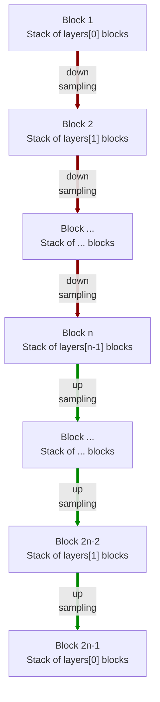

# modules.resnet.AE2d

:codicons-symbol-class: Class · [:material-graph-outline: nn.Module][torch-module] · [:octicons-file-code-24: Source]({{ source.root }}/modules/resnet.py#L1196){ target="_blank" }

```python
net = mdnc.modules.resnet.AE2d(
    channel, layers, block='bottleneck',
    kernel_size=3, in_planes=1, out_planes=1
)
```

This moule is a built-in model for 2D residual auto-encoder. The network structure is almost the same as [`mdnc.modules.resnet.UNet2d`](../UNet2d) but all block-level skip connections are removed. Generally, using [`mdnc.modules.resnet.UNet2d`](../UNet2d) should be a better choice.

The network would down-sample and up-sample the input data according to the network depth. The depth is given by the length of the argument `layers`.  The network structure is shown in the following chart:



The argument `layers` is a sequence of `#!py int`. For each block $i$, it contains `#!py layers[i-1]` repeated residual blocks (see [`mdnc.modules.resnet.BlockPlain2d`](../BlockPlain2d) and [`mdnc.modules.resnet.BlockBottleneck2d`](../BlockBottleneck2d)). Each down-sampling or up-sampling is configured by `#!py stride=2`. The channel number would be doubled in the down-sampling route and reduced to 1/2 in the up-sampling route.

## Arguments

**Requries**

| Argument {: .w-6rem} | Type {: .w-6rem} | Description {: .w-8rem} |
| :------: | :-----: | :---------- |
| `channel` | `#!py int` | The channel number of the first hidden block (layer). After each down-sampling, the channel number would be doubled. After each up-sampling, the channel number would be reduced to 1/2. |
| `layers` | `#!py (int,)` | A sequence of layer numbers for each block. Each number represents the number of residual blocks of a stage (block). The stage numer, i.e. the depth of the network is the length of this list. |
| `block` | `#!py str` | The residual block type, could be: <ul> <li>`#!py 'plain'`: see [`BlockPlain2d`](../BlockPlain2d).</li> <li>`#!py 'bottleneck'`: see [`BlockBottleneck2d`](../BlockBottleneck2d).</li> </ul> |
| `kernel_size` | `#!py int` or<br>`#!py (int, int)` | The kernel size of each residual block. |
| `in_planes` | `#!py int` | The channel number of the input data. |
| `out_planes` | `#!py int` | The channel number of the output data. |

## Operators

### :codicons-symbol-operator: `#!py __call__`

```python
y = net(x)
```

The forward operator implemented by the `forward()` method. The input is a 2D tensor, and the output is the final output of this network.

**Requries**

| Argument {: .w-5rem} | Type {: .w-6rem} | Description {: .w-8rem} |
| :------: | :-----: | :---------- |
| `x` | `#!py torch.Tensor` | A 2D tensor, the size should be `#!py (B, C, L1, L2)`, where `B` is the batch size, `C` is the input channel number, and `(L1, L2)` is the input data size. |

**Returns**

| Argument {: .w-5rem} | Description {: .w-8rem} |
| :------: | :---------- |
| `y` | A 2D tensor, the size should be `#!py (B, C, L1, L2)`, where `B` is the batch size, `C` is the output channel number, and `(L1, L2)` is the **input** data size. |

## Properties

### :codicons-symbol-variable: `nlayers`

```python
net.nlayers
```

The total number of convolutional layers along the depth of the network.

## Examples

???+ example "Example"
    === "Codes"
        ```python linenums="1"
        import mdnc

        net = mdnc.modules.resnet.AE2d(64, [2, 2, 2, 2, 3], in_planes=3, out_planes=1)
        print('The number of convolutional layers along the depth is {0}.'.format(net.nlayers))
        mdnc.contribs.torchsummary.summary(net, (3, 64, 63), device='cpu')
        ```

    === "Output"
        ```
        The number of convolutional layers along the depth is 59.
        ----------------------------------------------------------------
                Layer (type)               Output Shape         Param #
        ================================================================
                    Conv2d-1           [-1, 64, 64, 63]           4,800
            InstanceNorm2d-2           [-1, 64, 64, 63]             128
                     PReLU-3           [-1, 64, 64, 63]              64
                    Conv2d-4           [-1, 64, 64, 63]           4,096
            InstanceNorm2d-5           [-1, 64, 64, 63]             128
                     PReLU-6           [-1, 64, 64, 63]              64
                    Conv2d-7           [-1, 64, 64, 63]          36,864
            InstanceNorm2d-8           [-1, 64, 64, 63]             128
                     PReLU-9           [-1, 64, 64, 63]              64
                   Conv2d-10           [-1, 64, 64, 63]           4,096
        _BlockBo...neckNd-11           [-1, 64, 64, 63]               0
           InstanceNorm2d-12           [-1, 64, 64, 63]             128
                    PReLU-13           [-1, 64, 64, 63]              64
                   Conv2d-14           [-1, 64, 64, 63]           4,096
           InstanceNorm2d-15           [-1, 64, 64, 63]             128
                    PReLU-16           [-1, 64, 64, 63]              64
                   Conv2d-17           [-1, 64, 32, 32]          36,864
           InstanceNorm2d-18           [-1, 64, 32, 32]             128
                    PReLU-19           [-1, 64, 32, 32]              64
                   Conv2d-20           [-1, 64, 32, 32]           4,096
                   Conv2d-21           [-1, 64, 32, 32]           4,096
           InstanceNorm2d-22           [-1, 64, 32, 32]             128
        _BlockBo...neckNd-23           [-1, 64, 32, 32]               0
           _BlockResStkNd-24           [-1, 64, 32, 32]               0
           InstanceNorm2d-25           [-1, 64, 32, 32]             128
                    PReLU-26           [-1, 64, 32, 32]              64
                   Conv2d-27           [-1, 64, 32, 32]           4,096
           InstanceNorm2d-28           [-1, 64, 32, 32]             128
                    PReLU-29           [-1, 64, 32, 32]              64
                   Conv2d-30           [-1, 64, 32, 32]          36,864
           InstanceNorm2d-31           [-1, 64, 32, 32]             128
                    PReLU-32           [-1, 64, 32, 32]              64
                   Conv2d-33          [-1, 128, 32, 32]           8,192
                   Conv2d-34          [-1, 128, 32, 32]           8,192
           InstanceNorm2d-35          [-1, 128, 32, 32]             256
        _BlockBo...neckNd-36          [-1, 128, 32, 32]               0
           InstanceNorm2d-37          [-1, 128, 32, 32]             256
                    PReLU-38          [-1, 128, 32, 32]             128
                   Conv2d-39          [-1, 128, 32, 32]          16,384
           InstanceNorm2d-40          [-1, 128, 32, 32]             256
                    PReLU-41          [-1, 128, 32, 32]             128
                   Conv2d-42          [-1, 128, 16, 16]         147,456
           InstanceNorm2d-43          [-1, 128, 16, 16]             256
                    PReLU-44          [-1, 128, 16, 16]             128
                   Conv2d-45          [-1, 128, 16, 16]          16,384
                   Conv2d-46          [-1, 128, 16, 16]          16,384
           InstanceNorm2d-47          [-1, 128, 16, 16]             256
        _BlockBo...neckNd-48          [-1, 128, 16, 16]               0
           _BlockResStkNd-49          [-1, 128, 16, 16]               0
           InstanceNorm2d-50          [-1, 128, 16, 16]             256
                    PReLU-51          [-1, 128, 16, 16]             128
                   Conv2d-52          [-1, 128, 16, 16]          16,384
           InstanceNorm2d-53          [-1, 128, 16, 16]             256
                    PReLU-54          [-1, 128, 16, 16]             128
                   Conv2d-55          [-1, 128, 16, 16]         147,456
           InstanceNorm2d-56          [-1, 128, 16, 16]             256
                    PReLU-57          [-1, 128, 16, 16]             128
                   Conv2d-58          [-1, 256, 16, 16]          32,768
                   Conv2d-59          [-1, 256, 16, 16]          32,768
           InstanceNorm2d-60          [-1, 256, 16, 16]             512
        _BlockBo...neckNd-61          [-1, 256, 16, 16]               0
           InstanceNorm2d-62          [-1, 256, 16, 16]             512
                    PReLU-63          [-1, 256, 16, 16]             256
                   Conv2d-64          [-1, 256, 16, 16]          65,536
           InstanceNorm2d-65          [-1, 256, 16, 16]             512
                    PReLU-66          [-1, 256, 16, 16]             256
                   Conv2d-67            [-1, 256, 8, 8]         589,824
           InstanceNorm2d-68            [-1, 256, 8, 8]             512
                    PReLU-69            [-1, 256, 8, 8]             256
                   Conv2d-70            [-1, 256, 8, 8]          65,536
                   Conv2d-71            [-1, 256, 8, 8]          65,536
           InstanceNorm2d-72            [-1, 256, 8, 8]             512
        _BlockBo...neckNd-73            [-1, 256, 8, 8]               0
           _BlockResStkNd-74            [-1, 256, 8, 8]               0
           InstanceNorm2d-75            [-1, 256, 8, 8]             512
                    PReLU-76            [-1, 256, 8, 8]             256
                   Conv2d-77            [-1, 256, 8, 8]          65,536
           InstanceNorm2d-78            [-1, 256, 8, 8]             512
                    PReLU-79            [-1, 256, 8, 8]             256
                   Conv2d-80            [-1, 256, 8, 8]         589,824
           InstanceNorm2d-81            [-1, 256, 8, 8]             512
                    PReLU-82            [-1, 256, 8, 8]             256
                   Conv2d-83            [-1, 512, 8, 8]         131,072
                   Conv2d-84            [-1, 512, 8, 8]         131,072
           InstanceNorm2d-85            [-1, 512, 8, 8]           1,024
        _BlockBo...neckNd-86            [-1, 512, 8, 8]               0
           InstanceNorm2d-87            [-1, 512, 8, 8]           1,024
                    PReLU-88            [-1, 512, 8, 8]             512
                   Conv2d-89            [-1, 512, 8, 8]         262,144
           InstanceNorm2d-90            [-1, 512, 8, 8]           1,024
                    PReLU-91            [-1, 512, 8, 8]             512
                   Conv2d-92            [-1, 512, 4, 4]       2,359,296
           InstanceNorm2d-93            [-1, 512, 4, 4]           1,024
                    PReLU-94            [-1, 512, 4, 4]             512
                   Conv2d-95            [-1, 512, 4, 4]         262,144
                   Conv2d-96            [-1, 512, 4, 4]         262,144
           InstanceNorm2d-97            [-1, 512, 4, 4]           1,024
        _BlockBo...neckNd-98            [-1, 512, 4, 4]               0
           _BlockResStkNd-99            [-1, 512, 4, 4]               0
          InstanceNorm2d-100            [-1, 512, 4, 4]           1,024
                   PReLU-101            [-1, 512, 4, 4]             512
                  Conv2d-102            [-1, 512, 4, 4]         262,144
          InstanceNorm2d-103            [-1, 512, 4, 4]           1,024
                   PReLU-104            [-1, 512, 4, 4]             512
                  Conv2d-105            [-1, 512, 4, 4]       2,359,296
          InstanceNorm2d-106            [-1, 512, 4, 4]           1,024
                   PReLU-107            [-1, 512, 4, 4]             512
                  Conv2d-108           [-1, 1024, 4, 4]         524,288
                  Conv2d-109           [-1, 1024, 4, 4]         524,288
          InstanceNorm2d-110           [-1, 1024, 4, 4]           2,048
        _BlockBo...eckNd-111           [-1, 1024, 4, 4]               0
          InstanceNorm2d-112           [-1, 1024, 4, 4]           2,048
                   PReLU-113           [-1, 1024, 4, 4]           1,024
                  Conv2d-114           [-1, 1024, 4, 4]       1,048,576
          InstanceNorm2d-115           [-1, 1024, 4, 4]           2,048
                   PReLU-116           [-1, 1024, 4, 4]           1,024
                  Conv2d-117           [-1, 1024, 4, 4]       9,437,184
          InstanceNorm2d-118           [-1, 1024, 4, 4]           2,048
                   PReLU-119           [-1, 1024, 4, 4]           1,024
                  Conv2d-120           [-1, 1024, 4, 4]       1,048,576
        _BlockBo...eckNd-121           [-1, 1024, 4, 4]               0
          InstanceNorm2d-122           [-1, 1024, 4, 4]           2,048
                   PReLU-123           [-1, 1024, 4, 4]           1,024
                  Conv2d-124           [-1, 1024, 4, 4]       1,048,576
          InstanceNorm2d-125           [-1, 1024, 4, 4]           2,048
                   PReLU-126           [-1, 1024, 4, 4]           1,024
                Upsample-127           [-1, 1024, 8, 8]               0
                  Conv2d-128           [-1, 1024, 8, 8]       9,437,184
          InstanceNorm2d-129           [-1, 1024, 8, 8]           2,048
                   PReLU-130           [-1, 1024, 8, 8]           1,024
                  Conv2d-131            [-1, 512, 8, 8]         524,288
                Upsample-132           [-1, 1024, 8, 8]               0
                  Conv2d-133            [-1, 512, 8, 8]         524,288
          InstanceNorm2d-134            [-1, 512, 8, 8]           1,024
        _BlockBo...eckNd-135            [-1, 512, 8, 8]               0
          _BlockResStkNd-136            [-1, 512, 8, 8]               0
          InstanceNorm2d-137            [-1, 512, 8, 8]           1,024
                   PReLU-138            [-1, 512, 8, 8]             512
                  Conv2d-139            [-1, 512, 8, 8]         262,144
          InstanceNorm2d-140            [-1, 512, 8, 8]           1,024
                   PReLU-141            [-1, 512, 8, 8]             512
                  Conv2d-142            [-1, 512, 8, 8]       2,359,296
          InstanceNorm2d-143            [-1, 512, 8, 8]           1,024
                   PReLU-144            [-1, 512, 8, 8]             512
                  Conv2d-145            [-1, 512, 8, 8]         262,144
        _BlockBo...eckNd-146            [-1, 512, 8, 8]               0
          InstanceNorm2d-147            [-1, 512, 8, 8]           1,024
                   PReLU-148            [-1, 512, 8, 8]             512
                  Conv2d-149            [-1, 512, 8, 8]         262,144
          InstanceNorm2d-150            [-1, 512, 8, 8]           1,024
                   PReLU-151            [-1, 512, 8, 8]             512
                Upsample-152          [-1, 512, 16, 16]               0
                  Conv2d-153          [-1, 512, 16, 16]       2,359,296
          InstanceNorm2d-154          [-1, 512, 16, 16]           1,024
                   PReLU-155          [-1, 512, 16, 16]             512
                  Conv2d-156          [-1, 256, 16, 16]         131,072
                Upsample-157          [-1, 512, 16, 16]               0
                  Conv2d-158          [-1, 256, 16, 16]         131,072
          InstanceNorm2d-159          [-1, 256, 16, 16]             512
        _BlockBo...eckNd-160          [-1, 256, 16, 16]               0
          _BlockResStkNd-161          [-1, 256, 16, 16]               0
          InstanceNorm2d-162          [-1, 256, 16, 16]             512
                   PReLU-163          [-1, 256, 16, 16]             256
                  Conv2d-164          [-1, 256, 16, 16]          65,536
          InstanceNorm2d-165          [-1, 256, 16, 16]             512
                   PReLU-166          [-1, 256, 16, 16]             256
                  Conv2d-167          [-1, 256, 16, 16]         589,824
          InstanceNorm2d-168          [-1, 256, 16, 16]             512
                   PReLU-169          [-1, 256, 16, 16]             256
                  Conv2d-170          [-1, 256, 16, 16]          65,536
        _BlockBo...eckNd-171          [-1, 256, 16, 16]               0
          InstanceNorm2d-172          [-1, 256, 16, 16]             512
                   PReLU-173          [-1, 256, 16, 16]             256
                  Conv2d-174          [-1, 256, 16, 16]          65,536
          InstanceNorm2d-175          [-1, 256, 16, 16]             512
                   PReLU-176          [-1, 256, 16, 16]             256
                Upsample-177          [-1, 256, 32, 32]               0
                  Conv2d-178          [-1, 256, 32, 32]         589,824
          InstanceNorm2d-179          [-1, 256, 32, 32]             512
                   PReLU-180          [-1, 256, 32, 32]             256
                  Conv2d-181          [-1, 128, 32, 32]          32,768
                Upsample-182          [-1, 256, 32, 32]               0
                  Conv2d-183          [-1, 128, 32, 32]          32,768
          InstanceNorm2d-184          [-1, 128, 32, 32]             256
        _BlockBo...eckNd-185          [-1, 128, 32, 32]               0
          _BlockResStkNd-186          [-1, 128, 32, 32]               0
          InstanceNorm2d-187          [-1, 128, 32, 32]             256
                   PReLU-188          [-1, 128, 32, 32]             128
                  Conv2d-189          [-1, 128, 32, 32]          16,384
          InstanceNorm2d-190          [-1, 128, 32, 32]             256
                   PReLU-191          [-1, 128, 32, 32]             128
                  Conv2d-192          [-1, 128, 32, 32]         147,456
          InstanceNorm2d-193          [-1, 128, 32, 32]             256
                   PReLU-194          [-1, 128, 32, 32]             128
                  Conv2d-195          [-1, 128, 32, 32]          16,384
        _BlockBo...eckNd-196          [-1, 128, 32, 32]               0
          InstanceNorm2d-197          [-1, 128, 32, 32]             256
                   PReLU-198          [-1, 128, 32, 32]             128
                  Conv2d-199          [-1, 128, 32, 32]          16,384
          InstanceNorm2d-200          [-1, 128, 32, 32]             256
                   PReLU-201          [-1, 128, 32, 32]             128
                Upsample-202          [-1, 128, 64, 64]               0
                  Conv2d-203          [-1, 128, 64, 64]         147,456
          InstanceNorm2d-204          [-1, 128, 64, 64]             256
                   PReLU-205          [-1, 128, 64, 64]             128
                  Conv2d-206           [-1, 64, 64, 64]           8,192
                Upsample-207          [-1, 128, 64, 64]               0
                  Conv2d-208           [-1, 64, 64, 64]           8,192
          InstanceNorm2d-209           [-1, 64, 64, 64]             128
        _BlockBo...eckNd-210           [-1, 64, 64, 64]               0
          _BlockResStkNd-211           [-1, 64, 64, 64]               0
          InstanceNorm2d-212           [-1, 64, 64, 63]             128
                   PReLU-213           [-1, 64, 64, 63]              64
                  Conv2d-214           [-1, 64, 64, 63]           4,096
          InstanceNorm2d-215           [-1, 64, 64, 63]             128
                   PReLU-216           [-1, 64, 64, 63]              64
                  Conv2d-217           [-1, 64, 64, 63]          36,864
          InstanceNorm2d-218           [-1, 64, 64, 63]             128
                   PReLU-219           [-1, 64, 64, 63]              64
                  Conv2d-220           [-1, 64, 64, 63]           4,096
        _BlockBo...eckNd-221           [-1, 64, 64, 63]               0
          InstanceNorm2d-222           [-1, 64, 64, 63]             128
                   PReLU-223           [-1, 64, 64, 63]              64
                  Conv2d-224           [-1, 64, 64, 63]           4,096
          InstanceNorm2d-225           [-1, 64, 64, 63]             128
                   PReLU-226           [-1, 64, 64, 63]              64
                  Conv2d-227           [-1, 64, 64, 63]          36,864
          InstanceNorm2d-228           [-1, 64, 64, 63]             128
                   PReLU-229           [-1, 64, 64, 63]              64
                  Conv2d-230           [-1, 64, 64, 63]           4,096
        _BlockBo...eckNd-231           [-1, 64, 64, 63]               0
          _BlockResStkNd-232           [-1, 64, 64, 63]               0
                  Conv2d-233            [-1, 1, 64, 63]           1,601
                    AE2d-234            [-1, 1, 64, 63]               0
        ================================================================
        Total params: 39,893,057
        Trainable params: 39,893,057
        Non-trainable params: 0
        ----------------------------------------------------------------
        Input size (MB): 0.05
        Forward/backward pass size (MB): 188.53
        Params size (MB): 152.18
        Estimated Total Size (MB): 340.76
        ----------------------------------------------------------------
        ```

[torch-module]:https://pytorch.org/docs/stable/generated/torch.nn.Module.html "torch.nn.Module"
