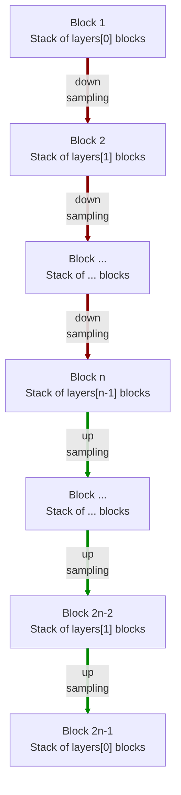

# modules.resnet.AE3d

:codicons-symbol-class: Class · [:material-graph-outline: nn.Module][torch-module] · [:octicons-file-code-24: Source]({{ source.root }}/modules/resnet.py#L1222){ target="_blank" }

```python
net = mdnc.modules.resnet.AE3d(
    channel, layers, block='bottleneck',
    kernel_size=3, in_planes=1, out_planes=1
)
```

This moule is a built-in model for 3D residual auto-encoder. The network structure is almost the same as [`mdnc.modules.resnet.UNet3d`](../UNet3d) but all block-level skip connections are removed. Generally, using [`mdnc.modules.resnet.UNet3d`](../UNet3d) should be a better choice.

The network would down-sample and up-sample the input data according to the network depth. The depth is given by the length of the argument `layers`.  The network structure is shown in the following chart:



The argument `layers` is a sequence of `#!py int`. For each block $i$, it contains `#!py layers[i-1]` repeated residual blocks (see [`mdnc.modules.resnet.BlockPlain3d`](../BlockPlain3d) and [`mdnc.modules.resnet.BlockBottleneck3d`](../BlockBottleneck3d)). Each down-sampling or up-sampling is configured by `#!py stride=2`. The channel number would be doubled in the down-sampling route and reduced to 1/2 in the up-sampling route.

## Arguments

**Requries**

| Argument {: .w-6rem} | Type {: .w-7rem} | Description {: .w-8rem} |
| :------: | :-----: | :---------- |
| `channel` | `#!py int` | The channel number of the first hidden block (layer). After each down-sampling, the channel number would be doubled. After each up-sampling, the channel number would be reduced to 1/2. |
| `layers` | `#!py (int,)` | A sequence of layer numbers for each block. Each number represents the number of residual blocks of a stage (block). The stage numer, i.e. the depth of the network is the length of this list. |
| `block` | `#!py str` | The residual block type, could be: <ul> <li>`#!py 'plain'`: see [`BlockPlain3d`](../BlockPlain3d).</li> <li>`#!py 'bottleneck'`: see [`BlockBottleneck3d`](../BlockBottleneck3d).</li> </ul> |
| `kernel_size` | `#!py int` or<br>`#!py (int, int, int)` | The kernel size of each residual block. |
| `in_planes` | `#!py int` | The channel number of the input data. |
| `out_planes` | `#!py int` | The channel number of the output data. |

## Operators

### :codicons-symbol-operator: `#!py __call__`

```python
y = net(x)
```

The forward operator implemented by the `forward()` method. The input is a 3D tensor, and the output is the final output of this network.

**Requries**

| Argument {: .w-5rem} | Type {: .w-6rem} | Description {: .w-8rem} |
| :------: | :-----: | :---------- |
| `x` | `#!py torch.Tensor` | A 3D tensor, the size should be `#!py (B, C, L1, L2, L3)`, where `B` is the batch size, `C` is the input channel number, and `(L1, L2, L3)` is the input data size. |

**Returns**

| Argument {: .w-5rem} | Description {: .w-8rem} |
| :------: | :---------- |
| `y` | A 3D tensor, the size should be `#!py (B, C, L1, L2, L3)`, where `B` is the batch size, `C` is the output channel number, and `(L1, L2, L3)` is the **input** data size. |

## Properties

### :codicons-symbol-variable: `nlayers`

```python
net.nlayers
```

The total number of convolutional layers along the depth of the network.

## Examples

???+ example "Example"
    === "Codes"
        ```python linenums="1"
        import mdnc

        net = mdnc.modules.resnet.AE3d(64, [2, 2, 2, 2, 3], in_planes=3, out_planes=1)
        print('The number of convolutional layers along the depth is {0}.'.format(net.nlayers))
        mdnc.contribs.torchsummary.summary(net, (3, 31, 32, 30), device='cpu')
        ```

    === "Output"
        ```
        The number of convolutional layers along the depth is 25.
        ----------------------------------------------------------------
                Layer (type)               Output Shape         Param #
        ================================================================
                    Conv3d-1       [-1, 64, 31, 32, 30]          24,000
            InstanceNorm3d-2       [-1, 64, 31, 32, 30]             128
                     PReLU-3       [-1, 64, 31, 32, 30]              64
                    Conv3d-4       [-1, 64, 31, 32, 30]           4,096
            InstanceNorm3d-5       [-1, 64, 31, 32, 30]             128
                     PReLU-6       [-1, 64, 31, 32, 30]              64
                    Conv3d-7       [-1, 64, 31, 32, 30]         110,592
            InstanceNorm3d-8       [-1, 64, 31, 32, 30]             128
                     PReLU-9       [-1, 64, 31, 32, 30]              64
                   Conv3d-10       [-1, 64, 31, 32, 30]           4,096
        _BlockBo...neckNd-11       [-1, 64, 31, 32, 30]               0
           InstanceNorm3d-12       [-1, 64, 31, 32, 30]             128
                    PReLU-13       [-1, 64, 31, 32, 30]              64
                   Conv3d-14       [-1, 64, 31, 32, 30]           4,096
           InstanceNorm3d-15       [-1, 64, 31, 32, 30]             128
                    PReLU-16       [-1, 64, 31, 32, 30]              64
                   Conv3d-17       [-1, 64, 16, 16, 15]         110,592
           InstanceNorm3d-18       [-1, 64, 16, 16, 15]             128
                    PReLU-19       [-1, 64, 16, 16, 15]              64
                   Conv3d-20       [-1, 64, 16, 16, 15]           4,096
                   Conv3d-21       [-1, 64, 16, 16, 15]           4,096
           InstanceNorm3d-22       [-1, 64, 16, 16, 15]             128
        _BlockBo...neckNd-23       [-1, 64, 16, 16, 15]               0
           _BlockResStkNd-24       [-1, 64, 16, 16, 15]               0
           InstanceNorm3d-25       [-1, 64, 16, 16, 15]             128
                    PReLU-26       [-1, 64, 16, 16, 15]              64
                   Conv3d-27       [-1, 64, 16, 16, 15]           4,096
           InstanceNorm3d-28       [-1, 64, 16, 16, 15]             128
                    PReLU-29       [-1, 64, 16, 16, 15]              64
                   Conv3d-30       [-1, 64, 16, 16, 15]         110,592
           InstanceNorm3d-31       [-1, 64, 16, 16, 15]             128
                    PReLU-32       [-1, 64, 16, 16, 15]              64
                   Conv3d-33      [-1, 128, 16, 16, 15]           8,192
                   Conv3d-34      [-1, 128, 16, 16, 15]           8,192
           InstanceNorm3d-35      [-1, 128, 16, 16, 15]             256
        _BlockBo...neckNd-36      [-1, 128, 16, 16, 15]               0
           InstanceNorm3d-37      [-1, 128, 16, 16, 15]             256
                    PReLU-38      [-1, 128, 16, 16, 15]             128
                   Conv3d-39      [-1, 128, 16, 16, 15]          16,384
           InstanceNorm3d-40      [-1, 128, 16, 16, 15]             256
                    PReLU-41      [-1, 128, 16, 16, 15]             128
                   Conv3d-42         [-1, 128, 8, 8, 8]         442,368
           InstanceNorm3d-43         [-1, 128, 8, 8, 8]             256
                    PReLU-44         [-1, 128, 8, 8, 8]             128
                   Conv3d-45         [-1, 128, 8, 8, 8]          16,384
                   Conv3d-46         [-1, 128, 8, 8, 8]          16,384
           InstanceNorm3d-47         [-1, 128, 8, 8, 8]             256
        _BlockBo...neckNd-48         [-1, 128, 8, 8, 8]               0
           _BlockResStkNd-49         [-1, 128, 8, 8, 8]               0
           InstanceNorm3d-50         [-1, 128, 8, 8, 8]             256
                    PReLU-51         [-1, 128, 8, 8, 8]             128
                   Conv3d-52         [-1, 128, 8, 8, 8]          16,384
           InstanceNorm3d-53         [-1, 128, 8, 8, 8]             256
                    PReLU-54         [-1, 128, 8, 8, 8]             128
                   Conv3d-55         [-1, 128, 8, 8, 8]         442,368
           InstanceNorm3d-56         [-1, 128, 8, 8, 8]             256
                    PReLU-57         [-1, 128, 8, 8, 8]             128
                   Conv3d-58         [-1, 256, 8, 8, 8]          32,768
                   Conv3d-59         [-1, 256, 8, 8, 8]          32,768
           InstanceNorm3d-60         [-1, 256, 8, 8, 8]             512
        _BlockBo...neckNd-61         [-1, 256, 8, 8, 8]               0
           InstanceNorm3d-62         [-1, 256, 8, 8, 8]             512
                    PReLU-63         [-1, 256, 8, 8, 8]             256
                   Conv3d-64         [-1, 256, 8, 8, 8]          65,536
           InstanceNorm3d-65         [-1, 256, 8, 8, 8]             512
                    PReLU-66         [-1, 256, 8, 8, 8]             256
                   Conv3d-67         [-1, 256, 4, 4, 4]       1,769,472
           InstanceNorm3d-68         [-1, 256, 4, 4, 4]             512
                    PReLU-69         [-1, 256, 4, 4, 4]             256
                   Conv3d-70         [-1, 256, 4, 4, 4]          65,536
                   Conv3d-71         [-1, 256, 4, 4, 4]          65,536
           InstanceNorm3d-72         [-1, 256, 4, 4, 4]             512
        _BlockBo...neckNd-73         [-1, 256, 4, 4, 4]               0
           _BlockResStkNd-74         [-1, 256, 4, 4, 4]               0
           InstanceNorm3d-75         [-1, 256, 4, 4, 4]             512
                    PReLU-76         [-1, 256, 4, 4, 4]             256
                   Conv3d-77         [-1, 256, 4, 4, 4]          65,536
           InstanceNorm3d-78         [-1, 256, 4, 4, 4]             512
                    PReLU-79         [-1, 256, 4, 4, 4]             256
                   Conv3d-80         [-1, 256, 4, 4, 4]       1,769,472
           InstanceNorm3d-81         [-1, 256, 4, 4, 4]             512
                    PReLU-82         [-1, 256, 4, 4, 4]             256
                   Conv3d-83         [-1, 512, 4, 4, 4]         131,072
                   Conv3d-84         [-1, 512, 4, 4, 4]         131,072
           InstanceNorm3d-85         [-1, 512, 4, 4, 4]           1,024
        _BlockBo...neckNd-86         [-1, 512, 4, 4, 4]               0
           InstanceNorm3d-87         [-1, 512, 4, 4, 4]           1,024
                    PReLU-88         [-1, 512, 4, 4, 4]             512
                   Conv3d-89         [-1, 512, 4, 4, 4]         262,144
           InstanceNorm3d-90         [-1, 512, 4, 4, 4]           1,024
                    PReLU-91         [-1, 512, 4, 4, 4]             512
                   Conv3d-92         [-1, 512, 2, 2, 2]       7,077,888
           InstanceNorm3d-93         [-1, 512, 2, 2, 2]           1,024
                    PReLU-94         [-1, 512, 2, 2, 2]             512
                   Conv3d-95         [-1, 512, 2, 2, 2]         262,144
                   Conv3d-96         [-1, 512, 2, 2, 2]         262,144
           InstanceNorm3d-97         [-1, 512, 2, 2, 2]           1,024
        _BlockBo...neckNd-98         [-1, 512, 2, 2, 2]               0
           _BlockResStkNd-99         [-1, 512, 2, 2, 2]               0
          InstanceNorm3d-100         [-1, 512, 2, 2, 2]           1,024
                   PReLU-101         [-1, 512, 2, 2, 2]             512
                  Conv3d-102         [-1, 512, 2, 2, 2]         262,144
          InstanceNorm3d-103         [-1, 512, 2, 2, 2]           1,024
                   PReLU-104         [-1, 512, 2, 2, 2]             512
                  Conv3d-105         [-1, 512, 2, 2, 2]       7,077,888
          InstanceNorm3d-106         [-1, 512, 2, 2, 2]           1,024
                   PReLU-107         [-1, 512, 2, 2, 2]             512
                  Conv3d-108        [-1, 1024, 2, 2, 2]         524,288
                  Conv3d-109        [-1, 1024, 2, 2, 2]         524,288
          InstanceNorm3d-110        [-1, 1024, 2, 2, 2]           2,048
        _BlockBo...eckNd-111        [-1, 1024, 2, 2, 2]               0
          InstanceNorm3d-112        [-1, 1024, 2, 2, 2]           2,048
                   PReLU-113        [-1, 1024, 2, 2, 2]           1,024
                  Conv3d-114        [-1, 1024, 2, 2, 2]       1,048,576
          InstanceNorm3d-115        [-1, 1024, 2, 2, 2]           2,048
                   PReLU-116        [-1, 1024, 2, 2, 2]           1,024
                  Conv3d-117        [-1, 1024, 2, 2, 2]      28,311,552
          InstanceNorm3d-118        [-1, 1024, 2, 2, 2]           2,048
                   PReLU-119        [-1, 1024, 2, 2, 2]           1,024
                  Conv3d-120        [-1, 1024, 2, 2, 2]       1,048,576
        _BlockBo...eckNd-121        [-1, 1024, 2, 2, 2]               0
          InstanceNorm3d-122        [-1, 1024, 2, 2, 2]           2,048
                   PReLU-123        [-1, 1024, 2, 2, 2]           1,024
                  Conv3d-124        [-1, 1024, 2, 2, 2]       1,048,576
          InstanceNorm3d-125        [-1, 1024, 2, 2, 2]           2,048
                   PReLU-126        [-1, 1024, 2, 2, 2]           1,024
                Upsample-127        [-1, 1024, 4, 4, 4]               0
                  Conv3d-128        [-1, 1024, 4, 4, 4]      28,311,552
          InstanceNorm3d-129        [-1, 1024, 4, 4, 4]           2,048
                   PReLU-130        [-1, 1024, 4, 4, 4]           1,024
                  Conv3d-131         [-1, 512, 4, 4, 4]         524,288
                Upsample-132        [-1, 1024, 4, 4, 4]               0
                  Conv3d-133         [-1, 512, 4, 4, 4]         524,288
          InstanceNorm3d-134         [-1, 512, 4, 4, 4]           1,024
        _BlockBo...eckNd-135         [-1, 512, 4, 4, 4]               0
          _BlockResStkNd-136         [-1, 512, 4, 4, 4]               0
          InstanceNorm3d-137         [-1, 512, 4, 4, 4]           1,024
                   PReLU-138         [-1, 512, 4, 4, 4]             512
                  Conv3d-139         [-1, 512, 4, 4, 4]         262,144
          InstanceNorm3d-140         [-1, 512, 4, 4, 4]           1,024
                   PReLU-141         [-1, 512, 4, 4, 4]             512
                  Conv3d-142         [-1, 512, 4, 4, 4]       7,077,888
          InstanceNorm3d-143         [-1, 512, 4, 4, 4]           1,024
                   PReLU-144         [-1, 512, 4, 4, 4]             512
                  Conv3d-145         [-1, 512, 4, 4, 4]         262,144
        _BlockBo...eckNd-146         [-1, 512, 4, 4, 4]               0
          InstanceNorm3d-147         [-1, 512, 4, 4, 4]           1,024
                   PReLU-148         [-1, 512, 4, 4, 4]             512
                  Conv3d-149         [-1, 512, 4, 4, 4]         262,144
          InstanceNorm3d-150         [-1, 512, 4, 4, 4]           1,024
                   PReLU-151         [-1, 512, 4, 4, 4]             512
                Upsample-152         [-1, 512, 8, 8, 8]               0
                  Conv3d-153         [-1, 512, 8, 8, 8]       7,077,888
          InstanceNorm3d-154         [-1, 512, 8, 8, 8]           1,024
                   PReLU-155         [-1, 512, 8, 8, 8]             512
                  Conv3d-156         [-1, 256, 8, 8, 8]         131,072
                Upsample-157         [-1, 512, 8, 8, 8]               0
                  Conv3d-158         [-1, 256, 8, 8, 8]         131,072
          InstanceNorm3d-159         [-1, 256, 8, 8, 8]             512
        _BlockBo...eckNd-160         [-1, 256, 8, 8, 8]               0
          _BlockResStkNd-161         [-1, 256, 8, 8, 8]               0
          InstanceNorm3d-162         [-1, 256, 8, 8, 8]             512
                   PReLU-163         [-1, 256, 8, 8, 8]             256
                  Conv3d-164         [-1, 256, 8, 8, 8]          65,536
          InstanceNorm3d-165         [-1, 256, 8, 8, 8]             512
                   PReLU-166         [-1, 256, 8, 8, 8]             256
                  Conv3d-167         [-1, 256, 8, 8, 8]       1,769,472
          InstanceNorm3d-168         [-1, 256, 8, 8, 8]             512
                   PReLU-169         [-1, 256, 8, 8, 8]             256
                  Conv3d-170         [-1, 256, 8, 8, 8]          65,536
        _BlockBo...eckNd-171         [-1, 256, 8, 8, 8]               0
          InstanceNorm3d-172         [-1, 256, 8, 8, 8]             512
                   PReLU-173         [-1, 256, 8, 8, 8]             256
                  Conv3d-174         [-1, 256, 8, 8, 8]          65,536
          InstanceNorm3d-175         [-1, 256, 8, 8, 8]             512
                   PReLU-176         [-1, 256, 8, 8, 8]             256
                Upsample-177      [-1, 256, 16, 16, 16]               0
                  Conv3d-178      [-1, 256, 16, 16, 16]       1,769,472
          InstanceNorm3d-179      [-1, 256, 16, 16, 16]             512
                   PReLU-180      [-1, 256, 16, 16, 16]             256
                  Conv3d-181      [-1, 128, 16, 16, 16]          32,768
                Upsample-182      [-1, 256, 16, 16, 16]               0
                  Conv3d-183      [-1, 128, 16, 16, 16]          32,768
          InstanceNorm3d-184      [-1, 128, 16, 16, 16]             256
        _BlockBo...eckNd-185      [-1, 128, 16, 16, 16]               0
          _BlockResStkNd-186      [-1, 128, 16, 16, 16]               0
          InstanceNorm3d-187      [-1, 128, 16, 16, 15]             256
                   PReLU-188      [-1, 128, 16, 16, 15]             128
                  Conv3d-189      [-1, 128, 16, 16, 15]          16,384
          InstanceNorm3d-190      [-1, 128, 16, 16, 15]             256
                   PReLU-191      [-1, 128, 16, 16, 15]             128
                  Conv3d-192      [-1, 128, 16, 16, 15]         442,368
          InstanceNorm3d-193      [-1, 128, 16, 16, 15]             256
                   PReLU-194      [-1, 128, 16, 16, 15]             128
                  Conv3d-195      [-1, 128, 16, 16, 15]          16,384
        _BlockBo...eckNd-196      [-1, 128, 16, 16, 15]               0
          InstanceNorm3d-197      [-1, 128, 16, 16, 15]             256
                   PReLU-198      [-1, 128, 16, 16, 15]             128
                  Conv3d-199      [-1, 128, 16, 16, 15]          16,384
          InstanceNorm3d-200      [-1, 128, 16, 16, 15]             256
                   PReLU-201      [-1, 128, 16, 16, 15]             128
                Upsample-202      [-1, 128, 32, 32, 30]               0
                  Conv3d-203      [-1, 128, 32, 32, 30]         442,368
          InstanceNorm3d-204      [-1, 128, 32, 32, 30]             256
                   PReLU-205      [-1, 128, 32, 32, 30]             128
                  Conv3d-206       [-1, 64, 32, 32, 30]           8,192
                Upsample-207      [-1, 128, 32, 32, 30]               0
                  Conv3d-208       [-1, 64, 32, 32, 30]           8,192
          InstanceNorm3d-209       [-1, 64, 32, 32, 30]             128
        _BlockBo...eckNd-210       [-1, 64, 32, 32, 30]               0
          _BlockResStkNd-211       [-1, 64, 32, 32, 30]               0
          InstanceNorm3d-212       [-1, 64, 31, 32, 30]             128
                   PReLU-213       [-1, 64, 31, 32, 30]              64
                  Conv3d-214       [-1, 64, 31, 32, 30]           4,096
          InstanceNorm3d-215       [-1, 64, 31, 32, 30]             128
                   PReLU-216       [-1, 64, 31, 32, 30]              64
                  Conv3d-217       [-1, 64, 31, 32, 30]         110,592
          InstanceNorm3d-218       [-1, 64, 31, 32, 30]             128
                   PReLU-219       [-1, 64, 31, 32, 30]              64
                  Conv3d-220       [-1, 64, 31, 32, 30]           4,096
        _BlockBo...eckNd-221       [-1, 64, 31, 32, 30]               0
          InstanceNorm3d-222       [-1, 64, 31, 32, 30]             128
                   PReLU-223       [-1, 64, 31, 32, 30]              64
                  Conv3d-224       [-1, 64, 31, 32, 30]           4,096
          InstanceNorm3d-225       [-1, 64, 31, 32, 30]             128
                   PReLU-226       [-1, 64, 31, 32, 30]              64
                  Conv3d-227       [-1, 64, 31, 32, 30]         110,592
          InstanceNorm3d-228       [-1, 64, 31, 32, 30]             128
                   PReLU-229       [-1, 64, 31, 32, 30]              64
                  Conv3d-230       [-1, 64, 31, 32, 30]           4,096
        _BlockBo...eckNd-231       [-1, 64, 31, 32, 30]               0
          _BlockResStkNd-232       [-1, 64, 31, 32, 30]               0
                  Conv3d-233        [-1, 1, 31, 32, 30]           8,001
                    AE3d-234        [-1, 1, 31, 32, 30]               0
        ================================================================
        Total params: 102,808,641
        Trainable params: 102,808,641
        Non-trainable params: 0
        ----------------------------------------------------------------
        Input size (MB): 0.34
        Forward/backward pass size (MB): 1003.55
        Params size (MB): 392.18
        Estimated Total Size (MB): 1396.07
        ----------------------------------------------------------------
        ```

[torch-module]:https://pytorch.org/docs/stable/generated/torch.nn.Module.html "torch.nn.Module"
