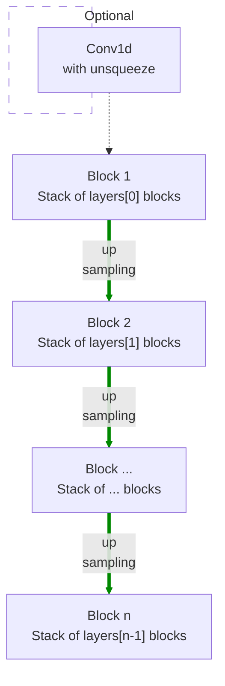

# modules.resnet.DecoderNet1d

:codicons-symbol-class: Class · [:material-graph-outline: nn.Module][torch-module] · [:octicons-file-code-24: Source]({{ source.root }}/modules/resnet.py#L1329){ target="_blank" }

```python
net = mdnc.modules.resnet.DecoderNet1d(
     channel, layers, out_size, block='bottleneck',
     kernel_size=3, in_length=2, out_planes=1
)
```

This moule is a built-in model for 1D residual decoder network. This network could be used as a part of the auto-encoder, or just a network for up-sampling (or generating) data.

The network would up-sample the input data according to the network depth. The depth is given by the length of the argument `layers`.  The network structure is shown in the following chart:



The argument `layers` is a sequence of `#!py int`. For each block $i$, it contains `#!py layers[i-1]` repeated residual blocks (see [`mdnc.modules.resnet.BlockPlain1d`](../BlockPlain1d) and [`mdnc.modules.resnet.BlockBottleneck1d`](../BlockBottleneck1d)). Each down-sampling or up-sampling is configured by `#!py stride=2`. The channel number would be doubled in the up-sampling route. An optional unsqueezer and convolutional layer could be prepended to the first layer when the argument `#!py in_length != None`. This optional layer is used for converting the vector features in initial feature maps.

## Arguments

**Requries**

| Argument {: .w-6rem} | Type {: .w-4rem} | Description {: .w-8rem} |
| :------: | :-----: | :---------- |
| `channel` | `#!py int` | The channel number of the first hidden block (layer). After each down-sampling, the channel number would be doubled. |
| `layers` | `#!py (int,)` | A sequence of layer numbers for each block. Each number represents the number of residual blocks of a stage (block). The stage numer, i.e. the depth of the network is the length of this list. |
| `out_size` | `#!py int` | The length of the output data. This argument needs to be specified by users, because the network needs to configure its layers according to the output size. |
| `block` | `#!py str` | The residual block type, could be: <ul> <li>`#!py 'plain'`: see [`BlockPlain1d`](../BlockPlain1d).</li> <li>`#!py 'bottleneck'`: see [`BlockBottleneck1d`](../BlockBottleneck1d).</li> </ul> |
| `kernel_size` | `#!py int` | The kernel size of each residual block. |
| `in_length` | `#!py int` | The length of the input vector, if not set, the input needs to be feature maps. See the property [`input_size`](#input_size) to check the input data size in this case. |
| `out_planes` | `#!py int` | The channel number of the output data. |

## Operators

### :codicons-symbol-operator: `#!py __call__`

```python
y = net(x)
```

The forward operator implemented by the `forward()` method. The input data is a tensor with a size determined by configurations. The output is a 1D tensor. The channel number of the output is specified by the argument `out_planes`.

**Requries**

| Argument {: .w-5rem} | Type {: .w-6rem} | Description {: .w-8rem} |
| :------: | :-----: | :---------- |
| `x` | `#!py torch.Tensor` | A tensor, <ul> <li>When `#!py in_length is None`: the size should be `#!py (B, L)`, where `B` is the batch size, and `L` is `in_length`.</li> <li>When `#!py in_length != None`: the size should be `#!py (B, C, L)`, where `B` is the batch size, `C` and `L` are the channel number and the length of the input feature maps (see [`input_size`](#input_size)) respectively.</li> </ul> |

**Returns**

| Argument {: .w-5rem} | Description {: .w-8rem} |
| :------: | :---------- |
| `y` | A 1D tensor, the size should be `#!py (B, C, L)`, where `B` is the batch size, `C` is the input channel number, and `L` is the output data size specified by the argument `out_size`. |

## Properties

### :codicons-symbol-variable: `nlayers`

```python
net.nlayers
```

The total number of convolutional layers along the depth of the network. This value would not take the fully-connected layer into consideration.

-----

### :codicons-symbol-variable: `input_size`

```python
net.input_size
```

The size of the input data size (a `#!py tuple`). This property is useful when `#!py in_length is None`. In this case, the input size is determined by the network.

??? warning
    This size contains the channel number (as the first element), because the input channel number is also determined by network when `#!py in_length is None`.

## Examples

???+ example "Example 1"
    === "Codes"
        ```python linenums="1"
        import mdnc

        net = mdnc.modules.resnet.DecoderNet1d(64, [2, 2, 2, 2, 2], in_length=32, out_size=128, out_planes=3)
        print('The number of convolutional layers along the depth is {0}.'.format(net.nlayers))
        print('The input size is {0}.'.format(net.input_size))
        mdnc.contribs.torchsummary.summary(net, net.input_size, device='cpu')
        ```

    === "Output"
        ```
        The number of convolutional layers along the depth is 33.
        The input size is (32,).
        ----------------------------------------------------------------
                Layer (type)               Output Shape         Param #
        ================================================================
                    Conv1d-1              [-1, 1024, 4]         132,096
                    Conv1d-2              [-1, 1024, 4]       3,145,728
            InstanceNorm1d-3              [-1, 1024, 4]           2,048
                     PReLU-4              [-1, 1024, 4]           1,024
                    Conv1d-5              [-1, 1024, 4]       1,048,576
            InstanceNorm1d-6              [-1, 1024, 4]           2,048
                     PReLU-7              [-1, 1024, 4]           1,024
                    Conv1d-8              [-1, 1024, 4]       3,145,728
            InstanceNorm1d-9              [-1, 1024, 4]           2,048
                    PReLU-10              [-1, 1024, 4]           1,024
                   Conv1d-11               [-1, 512, 4]         524,288
                   Conv1d-12               [-1, 512, 4]         524,288
           InstanceNorm1d-13               [-1, 512, 4]           1,024
        _BlockBo...neckNd-14               [-1, 512, 4]               0
           InstanceNorm1d-15               [-1, 512, 4]           1,024
                    PReLU-16               [-1, 512, 4]             512
                   Conv1d-17               [-1, 512, 4]         262,144
           InstanceNorm1d-18               [-1, 512, 4]           1,024
                    PReLU-19               [-1, 512, 4]             512
                 Upsample-20               [-1, 512, 8]               0
                   Conv1d-21               [-1, 512, 8]         786,432
           InstanceNorm1d-22               [-1, 512, 8]           1,024
                    PReLU-23               [-1, 512, 8]             512
                   Conv1d-24               [-1, 512, 8]         262,144
                 Upsample-25               [-1, 512, 8]               0
                   Conv1d-26               [-1, 512, 8]         262,144
           InstanceNorm1d-27               [-1, 512, 8]           1,024
        _BlockBo...neckNd-28               [-1, 512, 8]               0
           _BlockResStkNd-29               [-1, 512, 8]               0
           InstanceNorm1d-30               [-1, 512, 8]           1,024
                    PReLU-31               [-1, 512, 8]             512
                   Conv1d-32               [-1, 512, 8]         262,144
           InstanceNorm1d-33               [-1, 512, 8]           1,024
                    PReLU-34               [-1, 512, 8]             512
                   Conv1d-35               [-1, 512, 8]         786,432
           InstanceNorm1d-36               [-1, 512, 8]           1,024
                    PReLU-37               [-1, 512, 8]             512
                   Conv1d-38               [-1, 256, 8]         131,072
                   Conv1d-39               [-1, 256, 8]         131,072
           InstanceNorm1d-40               [-1, 256, 8]             512
        _BlockBo...neckNd-41               [-1, 256, 8]               0
           InstanceNorm1d-42               [-1, 256, 8]             512
                    PReLU-43               [-1, 256, 8]             256
                   Conv1d-44               [-1, 256, 8]          65,536
           InstanceNorm1d-45               [-1, 256, 8]             512
                    PReLU-46               [-1, 256, 8]             256
                 Upsample-47              [-1, 256, 16]               0
                   Conv1d-48              [-1, 256, 16]         196,608
           InstanceNorm1d-49              [-1, 256, 16]             512
                    PReLU-50              [-1, 256, 16]             256
                   Conv1d-51              [-1, 256, 16]          65,536
                 Upsample-52              [-1, 256, 16]               0
                   Conv1d-53              [-1, 256, 16]          65,536
           InstanceNorm1d-54              [-1, 256, 16]             512
        _BlockBo...neckNd-55              [-1, 256, 16]               0
           _BlockResStkNd-56              [-1, 256, 16]               0
           InstanceNorm1d-57              [-1, 256, 16]             512
                    PReLU-58              [-1, 256, 16]             256
                   Conv1d-59              [-1, 256, 16]          65,536
           InstanceNorm1d-60              [-1, 256, 16]             512
                    PReLU-61              [-1, 256, 16]             256
                   Conv1d-62              [-1, 256, 16]         196,608
           InstanceNorm1d-63              [-1, 256, 16]             512
                    PReLU-64              [-1, 256, 16]             256
                   Conv1d-65              [-1, 128, 16]          32,768
                   Conv1d-66              [-1, 128, 16]          32,768
           InstanceNorm1d-67              [-1, 128, 16]             256
        _BlockBo...neckNd-68              [-1, 128, 16]               0
           InstanceNorm1d-69              [-1, 128, 16]             256
                    PReLU-70              [-1, 128, 16]             128
                   Conv1d-71              [-1, 128, 16]          16,384
           InstanceNorm1d-72              [-1, 128, 16]             256
                    PReLU-73              [-1, 128, 16]             128
                 Upsample-74              [-1, 128, 32]               0
                   Conv1d-75              [-1, 128, 32]          49,152
           InstanceNorm1d-76              [-1, 128, 32]             256
                    PReLU-77              [-1, 128, 32]             128
                   Conv1d-78              [-1, 128, 32]          16,384
                 Upsample-79              [-1, 128, 32]               0
                   Conv1d-80              [-1, 128, 32]          16,384
           InstanceNorm1d-81              [-1, 128, 32]             256
        _BlockBo...neckNd-82              [-1, 128, 32]               0
           _BlockResStkNd-83              [-1, 128, 32]               0
           InstanceNorm1d-84              [-1, 128, 32]             256
                    PReLU-85              [-1, 128, 32]             128
                   Conv1d-86              [-1, 128, 32]          16,384
           InstanceNorm1d-87              [-1, 128, 32]             256
                    PReLU-88              [-1, 128, 32]             128
                   Conv1d-89              [-1, 128, 32]          49,152
           InstanceNorm1d-90              [-1, 128, 32]             256
                    PReLU-91              [-1, 128, 32]             128
                   Conv1d-92               [-1, 64, 32]           8,192
                   Conv1d-93               [-1, 64, 32]           8,192
           InstanceNorm1d-94               [-1, 64, 32]             128
        _BlockBo...neckNd-95               [-1, 64, 32]               0
           InstanceNorm1d-96               [-1, 64, 32]             128
                    PReLU-97               [-1, 64, 32]              64
                   Conv1d-98               [-1, 64, 32]           4,096
           InstanceNorm1d-99               [-1, 64, 32]             128
                   PReLU-100               [-1, 64, 32]              64
                Upsample-101               [-1, 64, 64]               0
                  Conv1d-102               [-1, 64, 64]          12,288
          InstanceNorm1d-103               [-1, 64, 64]             128
                   PReLU-104               [-1, 64, 64]              64
                  Conv1d-105               [-1, 64, 64]           4,096
                Upsample-106               [-1, 64, 64]               0
                  Conv1d-107               [-1, 64, 64]           4,096
          InstanceNorm1d-108               [-1, 64, 64]             128
        _BlockBo...eckNd-109               [-1, 64, 64]               0
          _BlockResStkNd-110               [-1, 64, 64]               0
          InstanceNorm1d-111               [-1, 64, 64]             128
                   PReLU-112               [-1, 64, 64]              64
                  Conv1d-113               [-1, 64, 64]           4,096
          InstanceNorm1d-114               [-1, 64, 64]             128
                   PReLU-115               [-1, 64, 64]              64
                  Conv1d-116               [-1, 64, 64]          12,288
          InstanceNorm1d-117               [-1, 64, 64]             128
                   PReLU-118               [-1, 64, 64]              64
                  Conv1d-119               [-1, 64, 64]           4,096
        _BlockBo...eckNd-120               [-1, 64, 64]               0
          InstanceNorm1d-121               [-1, 64, 64]             128
                   PReLU-122               [-1, 64, 64]              64
                  Conv1d-123               [-1, 64, 64]           4,096
          InstanceNorm1d-124               [-1, 64, 64]             128
                   PReLU-125               [-1, 64, 64]              64
                Upsample-126              [-1, 64, 128]               0
                  Conv1d-127              [-1, 64, 128]          12,288
          InstanceNorm1d-128              [-1, 64, 128]             128
                   PReLU-129              [-1, 64, 128]              64
                  Conv1d-130              [-1, 64, 128]           4,096
                Upsample-131              [-1, 64, 128]               0
                  Conv1d-132              [-1, 64, 128]           4,096
          InstanceNorm1d-133              [-1, 64, 128]             128
        _BlockBo...eckNd-134              [-1, 64, 128]               0
          _BlockResStkNd-135              [-1, 64, 128]               0
                  Conv1d-136               [-1, 3, 128]             963
            DecoderNet1d-137               [-1, 3, 128]               0
        ================================================================
        Total params: 12,407,043
        Trainable params: 12,407,043
        Non-trainable params: 0
        ----------------------------------------------------------------
        Input size (MB): 0.00
        Forward/backward pass size (MB): 3.97
        Params size (MB): 47.33
        Estimated Total Size (MB): 51.30
        ----------------------------------------------------------------
        ```

???+ example "Example 2"
    === "Codes"
        ```python linenums="1"
        import mdnc

        net = mdnc.modules.resnet.DecoderNet1d(64, [2, 2, 2, 2, 2], in_length=None, out_size=128, out_planes=3)
        print('The number of convolutional layers along the depth is {0}.'.format(net.nlayers))
        print('The input size is {0}.'.format(net.input_size))
        mdnc.contribs.torchsummary.summary(net, net.input_size, device='cpu')
        ```

    === "Output"
        ```
        The number of convolutional layers along the depth is 32.
        The input size is (1024, 4).
        ----------------------------------------------------------------
                Layer (type)               Output Shape         Param #
        ================================================================
                    Conv1d-1              [-1, 1024, 4]       3,145,728
            InstanceNorm1d-2              [-1, 1024, 4]           2,048
                     PReLU-3              [-1, 1024, 4]           1,024
                    Conv1d-4              [-1, 1024, 4]       1,048,576
            InstanceNorm1d-5              [-1, 1024, 4]           2,048
                     PReLU-6              [-1, 1024, 4]           1,024
                    Conv1d-7              [-1, 1024, 4]       3,145,728
            InstanceNorm1d-8              [-1, 1024, 4]           2,048
                     PReLU-9              [-1, 1024, 4]           1,024
                   Conv1d-10               [-1, 512, 4]         524,288
                   Conv1d-11               [-1, 512, 4]         524,288
           InstanceNorm1d-12               [-1, 512, 4]           1,024
        _BlockBo...neckNd-13               [-1, 512, 4]               0
           InstanceNorm1d-14               [-1, 512, 4]           1,024
                    PReLU-15               [-1, 512, 4]             512
                   Conv1d-16               [-1, 512, 4]         262,144
           InstanceNorm1d-17               [-1, 512, 4]           1,024
                    PReLU-18               [-1, 512, 4]             512
                 Upsample-19               [-1, 512, 8]               0
                   Conv1d-20               [-1, 512, 8]         786,432
           InstanceNorm1d-21               [-1, 512, 8]           1,024
                    PReLU-22               [-1, 512, 8]             512
                   Conv1d-23               [-1, 512, 8]         262,144
                 Upsample-24               [-1, 512, 8]               0
                   Conv1d-25               [-1, 512, 8]         262,144
           InstanceNorm1d-26               [-1, 512, 8]           1,024
        _BlockBo...neckNd-27               [-1, 512, 8]               0
           _BlockResStkNd-28               [-1, 512, 8]               0
           InstanceNorm1d-29               [-1, 512, 8]           1,024
                    PReLU-30               [-1, 512, 8]             512
                   Conv1d-31               [-1, 512, 8]         262,144
           InstanceNorm1d-32               [-1, 512, 8]           1,024
                    PReLU-33               [-1, 512, 8]             512
                   Conv1d-34               [-1, 512, 8]         786,432
           InstanceNorm1d-35               [-1, 512, 8]           1,024
                    PReLU-36               [-1, 512, 8]             512
                   Conv1d-37               [-1, 256, 8]         131,072
                   Conv1d-38               [-1, 256, 8]         131,072
           InstanceNorm1d-39               [-1, 256, 8]             512
        _BlockBo...neckNd-40               [-1, 256, 8]               0
           InstanceNorm1d-41               [-1, 256, 8]             512
                    PReLU-42               [-1, 256, 8]             256
                   Conv1d-43               [-1, 256, 8]          65,536
           InstanceNorm1d-44               [-1, 256, 8]             512
                    PReLU-45               [-1, 256, 8]             256
                 Upsample-46              [-1, 256, 16]               0
                   Conv1d-47              [-1, 256, 16]         196,608
           InstanceNorm1d-48              [-1, 256, 16]             512
                    PReLU-49              [-1, 256, 16]             256
                   Conv1d-50              [-1, 256, 16]          65,536
                 Upsample-51              [-1, 256, 16]               0
                   Conv1d-52              [-1, 256, 16]          65,536
           InstanceNorm1d-53              [-1, 256, 16]             512
        _BlockBo...neckNd-54              [-1, 256, 16]               0
           _BlockResStkNd-55              [-1, 256, 16]               0
           InstanceNorm1d-56              [-1, 256, 16]             512
                    PReLU-57              [-1, 256, 16]             256
                   Conv1d-58              [-1, 256, 16]          65,536
           InstanceNorm1d-59              [-1, 256, 16]             512
                    PReLU-60              [-1, 256, 16]             256
                   Conv1d-61              [-1, 256, 16]         196,608
           InstanceNorm1d-62              [-1, 256, 16]             512
                    PReLU-63              [-1, 256, 16]             256
                   Conv1d-64              [-1, 128, 16]          32,768
                   Conv1d-65              [-1, 128, 16]          32,768
           InstanceNorm1d-66              [-1, 128, 16]             256
        _BlockBo...neckNd-67              [-1, 128, 16]               0
           InstanceNorm1d-68              [-1, 128, 16]             256
                    PReLU-69              [-1, 128, 16]             128
                   Conv1d-70              [-1, 128, 16]          16,384
           InstanceNorm1d-71              [-1, 128, 16]             256
                    PReLU-72              [-1, 128, 16]             128
                 Upsample-73              [-1, 128, 32]               0
                   Conv1d-74              [-1, 128, 32]          49,152
           InstanceNorm1d-75              [-1, 128, 32]             256
                    PReLU-76              [-1, 128, 32]             128
                   Conv1d-77              [-1, 128, 32]          16,384
                 Upsample-78              [-1, 128, 32]               0
                   Conv1d-79              [-1, 128, 32]          16,384
           InstanceNorm1d-80              [-1, 128, 32]             256
        _BlockBo...neckNd-81              [-1, 128, 32]               0
           _BlockResStkNd-82              [-1, 128, 32]               0
           InstanceNorm1d-83              [-1, 128, 32]             256
                    PReLU-84              [-1, 128, 32]             128
                   Conv1d-85              [-1, 128, 32]          16,384
           InstanceNorm1d-86              [-1, 128, 32]             256
                    PReLU-87              [-1, 128, 32]             128
                   Conv1d-88              [-1, 128, 32]          49,152
           InstanceNorm1d-89              [-1, 128, 32]             256
                    PReLU-90              [-1, 128, 32]             128
                   Conv1d-91               [-1, 64, 32]           8,192
                   Conv1d-92               [-1, 64, 32]           8,192
           InstanceNorm1d-93               [-1, 64, 32]             128
        _BlockBo...neckNd-94               [-1, 64, 32]               0
           InstanceNorm1d-95               [-1, 64, 32]             128
                    PReLU-96               [-1, 64, 32]              64
                   Conv1d-97               [-1, 64, 32]           4,096
           InstanceNorm1d-98               [-1, 64, 32]             128
                    PReLU-99               [-1, 64, 32]              64
                Upsample-100               [-1, 64, 64]               0
                  Conv1d-101               [-1, 64, 64]          12,288
          InstanceNorm1d-102               [-1, 64, 64]             128
                   PReLU-103               [-1, 64, 64]              64
                  Conv1d-104               [-1, 64, 64]           4,096
                Upsample-105               [-1, 64, 64]               0
                  Conv1d-106               [-1, 64, 64]           4,096
          InstanceNorm1d-107               [-1, 64, 64]             128
        _BlockBo...eckNd-108               [-1, 64, 64]               0
          _BlockResStkNd-109               [-1, 64, 64]               0
          InstanceNorm1d-110               [-1, 64, 64]             128
                   PReLU-111               [-1, 64, 64]              64
                  Conv1d-112               [-1, 64, 64]           4,096
          InstanceNorm1d-113               [-1, 64, 64]             128
                   PReLU-114               [-1, 64, 64]              64
                  Conv1d-115               [-1, 64, 64]          12,288
          InstanceNorm1d-116               [-1, 64, 64]             128
                   PReLU-117               [-1, 64, 64]              64
                  Conv1d-118               [-1, 64, 64]           4,096
        _BlockBo...eckNd-119               [-1, 64, 64]               0
          InstanceNorm1d-120               [-1, 64, 64]             128
                   PReLU-121               [-1, 64, 64]              64
                  Conv1d-122               [-1, 64, 64]           4,096
          InstanceNorm1d-123               [-1, 64, 64]             128
                   PReLU-124               [-1, 64, 64]              64
                Upsample-125              [-1, 64, 128]               0
                  Conv1d-126              [-1, 64, 128]          12,288
          InstanceNorm1d-127              [-1, 64, 128]             128
                   PReLU-128              [-1, 64, 128]              64
                  Conv1d-129              [-1, 64, 128]           4,096
                Upsample-130              [-1, 64, 128]               0
                  Conv1d-131              [-1, 64, 128]           4,096
          InstanceNorm1d-132              [-1, 64, 128]             128
        _BlockBo...eckNd-133              [-1, 64, 128]               0
          _BlockResStkNd-134              [-1, 64, 128]               0
                  Conv1d-135               [-1, 3, 128]             963
            DecoderNet1d-136               [-1, 3, 128]               0
        ================================================================
        Total params: 12,274,947
        Trainable params: 12,274,947
        Non-trainable params: 0
        ----------------------------------------------------------------
        Input size (MB): 0.02
        Forward/backward pass size (MB): 3.94
        Params size (MB): 46.83
        Estimated Total Size (MB): 50.78
        ----------------------------------------------------------------
        ```

[torch-module]:https://pytorch.org/docs/stable/generated/torch.nn.Module.html "torch.nn.Module"
