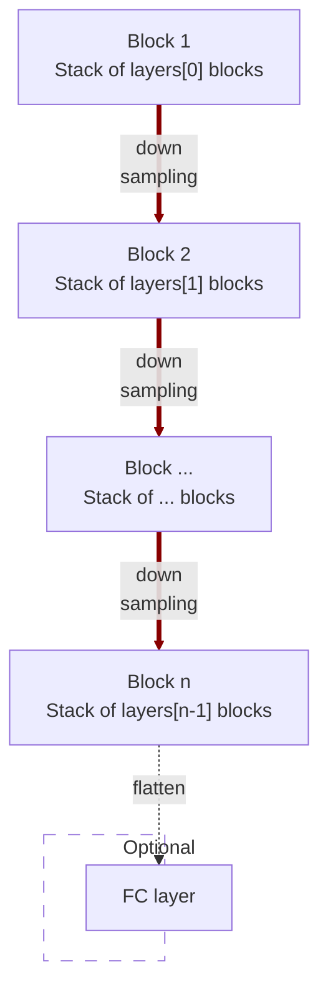

# modules.resnet.EncoderNet1d

:codicons-symbol-class: Class · [:material-graph-outline: nn.Module][torch-module] · [:octicons-file-code-24: Source]({{ source.root }}/modules/resnet.py#L1248){ target="_blank" }

```python
net = mdnc.modules.resnet.EncoderNet1d(
    channel, layers, block='bottleneck',
    kernel_size=3, in_planes=1, out_length=2
)
```

This moule is a built-in model for 1D residual encoder network. This network could be used as a part of the auto-encoder, or just a network for down-sampling data.

The network would down-sample the input data according to the network depth. The depth is given by the length of the argument `layers`.  The network structure is shown in the following chart:



The argument `layers` is a sequence of `#!py int`. For each block $i$, it contains `#!py layers[i-1]` repeated residual blocks (see [`mdnc.modules.resnet.BlockPlain1d`](../BlockPlain1d) and [`mdnc.modules.resnet.BlockBottleneck1d`](../BlockBottleneck1d)). Each down-sampling or up-sampling is configured by `#!py stride=2`. The channel number would be doubled in the down-sampling route. An optional flattener and fully-connected layer could be appended to the last layer when the argument `#!py out_length != None`.

## Arguments

**Requries**

| Argument {: .w-6rem} | Type {: .w-4rem} | Description {: .w-8rem} |
| :------: | :-----: | :---------- |
| `channel` | `#!py int` | The channel number of the first hidden block (layer). After each down-sampling, the channel number would be doubled. |
| `layers` | `#!py (int,)` | A sequence of layer numbers for each block. Each number represents the number of residual blocks of a stage (block). The stage numer, i.e. the depth of the network is the length of this list. |
| `block` | `#!py str` | The residual block type, could be: <ul> <li>`#!py 'plain'`: see [`BlockPlain1d`](../BlockPlain1d).</li> <li>`#!py 'bottleneck'`: see [`BlockBottleneck1d`](../BlockBottleneck1d).</li> </ul> |
| `kernel_size` | `#!py int` | The kernel size of each residual block. |
| `in_planes` | `#!py int` | The channel number of the input data. |
| `out_length` | `#!py int` | The length of the output vector, if not set, the output would not be flattened. |

## Operators

### :codicons-symbol-operator: `#!py __call__`

```python
y = net(x)
```

The forward operator implemented by the `forward()` method. The input is a 1D tensor, and the output is the final output of this network.

**Requries**

| Argument {: .w-5rem} | Type {: .w-6rem} | Description {: .w-8rem} |
| :------: | :-----: | :---------- |
| `x` | `#!py torch.Tensor` | A 1D tensor, the size should be `#!py (B, C, L)`, where `B` is the batch size, `C` is the input channel number, and `L` is the input data length. |

**Returns**

| Argument {: .w-5rem} | Description {: .w-8rem} |
| :------: | :---------- |
| `y` | A tensor, <ul> <li>When `#!py out_length is None`: the size should be `#!py (B, L)`, where `B` is the batch size, and `L` is `out_length`.</li> <li>When `#!py out_length != None`: the size should be `#!py (B, C, L)`, where `B` is the batch size, `C` and `L` are the channel number and the length of the last output stage (block) respectively.</li> </ul> |

## Properties

### :codicons-symbol-variable: `nlayers`

```python
net.nlayers
```

The total number of convolutional layers along the depth of the network. This value would not take the fully-connected layer into consideration.

## Examples

???+ example "Example 1"
    === "Codes"
        ```python linenums="1"
        import mdnc

        net = mdnc.modules.resnet.EncoderNet1d(64, [2, 2, 2, 2, 2], in_planes=3, out_length=32)
        print('The number of convolutional layers along the depth is {0}.'.format(net.nlayers))
        mdnc.contribs.torchsummary.summary(net, (3, 128), device='cpu')
        ```

    === "Output"
        ```
        The number of convolutional layers along the depth is 32.
        ----------------------------------------------------------------
                Layer (type)               Output Shape         Param #
        ================================================================
                    Conv1d-1              [-1, 64, 128]             960
            InstanceNorm1d-2              [-1, 64, 128]             128
                     PReLU-3              [-1, 64, 128]              64
                    Conv1d-4              [-1, 64, 128]           4,096
            InstanceNorm1d-5              [-1, 64, 128]             128
                     PReLU-6              [-1, 64, 128]              64
                    Conv1d-7              [-1, 64, 128]          12,288
            InstanceNorm1d-8              [-1, 64, 128]             128
                     PReLU-9              [-1, 64, 128]              64
                   Conv1d-10              [-1, 64, 128]           4,096
        _BlockBo...neckNd-11              [-1, 64, 128]               0
           InstanceNorm1d-12              [-1, 64, 128]             128
                    PReLU-13              [-1, 64, 128]              64
                   Conv1d-14              [-1, 64, 128]           4,096
           InstanceNorm1d-15              [-1, 64, 128]             128
                    PReLU-16              [-1, 64, 128]              64
                   Conv1d-17               [-1, 64, 64]          12,288
           InstanceNorm1d-18               [-1, 64, 64]             128
                    PReLU-19               [-1, 64, 64]              64
                   Conv1d-20               [-1, 64, 64]           4,096
                   Conv1d-21               [-1, 64, 64]           4,096
           InstanceNorm1d-22               [-1, 64, 64]             128
        _BlockBo...neckNd-23               [-1, 64, 64]               0
           _BlockResStkNd-24               [-1, 64, 64]               0
           InstanceNorm1d-25               [-1, 64, 64]             128
                    PReLU-26               [-1, 64, 64]              64
                   Conv1d-27               [-1, 64, 64]           4,096
           InstanceNorm1d-28               [-1, 64, 64]             128
                    PReLU-29               [-1, 64, 64]              64
                   Conv1d-30               [-1, 64, 64]          12,288
           InstanceNorm1d-31               [-1, 64, 64]             128
                    PReLU-32               [-1, 64, 64]              64
                   Conv1d-33              [-1, 128, 64]           8,192
                   Conv1d-34              [-1, 128, 64]           8,192
           InstanceNorm1d-35              [-1, 128, 64]             256
        _BlockBo...neckNd-36              [-1, 128, 64]               0
           InstanceNorm1d-37              [-1, 128, 64]             256
                    PReLU-38              [-1, 128, 64]             128
                   Conv1d-39              [-1, 128, 64]          16,384
           InstanceNorm1d-40              [-1, 128, 64]             256
                    PReLU-41              [-1, 128, 64]             128
                   Conv1d-42              [-1, 128, 32]          49,152
           InstanceNorm1d-43              [-1, 128, 32]             256
                    PReLU-44              [-1, 128, 32]             128
                   Conv1d-45              [-1, 128, 32]          16,384
                   Conv1d-46              [-1, 128, 32]          16,384
           InstanceNorm1d-47              [-1, 128, 32]             256
        _BlockBo...neckNd-48              [-1, 128, 32]               0
           _BlockResStkNd-49              [-1, 128, 32]               0
           InstanceNorm1d-50              [-1, 128, 32]             256
                    PReLU-51              [-1, 128, 32]             128
                   Conv1d-52              [-1, 128, 32]          16,384
           InstanceNorm1d-53              [-1, 128, 32]             256
                    PReLU-54              [-1, 128, 32]             128
                   Conv1d-55              [-1, 128, 32]          49,152
           InstanceNorm1d-56              [-1, 128, 32]             256
                    PReLU-57              [-1, 128, 32]             128
                   Conv1d-58              [-1, 256, 32]          32,768
                   Conv1d-59              [-1, 256, 32]          32,768
           InstanceNorm1d-60              [-1, 256, 32]             512
        _BlockBo...neckNd-61              [-1, 256, 32]               0
           InstanceNorm1d-62              [-1, 256, 32]             512
                    PReLU-63              [-1, 256, 32]             256
                   Conv1d-64              [-1, 256, 32]          65,536
           InstanceNorm1d-65              [-1, 256, 32]             512
                    PReLU-66              [-1, 256, 32]             256
                   Conv1d-67              [-1, 256, 16]         196,608
           InstanceNorm1d-68              [-1, 256, 16]             512
                    PReLU-69              [-1, 256, 16]             256
                   Conv1d-70              [-1, 256, 16]          65,536
                   Conv1d-71              [-1, 256, 16]          65,536
           InstanceNorm1d-72              [-1, 256, 16]             512
        _BlockBo...neckNd-73              [-1, 256, 16]               0
           _BlockResStkNd-74              [-1, 256, 16]               0
           InstanceNorm1d-75              [-1, 256, 16]             512
                    PReLU-76              [-1, 256, 16]             256
                   Conv1d-77              [-1, 256, 16]          65,536
           InstanceNorm1d-78              [-1, 256, 16]             512
                    PReLU-79              [-1, 256, 16]             256
                   Conv1d-80              [-1, 256, 16]         196,608
           InstanceNorm1d-81              [-1, 256, 16]             512
                    PReLU-82              [-1, 256, 16]             256
                   Conv1d-83              [-1, 512, 16]         131,072
                   Conv1d-84              [-1, 512, 16]         131,072
           InstanceNorm1d-85              [-1, 512, 16]           1,024
        _BlockBo...neckNd-86              [-1, 512, 16]               0
           InstanceNorm1d-87              [-1, 512, 16]           1,024
                    PReLU-88              [-1, 512, 16]             512
                   Conv1d-89              [-1, 512, 16]         262,144
           InstanceNorm1d-90              [-1, 512, 16]           1,024
                    PReLU-91              [-1, 512, 16]             512
                   Conv1d-92               [-1, 512, 8]         786,432
           InstanceNorm1d-93               [-1, 512, 8]           1,024
                    PReLU-94               [-1, 512, 8]             512
                   Conv1d-95               [-1, 512, 8]         262,144
                   Conv1d-96               [-1, 512, 8]         262,144
           InstanceNorm1d-97               [-1, 512, 8]           1,024
        _BlockBo...neckNd-98               [-1, 512, 8]               0
           _BlockResStkNd-99               [-1, 512, 8]               0
          InstanceNorm1d-100               [-1, 512, 8]           1,024
                   PReLU-101               [-1, 512, 8]             512
                  Conv1d-102               [-1, 512, 8]         262,144
          InstanceNorm1d-103               [-1, 512, 8]           1,024
                   PReLU-104               [-1, 512, 8]             512
                  Conv1d-105               [-1, 512, 8]         786,432
          InstanceNorm1d-106               [-1, 512, 8]           1,024
                   PReLU-107               [-1, 512, 8]             512
                  Conv1d-108              [-1, 1024, 8]         524,288
                  Conv1d-109              [-1, 1024, 8]         524,288
          InstanceNorm1d-110              [-1, 1024, 8]           2,048
        _BlockBo...eckNd-111              [-1, 1024, 8]               0
          InstanceNorm1d-112              [-1, 1024, 8]           2,048
                   PReLU-113              [-1, 1024, 8]           1,024
                  Conv1d-114              [-1, 1024, 8]       1,048,576
          InstanceNorm1d-115              [-1, 1024, 8]           2,048
                   PReLU-116              [-1, 1024, 8]           1,024
                  Conv1d-117              [-1, 1024, 4]       3,145,728
          InstanceNorm1d-118              [-1, 1024, 4]           2,048
                   PReLU-119              [-1, 1024, 4]           1,024
                  Conv1d-120              [-1, 1024, 4]       1,048,576
                  Conv1d-121              [-1, 1024, 4]       1,048,576
          InstanceNorm1d-122              [-1, 1024, 4]           2,048
        _BlockBo...eckNd-123              [-1, 1024, 4]               0
          _BlockResStkNd-124              [-1, 1024, 4]               0
                  Conv1d-125              [-1, 1024, 4]       3,146,752
        Adaptive...ool1d-126              [-1, 1024, 1]               0
                  Linear-127                   [-1, 32]          32,800
            EncoderNet1d-128                   [-1, 32]               0
        ================================================================
        Total params: 14,401,568
        Trainable params: 14,401,568
        Non-trainable params: 0
        ----------------------------------------------------------------
        Input size (MB): 0.00
        Forward/backward pass size (MB): 5.54
        Params size (MB): 54.94
        Estimated Total Size (MB): 60.48
        ----------------------------------------------------------------
        ```

???+ example "Example 2"
    === "Codes"
        ```python linenums="1"
        import mdnc

        net = mdnc.modules.resnet.EncoderNet1d(64, [2, 2, 2, 2, 2], in_planes=3, out_length=None)
        print('The number of convolutional layers along the depth is {0}.'.format(net.nlayers))
        mdnc.contribs.torchsummary.summary(net, (3, 128), device='cpu')
        ```

    === "Output"
        ```
        The number of convolutional layers along the depth is 32.
        ----------------------------------------------------------------
                Layer (type)               Output Shape         Param #
        ================================================================
                    Conv1d-1              [-1, 64, 128]             960
            InstanceNorm1d-2              [-1, 64, 128]             128
                     PReLU-3              [-1, 64, 128]              64
                    Conv1d-4              [-1, 64, 128]           4,096
            InstanceNorm1d-5              [-1, 64, 128]             128
                     PReLU-6              [-1, 64, 128]              64
                    Conv1d-7              [-1, 64, 128]          12,288
            InstanceNorm1d-8              [-1, 64, 128]             128
                     PReLU-9              [-1, 64, 128]              64
                   Conv1d-10              [-1, 64, 128]           4,096
        _BlockBo...neckNd-11              [-1, 64, 128]               0
           InstanceNorm1d-12              [-1, 64, 128]             128
                    PReLU-13              [-1, 64, 128]              64
                   Conv1d-14              [-1, 64, 128]           4,096
           InstanceNorm1d-15              [-1, 64, 128]             128
                    PReLU-16              [-1, 64, 128]              64
                   Conv1d-17               [-1, 64, 64]          12,288
           InstanceNorm1d-18               [-1, 64, 64]             128
                    PReLU-19               [-1, 64, 64]              64
                   Conv1d-20               [-1, 64, 64]           4,096
                   Conv1d-21               [-1, 64, 64]           4,096
           InstanceNorm1d-22               [-1, 64, 64]             128
        _BlockBo...neckNd-23               [-1, 64, 64]               0
           _BlockResStkNd-24               [-1, 64, 64]               0
           InstanceNorm1d-25               [-1, 64, 64]             128
                    PReLU-26               [-1, 64, 64]              64
                   Conv1d-27               [-1, 64, 64]           4,096
           InstanceNorm1d-28               [-1, 64, 64]             128
                    PReLU-29               [-1, 64, 64]              64
                   Conv1d-30               [-1, 64, 64]          12,288
           InstanceNorm1d-31               [-1, 64, 64]             128
                    PReLU-32               [-1, 64, 64]              64
                   Conv1d-33              [-1, 128, 64]           8,192
                   Conv1d-34              [-1, 128, 64]           8,192
           InstanceNorm1d-35              [-1, 128, 64]             256
        _BlockBo...neckNd-36              [-1, 128, 64]               0
           InstanceNorm1d-37              [-1, 128, 64]             256
                    PReLU-38              [-1, 128, 64]             128
                   Conv1d-39              [-1, 128, 64]          16,384
           InstanceNorm1d-40              [-1, 128, 64]             256
                    PReLU-41              [-1, 128, 64]             128
                   Conv1d-42              [-1, 128, 32]          49,152
           InstanceNorm1d-43              [-1, 128, 32]             256
                    PReLU-44              [-1, 128, 32]             128
                   Conv1d-45              [-1, 128, 32]          16,384
                   Conv1d-46              [-1, 128, 32]          16,384
           InstanceNorm1d-47              [-1, 128, 32]             256
        _BlockBo...neckNd-48              [-1, 128, 32]               0
           _BlockResStkNd-49              [-1, 128, 32]               0
           InstanceNorm1d-50              [-1, 128, 32]             256
                    PReLU-51              [-1, 128, 32]             128
                   Conv1d-52              [-1, 128, 32]          16,384
           InstanceNorm1d-53              [-1, 128, 32]             256
                    PReLU-54              [-1, 128, 32]             128
                   Conv1d-55              [-1, 128, 32]          49,152
           InstanceNorm1d-56              [-1, 128, 32]             256
                    PReLU-57              [-1, 128, 32]             128
                   Conv1d-58              [-1, 256, 32]          32,768
                   Conv1d-59              [-1, 256, 32]          32,768
           InstanceNorm1d-60              [-1, 256, 32]             512
        _BlockBo...neckNd-61              [-1, 256, 32]               0
           InstanceNorm1d-62              [-1, 256, 32]             512
                    PReLU-63              [-1, 256, 32]             256
                   Conv1d-64              [-1, 256, 32]          65,536
           InstanceNorm1d-65              [-1, 256, 32]             512
                    PReLU-66              [-1, 256, 32]             256
                   Conv1d-67              [-1, 256, 16]         196,608
           InstanceNorm1d-68              [-1, 256, 16]             512
                    PReLU-69              [-1, 256, 16]             256
                   Conv1d-70              [-1, 256, 16]          65,536
                   Conv1d-71              [-1, 256, 16]          65,536
           InstanceNorm1d-72              [-1, 256, 16]             512
        _BlockBo...neckNd-73              [-1, 256, 16]               0
           _BlockResStkNd-74              [-1, 256, 16]               0
           InstanceNorm1d-75              [-1, 256, 16]             512
                    PReLU-76              [-1, 256, 16]             256
                   Conv1d-77              [-1, 256, 16]          65,536
           InstanceNorm1d-78              [-1, 256, 16]             512
                    PReLU-79              [-1, 256, 16]             256
                   Conv1d-80              [-1, 256, 16]         196,608
           InstanceNorm1d-81              [-1, 256, 16]             512
                    PReLU-82              [-1, 256, 16]             256
                   Conv1d-83              [-1, 512, 16]         131,072
                   Conv1d-84              [-1, 512, 16]         131,072
           InstanceNorm1d-85              [-1, 512, 16]           1,024
        _BlockBo...neckNd-86              [-1, 512, 16]               0
           InstanceNorm1d-87              [-1, 512, 16]           1,024
                    PReLU-88              [-1, 512, 16]             512
                   Conv1d-89              [-1, 512, 16]         262,144
           InstanceNorm1d-90              [-1, 512, 16]           1,024
                    PReLU-91              [-1, 512, 16]             512
                   Conv1d-92               [-1, 512, 8]         786,432
           InstanceNorm1d-93               [-1, 512, 8]           1,024
                    PReLU-94               [-1, 512, 8]             512
                   Conv1d-95               [-1, 512, 8]         262,144
                   Conv1d-96               [-1, 512, 8]         262,144
           InstanceNorm1d-97               [-1, 512, 8]           1,024
        _BlockBo...neckNd-98               [-1, 512, 8]               0
           _BlockResStkNd-99               [-1, 512, 8]               0
          InstanceNorm1d-100               [-1, 512, 8]           1,024
                   PReLU-101               [-1, 512, 8]             512
                  Conv1d-102               [-1, 512, 8]         262,144
          InstanceNorm1d-103               [-1, 512, 8]           1,024
                   PReLU-104               [-1, 512, 8]             512
                  Conv1d-105               [-1, 512, 8]         786,432
          InstanceNorm1d-106               [-1, 512, 8]           1,024
                   PReLU-107               [-1, 512, 8]             512
                  Conv1d-108              [-1, 1024, 8]         524,288
                  Conv1d-109              [-1, 1024, 8]         524,288
          InstanceNorm1d-110              [-1, 1024, 8]           2,048
        _BlockBo...eckNd-111              [-1, 1024, 8]               0
          InstanceNorm1d-112              [-1, 1024, 8]           2,048
                   PReLU-113              [-1, 1024, 8]           1,024
                  Conv1d-114              [-1, 1024, 8]       1,048,576
          InstanceNorm1d-115              [-1, 1024, 8]           2,048
                   PReLU-116              [-1, 1024, 8]           1,024
                  Conv1d-117              [-1, 1024, 4]       3,145,728
          InstanceNorm1d-118              [-1, 1024, 4]           2,048
                   PReLU-119              [-1, 1024, 4]           1,024
                  Conv1d-120              [-1, 1024, 4]       1,048,576
                  Conv1d-121              [-1, 1024, 4]       1,048,576
          InstanceNorm1d-122              [-1, 1024, 4]           2,048
        _BlockBo...eckNd-123              [-1, 1024, 4]               0
          _BlockResStkNd-124              [-1, 1024, 4]               0
                  Conv1d-125              [-1, 1024, 4]       3,146,752
            EncoderNet1d-126              [-1, 1024, 4]               0
        ================================================================
        Total params: 14,368,768
        Trainable params: 14,368,768
        Non-trainable params: 0
        ----------------------------------------------------------------
        Input size (MB): 0.00
        Forward/backward pass size (MB): 5.56
        Params size (MB): 54.81
        Estimated Total Size (MB): 60.38
        ----------------------------------------------------------------
        ```

[torch-module]:https://pytorch.org/docs/stable/generated/torch.nn.Module.html "torch.nn.Module"
