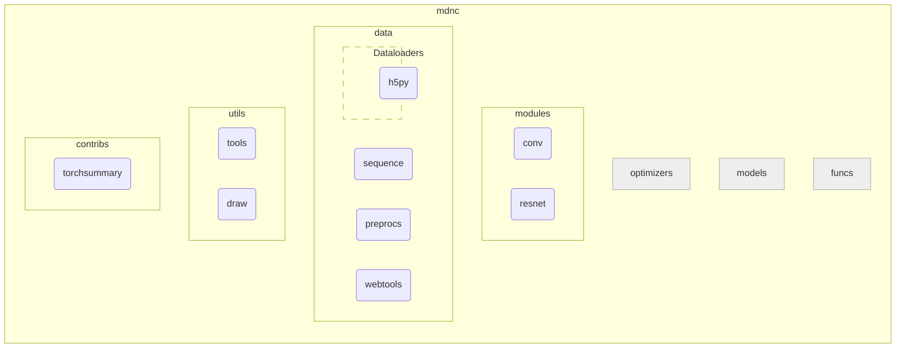

# Overview

The APIs of this package could be divided into the following sub-packages:

| Package name {: .w-7rem} | Description {: .w-8rem} |
| :----------: | :---------- |
| `optimizers` :fontawesome-solid-tools: | To be implemented ... |
| `modules` | A collection of specially designed pyTorch modules, including special network layers and network models. |
| `models` :fontawesome-solid-tools: | To be implemented ... |
| `data` | A collection of dataset loaders, online dataset management tools, and data processing tools. |
| `funcs` :fontawesome-solid-tools: | To be implemented ... |
| `utils` | A collection of data processing or visualization tools not related to datasets or pyTorch. |
| `contribs` | A collection of third-party packages, including the modified third-party packages and some enhancement APIs on the top of the third-party packages. |

The diagram of the MDNC is shown as follows:

## List of packages

### :codicons-package: `optimizers`

To be built ...

### :codicons-package: `modules`

To be documented ...

### :codicons-package: `models`

To be built ...

### :codicons-package: `data`

* :codicons-symbol-namespace: `sequence`: The infrastructures of CPU-based parallel I/O and processing. This module is used by all data loaders.
* :codicons-symbol-namespace: `h5py`: Wrapped HDF5 datasets savers, data converters and data loaders.
* :codicons-symbol-namespace: `preprocs`: Useful pre- and post- processing tools for all data loaders in this package.
* :codicons-symbol-namespace: `webtools`: Web tools for downloading tarball-packed datasets from Github.

### :codicons-package: `funcs`

To be built ...

### :codicons-package: `utils`

To be documented ...

### :codicons-package: `contribs`

* :codicons-symbol-namespace: `torchsummary`: The revised @sksq96/pytorch-summary. This is a Keras style `#!py model.summary()` in pyTorch, with some bugs gotten fixed. To view my modified version, see sksq96/pytorch-summary#165.
