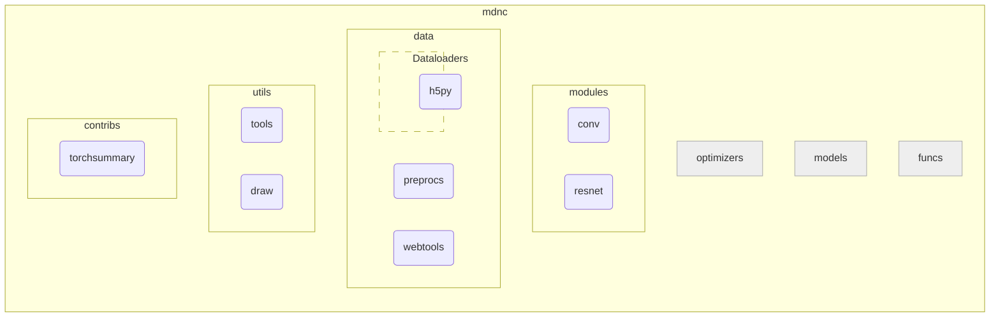

# Overview

The APIs of this package could be divided into the following sub-packages:

| Package name {: .w-7rem} | Description {: .w-8rem} |
| :----------: | :---------- |
| `optimizers` :fontawesome-solid-tools: | To be implemented ... |
| `modules` | A collection of specially designed pyTorch modules, including special network layers and network models. |
| `models` :fontawesome-solid-tools: | To be implemented ... |
| `data` | A collection of dataset loaders, online dataset management tools, and data processing tools. |
| `funcs` :fontawesome-solid-tools: | To be implemented ... |
| `utils` | A collection of data processing or visualization tools not related to datasets or pyTorch. |
| `contribs` | A collection of third-party packages, including the modified third-party packages and some enhancement APIs on the top of the third-party packages. |

The diagram of the MDNC is shown as follows:

