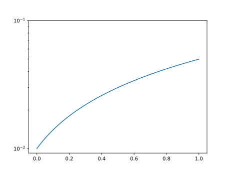

# utils.draw.fix_log_axis

:codicons-symbol-method: Function · [:octicons-file-code-24: Source]({{ source.root }}/utils/draw.py#L140){ target="_blank" }

```python
mdnc.utils.draw.fix_log_axis(
    ax=None, axis='y'
)
```

Control the log axis to be limited in 10^n^ ticks.

This function is not recommended, because it would take effects globally. Please use [`mdnc.utils.draw.setFigure`](../setFigure) as a safer way.

## Arguments

**Requries**

| Argument {: .w-5rem} | Type {: .w-4rem} | Description {: .w-8rem} |
| :------: | :-----: | :---------- |
| `ax` | `#!py object` | The subplot that requires to be controlled. If set `#!py None`, the `#!py plt.gca()` would be used. |
| `axis` | `#!py str`  | Make which axis to be normalized, could be: `#!py 'x'`, `#!py 'y'` or `#!py 'xy'`. |

## Examples

???+ example
    === "Codes"
        ```python linenums="1"
        import numpy as np
        import matplotlib.pyplot as plt
        import mdnc

        t = np.linspace(0, 1, 100)
        plt.plot(t, 0.01 + 0.04 * t)
        plt.yscale('log')
        mdnc.utils.draw.fix_log_axis(axis='y')
        plt.show()
        ```

    === "Output"
        {.img-fluid tag=1 title="Example of fix_log_axis."}
