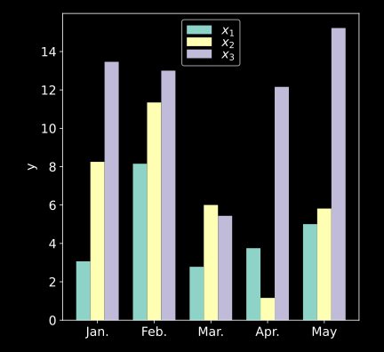

# utils.draw.plot_bar

:codicons-symbol-method: Function · [:octicons-file-code-24: Source]({{ source.root }}/utils/draw.py#L311){ target="_blank" }

```python
mdnc.utils.draw.plot_bar(
    gen, num,
    xlabel=None, ylabel='value', x_tick_labels=None, y_log=False,
    figure_size=(6, 5.5), legend_loc=None, legend_col=None,
    fig=None, ax=None
)
```

Plot a bar graph for multiple result groups. Each group is given by a 1D data sample array.

## Arguments

**Requries**

| Argument {: .w-7rem} | Type {: .w-7rem} | Description {: .w-8rem} |
| :------: | :-----: | :---------- |
| `gen` | `#!py object` | A generator callable object (function), each `#!py yield` returns a sample. It allows users to provide an extra kwargs dict for each iteration (see [Examples](#examples)). For each iteration, it returns a 1D data. |
| `num` | `#!py int`  | The total number of data samples `#!py yield` by the generator. |
| `xlabel` | `#!py str`  | The x axis label. |
| `ylabel` | `#!py str`  | The y axis label. |
| `x_tick_labels` | `#!py (str, )`  | The x tick labels (a sequence) that is used for overriding the original value `#!py [0, 1, 2, ...]`. |
| `y_log` | `#!py bool`  | A flag. Whether to convert the y axis into the logarithmic format. |
| `figure_size` | `#!py (float, float)`  | A tuple with two values representing the (width, height) of the output figure. The unit is inch. |
| `legend_loc` | `#!py str` or<br>`#!py int` or<br>`#!py (float, float)` | The localtion of the legend, see [:fontawesome-solid-external-link-alt: matplotlib.pyplot.legend][mpl-legend] to view details. (The legend only works when passing `label` to each iteration). |
| `legend_col` | `#!py int` | The number of columns of the legend, see [:fontawesome-solid-external-link-alt: matplotlib.pyplot.legend][mpl-legend] to view details. (The legend only works when passing `label` to each iteration). |
| `fig` | `#!py object` | A `matplotlib` figure instance. If not given, would use `#!py plt.gcf()` for instead. |
| `ax`  | `#!py object` | A `matplotlib` subplot instance. If not given, would use `#!py plt.gca()` for instead. |

## Examples

???+ example
    === "Codes"
        ```python linenums="1"
        import numpy as np
        import matplotlib.pyplot as plt
        import mdnc

        @mdnc.utils.draw.setFigure(style='dark_background', font_size=14)
        def test_plot_bar():
            def func_gen():
                size = 5
                x1 = np.abs(np.random.normal(loc=6.0, scale=3.0, size=size))
                yield x1, {'label': '$x_1$'}
                x2 = np.abs(np.random.normal(loc=9.0, scale=6.0, size=size))
                yield x2, {'label': '$x_2$'}
                x3 = np.abs(np.random.normal(loc=12.0, scale=6.0, size=size))
                yield x3, {'label': '$x_3$'}

            mdnc.utils.draw.plot_bar(func_gen(), num=3, ylabel='y', y_log=False,
                                     x_tick_labels=['Jan.', 'Feb.', 'Mar.', 'Apr.', 'May'])
            plt.show()

        test_plot_bar()
        ```

    === "Output"
        {.img-fluid tag=1 title="Example of plot_bar."}

[mpl-legend]:https://matplotlib.org/stable/api/_as_gen/matplotlib.pyplot.legend.html "matplotlib.pyplot.legend"
