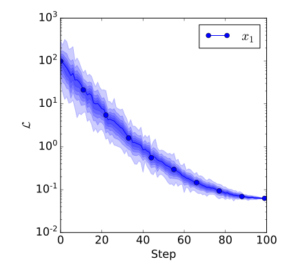

# utils.draw.plot_distribution_curves

:codicons-symbol-method: Function · [:octicons-file-code-24: Source]({{ source.root }}/utils/draw.py#L636){ target="_blank" }

```python
mdnc.utils.draw.plot_distribution_curves(
    gen, method='mean', level=3, outlier=0.1,
    xlabel=None, ylabel='value', y_log=False,
    figure_size=(6, 5.5), legend_loc=None, legend_col=None,
    fig=None, ax=None
)
```

Plot lines with multi-level distribution for multiple data groups. Each group is given by:

* one 1D array and one 2D array, representing the x axis (assuming to have a shape of `#!py (N,)`) and a stack of data samples (with a shape of `#!py (N, M)`). Each time point corresponds to `M` samples in the same distribution.
* or a 2D array. In this case, we only have the `#!py (N, M)` data stack.

???+ tip
    This function has similar meaning of [`plot_error_curves`](../plot_error_curves). It is used for compressing the time-series histograms. Its output is similar to [:fontawesome-solid-external-link-alt: tensorboard.distribution][edward-tensorboard].

## Arguments

**Requries**

| Argument {: .w-6rem} | Type {: .w-7rem} | Description {: .w-8rem} |
| :------: | :-----: | :---------- |
| `gen` | `#!py object` | A generator callable object (function), each `#!py yield` returns a sample. It allows users to provide an extra kwargs dict for each iteration (see [Examples](#examples)). For each iteration, it returns 4 1D arrays, or 2 2D arrays, or 2 1D arrays, or a 4D array, or a 2D array, or a 1D array. |
| `method` | `#!py str`  | The method for calculating curves, could be `#!py 'mean'` or `#!py 'middle'`, representing the mean value and the median value respectively. |
| `level` | `#!py int`  | The histogram level. |
| `outlier` | `#!py float`  | Outlier proportion (should be 0\~1), the part marked as outliers would be thrown away when drawing the figures. |
| `xlabel` | `#!py str`  | The x axis label. |
| `ylabel` | `#!py str`  | The y axis label. |
| `y_log` | `#!py bool`  | A flag. Whether to convert the y axis into the logarithmic format. |
| `figure_size` | `#!py (float, float)`  | A tuple with two values representing the (width, height) of the output figure. The unit is inch. |
| `legend_loc` | `#!py str` or<br>`#!py int` or<br>`#!py (float, float)` | The localtion of the legend, see [:fontawesome-solid-external-link-alt: matplotlib.pyplot.legend][mpl-legend] to view details. (The legend only works when passing `label` to each iteration). |
| `legend_col` | `#!py int` | The number of columns of the legend, see [:fontawesome-solid-external-link-alt: matplotlib.pyplot.legend][mpl-legend] to view details. (The legend only works when passing `label` to each iteration). |
| `fig` | `#!py object` | A `matplotlib` figure instance. If not given, would use `#!py plt.gcf()` for instead. |
| `ax`  | `#!py object` | A `matplotlib` subplot instance. If not given, would use `#!py plt.gca()` for instead. |

## Examples

???+ example
    === "Codes"
        ```python linenums="1"
        import numpy as np
        import matplotlib.pyplot as plt
        import mdnc

        @mdnc.utils.draw.setFigure(style='classic', font_size=16)
        def test_distribution():
            def func_gen():
                size = 100
                x = np.arange(start=0, stop=size)
                for i in range(1):
                    begin = 1 + 99.0 * np.random.rand()
                    end = 2 + 10 * np.random.rand()
                    exp_v = np.square((x - size) / size) - 1.0
                    exp_vnoise = np.random.normal(0.0, np.expand_dims((size - x) / (10 * size), axis=-1), (size, 50))
                    v = begin * np.exp((np.expand_dims(exp_v, axis=-1) + exp_vnoise) * end)
                    yield x, v, {'label': r'$x_{' + str(i + 1) + r'}$'}
            mdnc.utils.draw.plot_distribution_curves(func_gen(), method='mean', level=5, outlier=0.05,
                                                     xlabel='Step', ylabel=r'$\mathcal{L}$', y_log=True)
            plt.show()

        test_distribution()
        ```

    === "Output"
        {.img-fluid tag=1 title="Example of plot_distribution_curves."}

[mpl-legend]:https://matplotlib.org/stable/api/_as_gen/matplotlib.pyplot.legend.html "matplotlib.pyplot.legend"
[edward-tensorboard]:http://edwardlib.org/tutorials/tensorboard "Tensorboard tutorials"