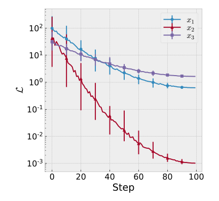
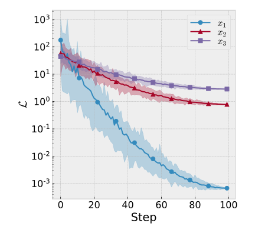

# utils.draw.plot_error_curves

:codicons-symbol-method: Function · [:octicons-file-code-24: Source]({{ source.root }}/utils/draw.py#L554){ target="_blank" }

```python
mdnc.utils.draw.plot_error_curves(
    gen, x_error_num=10,
    y_error_method='std', plot_method='error',
    xlabel=None, ylabel='value', y_log=False,
    figure_size=(6, 5.5), legend_loc=None, legend_col=None,
    fig=None, ax=None
)
```

Plot lines with error bars for multiple data groups. Each group is given by:

* one 1D array and one 2D array, representing the x axis (assuming to have a shape of `#!py (N,)`) and a stack of data samples (with a shape of `#!py (N, M)`). Each time point corresponds to `M` samples in the same distribution.
* or a 2D array. In this case, we only have the `#!py (N, M)` data stack.

## Arguments

**Requries**

| Argument {: .w-7rem} | Type {: .w-7rem} | Description {: .w-8rem} |
| :------: | :-----: | :---------- |
| `gen` | `#!py object` | A generator callable object (function), each `#!py yield` returns a sample. It allows users to provide an extra kwargs dict for each iteration (see [Examples](#examples)). For each iteration, it returns 1D + 2D arrays, or a single 2D array. |
| `x_error_num` | `#!py int`  | The number of displayed error bars. |
| `y_error_method` | `#!py str`  | The method for calculating the error bar. Could be: <ul> <li>`#!py 'std'`: use standard error.</li> <li> <p>`#!py 'minmax'`: use the range of the data.</p> </li> </ul> |
| `plot_method` | `#!py str`  | The method for plotting the figure. Could be: <ul> <li> <p>`#!py 'error'`: use error bar graph.</p> </li> <li>`#!py 'fill'`: use fill_between graph.</li> </ul> |
| `xlabel` | `#!py str`  | The x axis label. |
| `ylabel` | `#!py str`  | The y axis label. |
| `y_log` | `#!py bool`  | A flag. Whether to convert the y axis into the logarithmic format. |
| `figure_size` | `#!py (float, float)`  | A tuple with two values representing the (width, height) of the output figure. The unit is inch. |
| `legend_loc` | `#!py str` or<br>`#!py int` or<br>`#!py (float, float)` | The localtion of the legend, see [:fontawesome-solid-external-link-alt: matplotlib.pyplot.legend][mpl-legend] to view details. (The legend only works when passing `label` to each iteration). |
| `legend_col` | `#!py int` | The number of columns of the legend, see [:fontawesome-solid-external-link-alt: matplotlib.pyplot.legend][mpl-legend] to view details. (The legend only works when passing `label` to each iteration). |
| `fig` | `#!py object` | A `matplotlib` figure instance. If not given, would use `#!py plt.gcf()` for instead. |
| `ax`  | `#!py object` | A `matplotlib` subplot instance. If not given, would use `#!py plt.gca()` for instead. |

## Examples

???+ example
    === "Codes"
        ```python linenums="1"
        import numpy as np
        import matplotlib.pyplot as plt
        import mdnc

        @mdnc.utils.draw.setFigure(style='bmh', font_size=16)
        def test_error_bar():
            def func_gen():
                size = 100
                x = np.arange(start=0, stop=size)
                for i in range(3):
                    begin = 1 + 99.0 * np.random.rand()
                    end = 2 + 10 * np.random.rand()
                    exp_v = np.square((x - size) / size) - 1.0
                    exp_vnoise = np.random.normal(0.0, np.expand_dims((size - x) / (10 * size), axis=-1), (size, 50))
                    v = begin * np.exp((np.expand_dims(exp_v, axis=-1) + exp_vnoise) * end)
                    yield x, v, {'label': r'$x_{' + str(i + 1) + r'}$'}
            mdnc.utils.draw.plot_error_curves(func_gen(), y_log=True,
                                              y_error_method='minmax',
                                              xlabel='Step', ylabel=r'$\mathcal{L}$')
            plt.show()
            mdnc.utils.draw.plot_error_curves(func_gen(), y_log=True,
                                              y_error_method='minmax', plot_method='fill',
                                              xlabel='Step', ylabel=r'$\mathcal{L}$')
            plt.show()

        test_error_bar()
        ```

    === "Output"
        {.img-fluid tag=1 title="Example of plot_error_curves (bar style)."}
        {.img-fluid tag=2 title="Example of plot_error_curves (fill style)."}

[mpl-legend]:https://matplotlib.org/stable/api/_as_gen/matplotlib.pyplot.legend.html "matplotlib.pyplot.legend"
