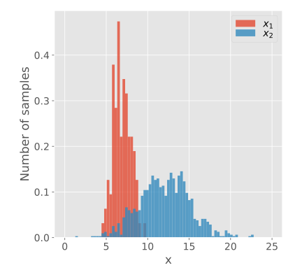

# utils.draw.plot_hist

:codicons-symbol-method: Function · [:octicons-file-code-24: Source]({{ source.root }}/utils/draw.py#L259){ target="_blank" }

```python
mdnc.utils.draw.plot_hist(
    gen, normalized=False, cumulative=False,
    xlabel='Value', ylabel='Number of samples', x_log=False, y_log=False,
    figure_size=(6, 5.5), legend_loc=None, legend_col=None,
    fig=None, ax=None
)
```

Plot a histogram for multiple distributions. Each distribution is given by a 1D data sample array.

## Arguments

**Requries**

| Argument {: .w-6rem} | Type {: .w-7rem} | Description {: .w-8rem} |
| :------: | :-----: | :---------- |
| `gen` | `#!py object` | A generator callable object (function), each `#!py yield` returns a sample. It allows users to provide an extra kwargs dict for each iteration (see [Examples](#examples)). For each iteration, it returns a 1D data. |
| `normalized` | `#!py bool`  | A flag. Whether to use normalization for each group when drawing the histogram. |
| `xlabel` | `#!py str`  | The x axis label. |
| `ylabel` | `#!py str`  | The y axis label. |
| `x_log` | `#!py bool`  | A flag. Whether to convert the x axis into the logarithmic format. |
| `y_log` | `#!py bool`  | A flag. Whether to convert the y axis into the logarithmic format. |
| `figure_size` | `#!py (float, float)`  | A tuple with two values representing the (width, height) of the output figure. The unit is inch. |
| `legend_loc` | `#!py str` or<br>`#!py int` or<br>`#!py (float, float)` | The localtion of the legend, see [:fontawesome-solid-external-link-alt: matplotlib.pyplot.legend][mpl-legend] to view details. (The legend only works when passing `label` to each iteration). |
| `legend_col` | `#!py int` | The number of columns of the legend, see [:fontawesome-solid-external-link-alt: matplotlib.pyplot.legend][mpl-legend] to view details. (The legend only works when passing `label` to each iteration). |
| `fig` | `#!py object` | A `matplotlib` figure instance. If not given, would use `#!py plt.gcf()` for instead. |
| `ax`  | `#!py object` | A `matplotlib` subplot instance. If not given, would use `#!py plt.gca()` for instead. |

## Examples

???+ example
    === "Codes"
        ```python linenums="1"
        import numpy as np
        import matplotlib.pyplot as plt
        import mdnc

        @mdnc.utils.draw.setFigure(style='ggplot', font_size=14)
        def test_plot_hist():
            def func_gen():
                getbins = np.linspace(0, 25, 80)
                x1 = np.random.normal(loc=7.0, scale=1.0, size=100)
                yield x1, {'bins': getbins, 'label': '$x_1$'}
                x2 = np.random.normal(loc=12.0, scale=3.0, size=1000)
                yield x2, {'bins': getbins, 'label': '$x_2$'}

            mdnc.utils.draw.plot_hist(func_gen(), xlabel='x', normalized=True, cumulative=False)
            plt.show()

        test_plot_hist()
        ```

    === "Output"
        {.img-fluid tag=1 title="Example of plot_hist."}

[mpl-legend]:https://matplotlib.org/stable/api/_as_gen/matplotlib.pyplot.legend.html "matplotlib.pyplot.legend"
