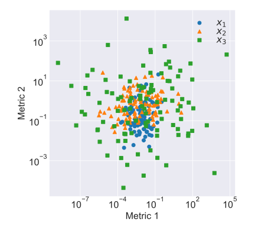

# utils.draw.plot_scatter

:codicons-symbol-method: Function · [:octicons-file-code-24: Source]({{ source.root }}/utils/draw.py#L379){ target="_blank" }

```python
mdnc.utils.draw.plot_scatter(
    gen,
    xlabel=None, ylabel='value', x_log=None, y_log=False,
    figure_size=(6, 5.5), legend_loc=None, legend_col=None,
    fig=None, ax=None
)
```

Plot a scatter graph for multiple data groups. Each group is given by:

* a 1D data arrays (x, y coordinates),
* or a 2D array `#!py (N, 2)`, the second axis represents the x, y corrdincates.

## Arguments

**Requries**

| Argument {: .w-6rem} | Type {: .w-7rem} | Description {: .w-8rem} |
| :------: | :-----: | :---------- |
| `gen` | `#!py object` | A generator callable object (function), each `#!py yield` returns a sample. It allows users to provide an extra kwargs dict for each iteration (see [Examples](#examples)). For each iteration, it returns 2 1D arrays or a 2D array. |
| `xlabel` | `#!py str`  | The x axis label. |
| `ylabel` | `#!py str`  | The y axis label. |
| `x_log` | `#!py bool`  | A flag. Whether to convert the x axis into the logarithmic format. |
| `y_log` | `#!py bool`  | A flag. Whether to convert the y axis into the logarithmic format. |
| `figure_size` | `#!py (float, float)`  | A tuple with two values representing the (width, height) of the output figure. The unit is inch. |
| `legend_loc` | `#!py str` or<br>`#!py int` or<br>`#!py (float, float)` | The localtion of the legend, see [:fontawesome-solid-external-link-alt: matplotlib.pyplot.legend][mpl-legend] to view details. (The legend only works when passing `label` to each iteration). |
| `legend_col` | `#!py int` | The number of columns of the legend, see [:fontawesome-solid-external-link-alt: matplotlib.pyplot.legend][mpl-legend] to view details. (The legend only works when passing `label` to each iteration). |
| `fig` | `#!py object` | A `matplotlib` figure instance. If not given, would use `#!py plt.gcf()` for instead. |
| `ax`  | `#!py object` | A `matplotlib` subplot instance. If not given, would use `#!py plt.gca()` for instead. |

## Examples

???+ example
    === "Codes"
        ```python linenums="1"
        import numpy as np
        import matplotlib.pyplot as plt
        import mdnc

        @mdnc.utils.draw.setFigure(style='seaborn-darkgrid', font_size=16)
        def test_scatter():
            def func_gen():
                size = 100
                for i in range(3):
                    center = -4.0 + 4.0 * np.random.rand(2)
                    scale = 0.5 + 2.0 * np.random.rand(2)
                    x1 = np.random.normal(loc=center[0], scale=scale[0], size=size)
                    x2 = np.random.normal(loc=center[1], scale=scale[1], size=size)
                    yield np.power(10, x1), np.power(10, x2), {'label': r'$x_{' + str(i + 1) + r'}$'}

            mdnc.utils.draw.plot_scatter(func_gen(), x_log=True, y_log=True,
                                         xlabel='Metric 1', ylabel='Metric 2')
            plt.show()

        test_scatter()
        ```

    === "Output"
        {.img-fluid tag=1 title="Example of plot_scatter."}

[mpl-legend]:https://matplotlib.org/stable/api/_as_gen/matplotlib.pyplot.legend.html "matplotlib.pyplot.legend"
