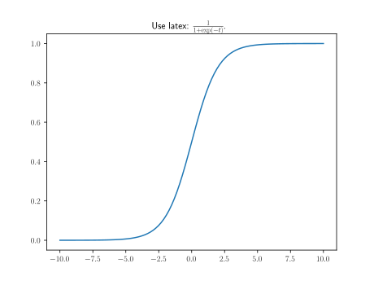

# utils.draw.use_tex

:codicons-symbol-method: Function · [:octicons-file-code-24: Source]({{ source.root }}/utils/draw.py#L127){ target="_blank" }

```python
mdnc.utils.draw.use_tex(
    flag=False
)
```

Switch the `maplotlib` font backend to $\LaTeX$.

This function is not recommended, because it would take effects globally. Please use [`mdnc.utils.draw.setFigure`](../setFigure) as a safer way.

## Arguments

**Requries**

| Argument {: .w-5rem} | Type {: .w-4rem} | Description {: .w-8rem} |
| :------: | :-----: | :---------- |
| `flag` | `#!py bool` | A flag, indicating whether to use the $\LaTeX$ backend for rendering figure fonts. |

## Examples

???+ example
    === "Codes"
        ```python linenums="1"
        import numpy as np
        import matplotlib.pyplot as plt
        import mdnc

        mdnc.utils.draw.use_tex(True)
        t = np.linspace(-10, 10, 100)
        plt.plot(t, 1 / (1 + np.exp(-t)))
        plt.title(r'Use latex: $\frac{1}{1 + \exp (-t)}$.')
        plt.show()
        ```

    === "Output"
        {.img-fluid tag=1 title="Example of use_tex."}
